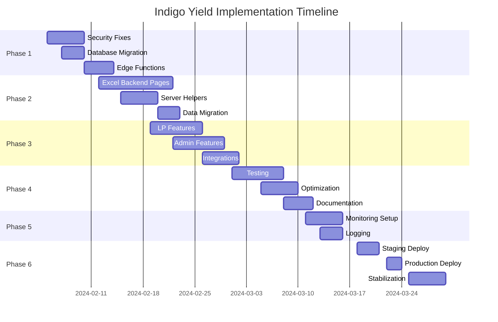

# Indigo Yield Platform - Implementation Plan
## Production Readiness Roadmap

---

## Executive Summary

The Indigo Yield platform requires significant updates before production deployment. This plan outlines a phased approach to address critical gaps, implement the Excel backend integration, and achieve production readiness.

**Current State**: 55% ready for production
**Target State**: 95% production ready
**Estimated Timeline**: 8-10 weeks
**Priority Focus**: Excel backend, security fixes, feature completion

---

## Phase 1: Critical Security & Infrastructure (Week 1-2)
**Priority: P0 - IMMEDIATE**

### 1.1 Security Fixes
- [ ] Remove any remaining hardcoded credentials
- [ ] Implement rate limiting on all API endpoints
- [ ] Add CAPTCHA to public forms (login, registration)
- [ ] Enhance input validation across all forms
- [ ] Add request signing for sensitive operations

### 1.2 Database Migration for Excel Backend
```sql
-- Apply migration 003_excel_backend.sql
-- Create normalized schema for:
- funds table (fund configurations)
- investors table (investor master data)
- transactions table (unified ledger)
- daily_nav table (NAV tracking)
- KPI views and calculation functions
```

### 1.3 Environment Configuration
- [ ] Set up proper environment variables:
  - `SUPABASE_SERVICE_ROLE_KEY` (Edge Functions only)
  - `SENTRY_DSN_EDGE` (Edge Function monitoring)
  - `SMTP_*` credentials for email
  - `WEB_PUSH_VAPID_*` keys
- [ ] Configure Vercel environment variables
- [ ] Set up staging environment

### 1.4 Edge Functions Deployment
Deploy critical Edge Functions:
1. `excel_import` - Import Excel data to database
2. `excel_export` - Export database to Excel
3. `parity_check` - Data consistency validation
4. `status` - Health check endpoint
5. `statement_generator` - PDF statement generation

---

## Phase 2: Excel Backend Integration (Week 2-4)
**Priority: P0 - CRITICAL**

### 2.1 Admin Pages Implementation
Create new admin pages for Excel operations:

#### FundPerformance Page
```typescript
// src/pages/admin/FundPerformance.tsx
- Daily NAV management interface
- Performance calculation display
- Fund comparison charts
- Export functionality
```

#### InvestmentsLedger Page
```typescript
// src/pages/admin/InvestmentsLedger.tsx
- Complete transaction ledger
- Filtering by investor/fund/date
- Bulk transaction import
- Audit trail integration
```

#### FeesInterest Page
```typescript
// src/pages/admin/FeesInterest.tsx
- Fee calculation engine
- Interest posting interface
- Batch processing controls
- Preview and approval workflow
```

#### InvestorMaster Page
```typescript
// src/pages/admin/InvestorMaster.tsx
- Complete investor CRUD
- KYC status management
- Document management
- Communication preferences
```

#### Reconciliation Page
```typescript
// src/pages/admin/Reconciliation.tsx
- Balance verification (prior + flows + PnL = ending)
- Discrepancy detection
- Adjustment posting
- Audit reports
```

#### ImportExportExcel Page
```typescript
// src/pages/admin/ImportExportExcel.tsx
- Excel upload interface
- Data validation preview
- Import progress tracking
- Export configuration
- Parity check results
```

### 2.2 Server Helpers Implementation
```typescript
// src/server/admin.funds.ts
- listDailyNav()
- upsertDailyNav()
- calculateReturns()

// src/server/admin.tx.ts
- listTransactions()
- createTransaction()
- bulkImportTransactions()

// src/server/admin.statements.ts
- generateStatements()
- bulkGenerateStatements()
- emailStatements()
```

### 2.3 Data Migration Scripts
- [ ] Create Excel template matching current structure
- [ ] Build migration script for existing data
- [ ] Implement rollback procedures
- [ ] Create data validation scripts

---

## Phase 3: Core Feature Completion (Week 4-6)
**Priority: P1 - HIGH**

### 3.1 LP Portal Gaps
#### Deposits Page Implementation
```typescript
// src/pages/DepositsPage.tsx
- Deposit request form
- Wire instructions display
- Request status tracking
- Document upload for proof
```

#### Withdrawals System
```typescript
// src/pages/WithdrawalsPage.tsx
- Withdrawal request workflow
- Balance verification
- Approval queue integration
- Email notifications
```

#### Support System
```typescript
// src/pages/SupportPage.tsx
- Ticket creation interface
- Message threading
- File attachments
- Status tracking
```

### 3.2 Admin Portal Gaps
#### Requests Queue
```typescript
// src/pages/admin/AdminRequestsQueuePage.tsx
- Pending deposits/withdrawals list
- Approval/rejection workflow
- Bulk operations
- Email notifications
```

#### Yield Settings Management
```typescript
// src/pages/admin/AdminYieldSettingsPage.tsx
- APR configuration by asset
- Historical rate tracking
- Effective date management
- Calculation preview
```

#### Statement Management
```typescript
// src/pages/admin/AdminStatementsPage.tsx
- Statement generation controls
- Batch processing
- Delivery tracking
- Regeneration capabilities
```

### 3.3 Integration Points
- [ ] Connect portfolio analytics to real data
- [ ] Replace all mock data with database queries
- [ ] Implement real-time updates via subscriptions
- [ ] Add WebSocket support for live data

---

## Phase 4: Testing & Quality Assurance (Week 6-7)
**Priority: P1 - HIGH**

### 4.1 Test Implementation
#### Unit Tests
```typescript
// __tests__/components/
- Component testing with React Testing Library
- Hook testing
- Utility function testing
- Coverage target: 80%
```

#### Integration Tests
```typescript
// __tests__/integration/
- API endpoint testing
- Database operation testing
- Edge Function testing
- RLS policy validation
```

#### E2E Tests
```typescript
// tests/e2e/
- Complete user journeys
- Admin workflows
- Excel import/export flows
- Statement generation
```

### 4.2 Performance Optimization
- [ ] Implement code splitting
  ```typescript
  const AdminRoutes = lazy(() => import('./AdminRoutes'))
  const ChartsModule = lazy(() => import('./ChartsModule'))
  ```
- [ ] Add React.memo to expensive components
- [ ] Implement virtual scrolling for large lists
- [ ] Optimize bundle size (tree shaking)
- [ ] Add service worker for caching

### 4.3 Documentation
- [ ] API documentation (OpenAPI/Swagger)
- [ ] Component storybook
- [ ] Admin user guide
- [ ] LP user guide
- [ ] Deployment documentation
- [ ] Troubleshooting guide

---

## Phase 5: Observability & Monitoring (Week 7-8)
**Priority: P2 - MEDIUM**

### 5.1 Enhanced Monitoring
#### Sentry Configuration
```typescript
// Edge Functions monitoring
- Error tracking for all Edge Functions
- Performance monitoring
- Custom alerts for critical errors
```

#### PostHog Analytics
```typescript
// src/lib/analytics.ts
- User behavior tracking (consent-gated)
- Feature usage metrics
- Conversion funnels
- Custom dashboards
```

### 5.2 Logging Infrastructure
- [ ] Structured logging implementation
- [ ] Log aggregation setup
- [ ] Alert configuration
- [ ] Audit log enhancements

### 5.3 Health Checks
- [ ] Database connection monitoring
- [ ] Edge Function health endpoints
- [ ] Third-party service monitoring
- [ ] Uptime monitoring setup

---

## Phase 6: Production Deployment (Week 8-10)
**Priority: P1 - HIGH**

### 6.1 Pre-Production Checklist
- [ ] Security audit completion
- [ ] Performance benchmarking
- [ ] Load testing (expected 500+ concurrent users)
- [ ] Disaster recovery plan
- [ ] Backup procedures verified
- [ ] SSL certificates configured
- [ ] Domain setup complete

### 6.2 Deployment Process
1. **Staging Deployment**
   - Deploy to staging environment
   - Run full test suite
   - User acceptance testing
   - Performance validation

2. **Production Deployment**
   - Database migration execution
   - Edge Functions deployment
   - Frontend deployment
   - DNS configuration
   - SSL verification

3. **Post-Deployment**
   - Smoke tests
   - Monitor error rates
   - Check performance metrics
   - Verify email delivery
   - Test payment flows

### 6.3 Rollback Plan
- [ ] Database rollback scripts ready
- [ ] Previous version tagged
- [ ] Rollback procedures documented
- [ ] Communication plan prepared

---

## Implementation Timeline



---

## Resource Requirements

### Development Team
- **Backend Developer**: Excel integration, Edge Functions (8 weeks)
- **Frontend Developer**: UI completion, integration (8 weeks)
- **DevOps Engineer**: Infrastructure, deployment (4 weeks)
- **QA Engineer**: Testing, validation (4 weeks)
- **Technical Writer**: Documentation (2 weeks)

### Infrastructure
- Supabase Pro plan (for production)
- Vercel Pro plan (for production)
- Sentry Team plan
- PostHog Growth plan
- Email service (SendGrid/AWS SES)

### Budget Estimate
- Development: $80,000 - $120,000
- Infrastructure: $500-1000/month
- Third-party services: $300-500/month
- Security audit: $10,000 - $15,000

---

## Risk Mitigation

### High-Risk Areas
1. **Data Migration**: 
   - Mitigation: Extensive testing, rollback plan, parallel run period

2. **Excel Integration Complexity**:
   - Mitigation: Incremental implementation, thorough testing, parity checks

3. **Security Vulnerabilities**:
   - Mitigation: External security audit, penetration testing, code review

4. **Performance at Scale**:
   - Mitigation: Load testing, performance optimization, caching strategy

### Contingency Plans
- Additional developer resources available
- Extended timeline buffer (2 weeks)
- Phased rollout option
- Feature flag system for gradual enablement

---

## Success Metrics

### Technical Metrics
- [ ] 95% uptime SLA
- [ ] <2s page load time (P95)
- [ ] <200ms API response time (P95)
- [ ] Zero critical security vulnerabilities
- [ ] 80% test coverage

### Business Metrics
- [ ] 100% data accuracy (Excel parity)
- [ ] <1% error rate in transactions
- [ ] 24-hour statement generation SLA
- [ ] 99.9% email delivery rate

### User Experience Metrics
- [ ] <5% support ticket rate
- [ ] >90% user satisfaction score
- [ ] <2 clicks to key actions
- [ ] Mobile responsive (100% features)

---

## Next Immediate Steps

### Week 1 Actions
1. **Monday**: 
   - Set up staging environment
   - Begin security fixes
   - Review Excel integration requirements

2. **Tuesday-Wednesday**:
   - Implement database migration 003
   - Deploy first Edge Functions
   - Start FundPerformance page

3. **Thursday-Friday**:
   - Complete security fixes
   - Test Edge Functions
   - Begin InvestmentsLedger page

### Critical Path Items
⚠️ **Must complete before any other work:**
1. Database migration 003
2. Security vulnerability fixes
3. Edge Function infrastructure

### Team Assignments
- **Backend Team**: Focus on Excel backend and Edge Functions
- **Frontend Team**: Complete placeholder pages
- **DevOps**: Environment setup and monitoring
- **QA**: Prepare test plans and automation

---

## Communication Plan

### Stakeholder Updates
- Weekly progress reports
- Bi-weekly demos
- Daily standups for dev team
- Executive summary monthly

### Documentation Requirements
- Technical design documents
- API specifications
- User guides
- Deployment runbooks

### Training Plan
- Admin user training (Week 7)
- LP user documentation (Week 8)
- Support team training (Week 9)

---

## Conclusion

This implementation plan provides a structured approach to achieving production readiness for the Indigo Yield platform. The phased approach ensures critical issues are addressed first while maintaining development momentum on feature completion.

**Key Success Factors:**
1. Completing Excel backend integration
2. Fixing all security vulnerabilities
3. Achieving comprehensive test coverage
4. Ensuring data accuracy and consistency
5. Delivering excellent user experience

With proper execution of this plan, the platform will be ready for production deployment within 8-10 weeks.

---

*Document Version: 1.0*
*Last Updated: 2024-02-02*
*Next Review: Weekly during implementation*
