# THREAT MODEL & INCIDENT RESPONSE PLAN - INDIGO YIELD PLATFORM

## Executive Summary
**Platform Risk Level:** CRITICAL (Financial Services)
**Threat Actors:** External hackers, Insider threats, Nation-states, Competitors
**Primary Assets:** $100M+ AUM, 10,000+ user PII, Financial transactions
**Incident Response Time:** 15 minutes (P0), 30 minutes (P1)

## 1. THREAT MODEL ANALYSIS

### 1.1 STRIDE Threat Classification

```mermaid
graph TD
    S[Spoofing] --> S1[Fake login pages]
    S --> S2[Email spoofing]
    S --> S3[Session hijacking]

    T[Tampering] --> T1[Transaction manipulation]
    T --> T2[Balance modification]
    T --> T3[Data corruption]

    R[Repudiation] --> R1[Deny transactions]
    R --> R2[Dispute transfers]
    R --> R3[False claims]

    I[Information Disclosure] --> I1[PII leakage]
    I --> I2[Financial data breach]
    I --> I3[API key exposure]

    D[Denial of Service] --> D1[DDoS attacks]
    D --> D2[Resource exhaustion]
    D --> D3[Account lockouts]

    E[Elevation of Privilege] --> E1[Admin access]
    E --> E2[Bypass RLS]
    E --> E3[System compromise]
```



### 1.2 Attack Surface Analysis

| Component | Attack Surface | Risk Level | Threat Vectors |
|-----------|---------------|------------|----------------|
| **Web Application** | Public Internet | CRITICAL | XSS, CSRF, Injection, Session attacks |
| **iOS Application** | App Store | HIGH | Reverse engineering, Jailbreak bypass |
| **API Endpoints** | HTTPS/WSS | CRITICAL | API abuse, Rate limiting bypass, IDOR |
| **Database** | Supabase Cloud | HIGH | SQL injection, Data exfiltration |
| **Admin Portal** | Restricted Access | CRITICAL | Privilege escalation, Insider threat |
| **Third-party APIs** | OAuth/Webhooks | HIGH | Token theft, Webhook manipulation |
| **File Storage** | Supabase Storage | MEDIUM | Unauthorized access, Data leakage |
| **Email System** | SMTP/SendGrid | MEDIUM | Phishing, Email hijacking |

### 1.3 Threat Actor Profiles

```yaml
External Attackers:
  Motivation: Financial gain, Data theft
  Capabilities: High (organized crime)
  Tactics:
    - Phishing campaigns
    - Automated attacks
    - Zero-day exploits
    - Social engineering
  Probability: HIGH

Insider Threats:
  Motivation: Financial gain, Revenge
  Capabilities: Very High (privileged access)
  Tactics:
    - Data exfiltration
    - Sabotage
    - Fraud
    - IP theft
  Probability: MEDIUM

Nation-State Actors:
  Motivation: Economic espionage
  Capabilities: Extremely High
  Tactics:
    - Advanced persistent threats
    - Supply chain attacks
    - Zero-days
  Probability: LOW

Competitors:
  Motivation: Business intelligence
  Capabilities: Medium
  Tactics:
    - Corporate espionage
    - Poaching attempts
    - Reverse engineering
  Probability: MEDIUM

Script Kiddies:
  Motivation: Reputation, Fun
  Capabilities: Low
  Tactics:
    - Known exploits
    - DDoS attacks
    - Defacement
  Probability: HIGH
```

## 2. CRITICAL ATTACK SCENARIOS

### 2.1 Scenario 1: Account Takeover Attack

```yaml
Attack Path:
  1. Reconnaissance:
     - Gather user emails from data breaches
     - Social media profiling
     - Phishing for credentials

  2. Initial Access:
     - Credential stuffing
     - Password spraying
     - Phishing success

  3. Persistence:
     - Add backup authentication method
     - Change email/phone
     - Disable notifications

  4. Actions:
     - Transfer funds
     - Access sensitive data
     - Lateral movement

Impact:
  - Financial loss: Up to full account balance
  - Data breach: PII exposure
  - Reputation damage: Loss of trust

Likelihood: HIGH
Risk Score: 9.0/10

Mitigations:
  - Mandatory MFA
  - Device fingerprinting
  - Anomaly detection
  - Transaction limits
  - Email confirmations
```

### 2.2 Scenario 2: SQL Injection Leading to Data Breach

```yaml
Attack Path:
  1. Discovery:
     - Identify input fields
     - Test for SQLi vulnerabilities
     - Map database structure

  2. Exploitation:
     - Extract user credentials
     - Dump financial data
     - Bypass authentication

  3. Exfiltration:
     - Download user database
     - Extract transaction history
     - Steal API keys

  4. Monetization:
     - Sell data on dark web
     - Ransom demand
     - Identity theft

Impact:
  - Complete data breach
  - Regulatory fines: $1M+
  - Legal liability: $200/record
  - Business shutdown risk

Likelihood: MEDIUM
Risk Score: 8.5/10

Mitigations:
  - Parameterized queries
  - Input validation
  - WAF rules
  - Database activity monitoring
  - Encryption at rest
```

### 2.3 Scenario 3: Insider Threat - Rogue Admin

```yaml
Attack Path:
  1. Privileged Access:
     - Admin credentials
     - Database access
     - Bypass controls

  2. Data Collection:
     - Export user data
     - Copy transaction records
     - Screenshot sensitive info

  3. Exfiltration:
     - Email to personal account
     - Upload to cloud storage
     - Physical media

  4. Monetization:
     - Sell to competitors
     - Blackmail company
     - Start competing business

Impact:
  - Complete data loss
  - Competitive disadvantage
  - Regulatory violations
  - Customer trust destroyed

Likelihood: MEDIUM
Risk Score: 8.0/10

Mitigations:
  - Least privilege principle
  - Audit logging
  - DLP controls
  - Background checks
  - Separation of duties
```

### 2.4 Scenario 4: Supply Chain Attack via NPM Package

```yaml
Attack Path:
  1. Compromise:
     - Hijack NPM package
     - Typosquatting
     - Dependency confusion

  2. Injection:
     - Malicious code in build
     - Backdoor installation
     - Credential harvesting

  3. Execution:
     - Deploy to production
     - Activate payload
     - Establish C2 channel

  4. Impact:
     - Full system compromise
     - Data exfiltration
     - Cryptomining
     - Ransomware

Impact:
  - Complete platform compromise
  - All user data at risk
  - Service disruption
  - Recovery time: Weeks

Likelihood: LOW
Risk Score: 7.5/10

Mitigations:
  - Dependency scanning
  - Package pinning
  - Security audits
  - SBOM tracking
  - Isolated build environment
```

## 3. INCIDENT RESPONSE PLAN

### 3.1 Incident Response Team Structure

```yaml
Incident Commander (IC):
  Role: Overall incident coordination
  Contact: CTO / Security Lead
  Backup: VP Engineering

Security Lead:
  Role: Technical investigation
  Contact: Security Engineer
  Backup: Senior Developer

Communications Lead:
  Role: Internal/External communications
  Contact: Head of Marketing
  Backup: CEO

Legal Counsel:
  Role: Legal and compliance
  Contact: External Law Firm
  Backup: Compliance Officer

Operations Lead:
  Role: System operations
  Contact: DevOps Lead
  Backup: Infrastructure Engineer
```

### 3.2 Incident Classification Matrix

| Severity | Definition | Response Time | Team | Examples |
|----------|------------|---------------|------|----------|
| **P0 - Critical** | Complete outage or data breach | 15 min | Full team + Executives | Ransomware, major breach |
| **P1 - High** | Partial outage or security incident | 30 min | Core team | Account takeover, fraud |
| **P2 - Medium** | Limited impact incident | 2 hours | Security + Ops | Suspicious activity |
| **P3 - Low** | Minor issue | 24 hours | On-call | Policy violation |

### 3.3 Incident Response Procedures

#### Phase 1: DETECTION & ALERTING (0-15 minutes)

```markdown
IMMEDIATE ACTIONS:
1. [ ] Alert triggered in monitoring system
2. [ ] On-call engineer acknowledges
3. [ ] Initial severity assessment
4. [ ] Create incident channel (#incident-YYYY-MM-DD-XXX)
5. [ ] Notify Incident Commander

DETECTION SOURCES:
- Security monitoring (Datadog, Sentry)
- User reports
- Automated alerts
- Third-party notifications
- Audit log anomalies
```

#### Phase 2: CONTAINMENT (15-60 minutes)

```yaml
Containment Actions by Type:

Data Breach:
  - Revoke all API keys
  - Force password reset
  - Disable affected accounts
  - Block suspicious IPs
  - Snapshot affected systems

Account Takeover:
  - Lock affected accounts
  - Revoke all sessions
  - Disable API access
  - Review recent transactions
  - Enable additional monitoring

DDoS Attack:
  - Enable DDoS protection
  - Scale infrastructure
  - Block attack sources
  - Activate CDN caching
  - Prepare failover

Malware/Ransomware:
  - Isolate infected systems
  - Disconnect from network
  - Preserve evidence
  - Activate backups
  - Engage law enforcement
```

#### Phase 3: INVESTIGATION (1-4 hours)

```typescript
// Investigation Checklist
interface Investigation {
  timeline: {
    firstIndicator: Date;
    compromiseTime: Date;
    detectionTime: Date;
    containmentTime: Date;
  };

  scope: {
    affectedSystems: string[];
    affectedUsers: number;
    dataTypes: string[];
    geographicScope: string[];
  };

  indicators: {
    iocs: string[]; // IPs, domains, hashes
    ttps: string[]; // Tactics, techniques, procedures
    artifacts: string[]; // Logs, files, screenshots
  };

  rootCause: {
    vulnerability: string;
    exploitMethod: string;
    entryPoint: string;
    attributedTo: string;
  };
}
```

#### Phase 4: ERADICATION (2-24 hours)

```markdown
ERADICATION STEPS:

1. Remove Threat:
   - [ ] Delete malicious files
   - [ ] Remove unauthorized access
   - [ ] Close vulnerabilities
   - [ ] Update signatures

2. Patch Systems:
   - [ ] Apply security patches
   - [ ] Update configurations
   - [ ] Strengthen controls
   - [ ] Reset credentials

3. Verify Clean:
   - [ ] Run security scans
   - [ ] Check integrity
   - [ ] Review logs
   - [ ] Test fixes
```

#### Phase 5: RECOVERY (24-72 hours)

```yaml
Recovery Process:

System Restoration:
  1. Restore from clean backups
  2. Rebuild compromised systems
  3. Reapply security configurations
  4. Validate data integrity
  5. Test functionality

Service Resumption:
  1. Gradual service restoration
  2. Monitor for anomalies
  3. Verify security controls
  4. User communication
  5. Full service restoration

Monitoring Enhancement:
  1. Increase monitoring sensitivity
  2. Add specific detections
  3. Review alert thresholds
  4. Deploy additional sensors
  5. 24/7 watch period (7 days)
```

#### Phase 6: POST-INCIDENT (72+ hours)

```markdown
POST-INCIDENT ACTIVITIES:

1. Lessons Learned Meeting (Within 5 days):
   - What went well?
   - What went wrong?
   - What was missing?
   - Action items

2. Documentation:
   - [ ] Complete incident report
   - [ ] Update runbooks
   - [ ] Document new IOCs
   - [ ] Share threat intelligence

3. Improvements:
   - [ ] Patch procedures
   - [ ] Update monitoring
   - [ ] Training needs
   - [ ] Tool enhancements

4. Compliance:
   - [ ] Regulatory notifications (72 hours)
   - [ ] Customer notifications (if required)
   - [ ] Insurance claims
   - [ ] Legal documentation
```

## 4. COMMUNICATION PROTOCOLS

### 4.1 Internal Communications

```yaml
Incident Channel Structure:
  #incident-YYYY-MM-DD-XXX:
    Purpose: Central coordination
    Members: Response team
    Updates: Every 30 minutes

  #incident-exec:
    Purpose: Executive updates
    Members: C-suite, Board
    Updates: Hourly

  #incident-status:
    Purpose: Company-wide updates
    Members: All employees
    Updates: Major milestones

Communication Templates:
  Initial: |
    INCIDENT DECLARED
    Severity: P[0-3]
    Type: [breach/outage/attack]
    Impact: [description]
    IC: [name]
    Channel: #incident-XXX

  Update: |
    INCIDENT UPDATE [time]
    Status: [investigating/contained/recovering]
    Progress: [actions taken]
    Next: [planned actions]
    ETA: [restoration time]

  Resolution: |
    INCIDENT RESOLVED
    Duration: [time]
    Impact: [final assessment]
    RCA: [scheduled time]
    Actions: [follow-up items]
```

### 4.2 External Communications

```markdown
## Customer Communication

### Timing Requirements:
- P0: Within 1 hour
- P1: Within 4 hours
- P2: Within 24 hours
- P3: As needed

### Templates:

**Initial Notification:**
Subject: [Service Status Update - Investigating Issue]

We are currently investigating an issue affecting [service].
- Start time: [time]
- Services affected: [list]
- Customer impact: [description]

We will provide updates every [30/60] minutes.

**Progress Update:**
Subject: [Service Status Update - Progress Report]

Update on the ongoing issue:
- Current status: [investigating/partially resolved]
- Progress made: [actions taken]
- Estimated resolution: [time]

**Resolution Notice:**
Subject: [Service Status Update - Issue Resolved]

The issue has been resolved:
- Resolution time: [time]
- Root cause: [brief description]
- Prevention measures: [actions]

### Regulatory Notifications:

**Data Breach (GDPR/CCPA):**
- Timeline: 72 hours
- Recipients: Data Protection Authority
- Content: Nature, scope, measures, contacts

**Financial Incident (SEC/FINRA):**
- Timeline: Immediate material events
- Recipients: Regulators, investors
- Content: 8-K filing if material
```

## 5. INCIDENT PLAYBOOKS

### 5.1 Playbook: Data Breach Response

```yaml
Trigger: Confirmed or suspected data breach

Immediate Actions (0-30 min):
  1. Activate incident response team
  2. Contain the breach:
     - Isolate affected systems
     - Revoke compromised credentials
     - Block malicious IPs
  3. Preserve evidence:
     - Capture memory dumps
     - Copy logs
     - Document timeline

Investigation (30 min - 4 hours):
  1. Determine scope:
     - What data was accessed?
     - How many records affected?
     - Time period of breach?
  2. Identify attack vector:
     - Entry point
     - Exploitation method
     - Persistence mechanisms
  3. Collect forensics:
     - System images
     - Network captures
     - Audit logs

Containment (2-8 hours):
  1. Patch vulnerabilities
  2. Reset all credentials
  3. Implement additional monitoring
  4. Review and update access controls

Notification (24-72 hours):
  1. Legal counsel review
  2. Prepare notifications:
     - Regulatory bodies
     - Affected customers
     - Credit monitoring offers
  3. Public relations strategy
  4. Law enforcement (if criminal)

Recovery (3-7 days):
  1. Rebuild affected systems
  2. Restore from clean backups
  3. Implement additional controls
  4. Conduct security audit
  5. Employee training
```

### 5.2 Playbook: Ransomware Attack

```yaml
Trigger: Ransomware detected on any system

CRITICAL: DO NOT PAY RANSOM (company policy)

Immediate Actions (0-15 min):
  1. ISOLATE - Disconnect all affected systems
  2. ALERT - Notify incident response team
  3. PRESERVE - Take system snapshots
  4. IDENTIFY - Determine ransomware variant

Containment (15-60 min):
  1. Network isolation:
     - Disconnect from internet
     - Segment network
     - Disable remote access
  2. Stop spread:
     - Power off affected systems
     - Disable scheduled tasks
     - Block C2 communications
  3. Inventory impact:
     - List affected systems
     - Identify critical data
     - Check backup integrity

Investigation (1-4 hours):
  1. Determine entry point
  2. Identify patient zero
  3. Timeline reconstruction
  4. Collect indicators
  5. Check for data exfiltration

Recovery Options:
  Option A - Restore from Backup:
    1. Verify backup integrity
    2. Isolate recovery environment
    3. Restore systems
    4. Apply all patches
    5. Monitor for reinfection

  Option B - Decrypt (if possible):
    1. Identify ransomware family
    2. Check for decryptor availability
    3. Test on non-critical system
    4. Full restoration

  Option C - Rebuild:
    1. Clean installation
    2. Restore data from backup
    3. Reconfigure services
    4. Harden security

Post-Incident:
  1. Full security audit
  2. Penetration testing
  3. Employee training
  4. Update incident response plan
  5. Cyber insurance claim
```

### 5.3 Playbook: DDoS Attack

```yaml
Trigger: Service degradation or unavailability due to traffic

Immediate Response (0-5 min):
  1. Confirm DDoS (not legitimate traffic)
  2. Activate DDoS protection
  3. Alert CloudFlare team
  4. Scale infrastructure

Mitigation (5-30 min):
  1. Traffic Analysis:
     - Identify attack vectors
     - Determine traffic patterns
     - Locate source IPs/regions

  2. Filtering:
     - Enable rate limiting
     - Geographic filtering
     - Challenge suspicious traffic
     - Block identified sources

  3. Scaling:
     - Auto-scale servers
     - Activate CDN caching
     - Enable read replicas
     - Queue non-critical operations

Advanced Mitigation (30+ min):
  1. CloudFlare Settings:
     - Under Attack Mode
     - Increase challenge threshold
     - Custom WAF rules
     - IP reputation filtering

  2. Application Level:
     - Reduce functionality
     - Cache aggressive
     - Disable expensive operations
     - Prioritize critical users

Recovery:
  1. Gradual restoration
  2. Monitor for persistence
  3. Analyze attack patterns
  4. Update defenses
  5. Document lessons learned
```

## 6. SECURITY MONITORING & DETECTION

### 6.1 Security Event Monitoring

```typescript
// Security Event Configuration
interface SecurityMonitoring {
  authenticationEvents: {
    failedLogins: {
      threshold: 5,
      window: '5m',
      severity: 'HIGH',
      action: 'BLOCK_IP'
    },
    impossibleTravel: {
      maxVelocity: '500mph',
      severity: 'CRITICAL',
      action: 'LOCK_ACCOUNT'
    },
    newDevice: {
      requireMFA: true,
      notification: 'EMAIL',
      riskScore: '+20'
    }
  },

  transactionEvents: {
    largeTransfer: {
      threshold: 10000,
      severity: 'HIGH',
      action: 'MANUAL_REVIEW'
    },
    velocityCheck: {
      maxDaily: 50000,
      maxTransactions: 10,
      action: 'HOLD'
    },
    unusualPattern: {
      mlModel: 'transaction_anomaly_v2',
      threshold: 0.95,
      action: 'FLAG'
    }
  },

  systemEvents: {
    privilegeEscalation: {
      severity: 'CRITICAL',
      action: 'ALERT_IMMEDIATE'
    },
    configChange: {
      severity: 'HIGH',
      requireApproval: true
    },
    massDataExport: {
      threshold: '1GB',
      severity: 'HIGH',
      action: 'INVESTIGATE'
    }
  }
}
```

### 6.2 SIEM Rules and Alerts

```yaml
Critical Alerts (Page immediately):
  - Multiple admin login failures
  - Database dump attempts
  - Privilege escalation
  - Data exfiltration (>100MB)
  - Known malware signatures
  - Impossible travel detected
  - Critical configuration change

High Priority (Page within 15 min):
  - Unusual API usage pattern
  - Multiple failed MFA attempts
  - Large financial transaction
  - New admin account created
  - Suspicious SQL queries
  - Authentication from TOR
  - Mass password reset requests

Medium Priority (Email):
  - Failed backup
  - Certificate expiration warning
  - Unusual user behavior
  - Policy violation
  - Third-party API errors
  - Performance degradation

Log Retention:
  Security Logs: 7 years
  Application Logs: 1 year
  Access Logs: 1 year
  Transaction Logs: 7 years
  Debug Logs: 30 days
```

## 7. FORENSICS AND EVIDENCE COLLECTION

### 7.1 Digital Forensics Procedures

```markdown
## Evidence Collection Checklist

### System Evidence:
- [ ] Memory dumps (RAM)
- [ ] Disk images (bit-for-bit copy)
- [ ] System logs
- [ ] Registry hives (Windows)
- [ ] Running processes
- [ ] Network connections
- [ ] User artifacts

### Network Evidence:
- [ ] Packet captures
- [ ] Firewall logs
- [ ] DNS logs
- [ ] Proxy logs
- [ ] NetFlow data
- [ ] IDS/IPS alerts

### Application Evidence:
- [ ] Application logs
- [ ] Database audit logs
- [ ] Transaction records
- [ ] User activity logs
- [ ] API access logs
- [ ] Configuration files

### Cloud Evidence:
- [ ] CloudTrail logs (AWS)
- [ ] Activity logs (Azure)
- [ ] Stackdriver logs (GCP)
- [ ] Storage access logs
- [ ] Identity logs
```

### 7.2 Chain of Custody

```yaml
Evidence Handling:
  Collection:
    - Use write-blockers
    - Generate hash values
    - Document collection process
    - Photograph physical evidence

  Storage:
    - Encrypted storage
    - Access controls
    - Audit trail
    - Backup copies

  Documentation:
    - Evidence ID
    - Collection date/time
    - Collector name
    - Source system
    - Hash values
    - Transfer log

  Legal Hold:
    - Preserve all evidence
    - Suspend deletion policies
    - Document preservation
    - Regular verification
```

## 8. TABLETOP EXERCISES

### 8.1 Exercise Schedule

| Exercise | Frequency | Participants | Duration |
|----------|-----------|--------------|----------|
| Data Breach | Quarterly | Full IR team | 4 hours |
| Ransomware | Bi-annual | IT + Security | 3 hours |
| Insider Threat | Annual | Security + HR | 2 hours |
| DDoS Attack | Quarterly | Ops + Security | 2 hours |
| Supply Chain | Annual | Full team | 4 hours |

### 8.2 Exercise Scenario: Major Data Breach

```markdown
## Tabletop Exercise: Customer Data Breach

### Scenario:
Friday, 4:30 PM: Security analyst notices unusual database queries
4:45 PM: Investigation reveals unauthorized data export
5:00 PM: 50,000 customer records confirmed stolen
5:15 PM: Attacker still has active access
5:30 PM: Media contact asking about breach

### Injects:

**Inject 1 (30 min):**
- Attacker escalates privileges to admin
- What do you do?

**Inject 2 (45 min):**
- Customer complaints on social media
- How do you respond?

**Inject 3 (60 min):**
- Ransomware deployed on backup servers
- What's your recovery strategy?

**Inject 4 (90 min):**
- Regulatory body demands immediate report
- What information do you provide?

### Discussion Points:
1. Initial containment decisions
2. Communication strategy
3. Legal obligations
4. Recovery priorities
5. Lessons learned
```

## 9. VENDOR AND SUPPLY CHAIN SECURITY

### 9.1 Third-Party Risk Assessment

```yaml
Critical Vendors:
  Supabase:
    Risk Level: CRITICAL
    Data Access: Full database
    Controls:
      - SOC 2 Type II required
      - Annual security review
      - Incident notification SLA
      - Data residency requirements

  Stripe:
    Risk Level: HIGH
    Data Access: Payment information
    Controls:
      - PCI DSS compliance
      - Webhook signature validation
      - API key rotation
      - Transaction monitoring

  Vercel:
    Risk Level: MEDIUM
    Data Access: Application hosting
    Controls:
      - DDoS protection
      - Security headers
      - Deployment controls
      - Access logging

Assessment Criteria:
  - Security certifications
  - Incident history
  - Access to data
  - Business criticality
  - Alternative options
```

## 10. SECURITY METRICS AND KPIs

### 10.1 Security Performance Indicators

```typescript
interface SecurityMetrics {
  preventive: {
    patchingCompliance: '95%', // Systems patched within SLA
    mfaAdoption: '100%', // Users with MFA enabled
    trainingCompletion: '100%', // Security training
    vulnerabilityRemediation: '48hrs' // Critical vuln fix time
  },

  detective: {
    mtd: '< 1 hour', // Mean time to detect
    falsePositiveRate: '< 5%', // Alert accuracy
    incidentDetectionRate: '> 95%', // Incidents detected vs occurred
    logCoverage: '100%' // Systems with logging
  },

  responsive: {
    mtr: '< 4 hours', // Mean time to respond
    mtc: '< 8 hours', // Mean time to contain
    mtrr: '< 24 hours', // Mean time to recover
    incidentRecurrence: '< 5%' // Repeat incidents
  },

  compliance: {
    auditFindings: 0, // Critical findings
    regulatoryViolations: 0, // Compliance violations
    policyExceptions: '< 10', // Approved exceptions
    evidenceCollection: '100%' // Audit evidence ready
  }
}
```

---

**Document Classification:** HIGHLY CONFIDENTIAL
**Distribution:** Security Team, C-Suite Only
**Review Frequency:** Quarterly
**Last Updated:** November 4, 2025
**Next Review:** February 4, 2026
**Exercise Schedule:** Quarterly tabletop, Annual full simulation