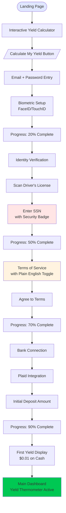
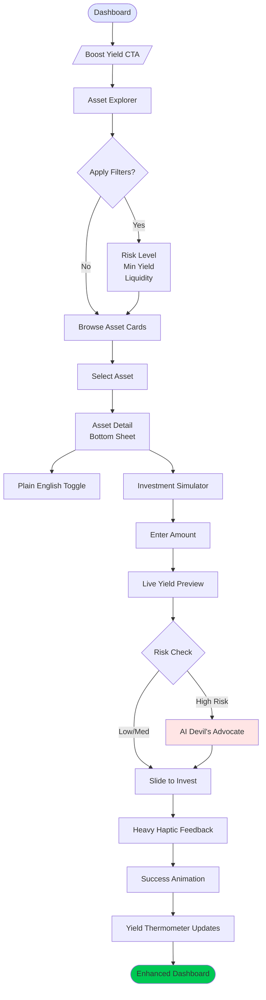

# User Journey Visual Flows & Implementation Specs

> Visual representations and implementation details for the three critical user journeys

---

## 1. Signup/Onboarding Journey - "The Trust Bridge"

### Visual Flow Diagram



### Key Interaction Components

#### 1.1 Trust-Building Progress Bar

```tsx
interface ProgressBarProps {
  currentStep: number;
  totalSteps: number;
  startAt: number; // Goal gradient effect
}

const TrustProgressBar: React.FC<ProgressBarProps> = ({
  currentStep,
  totalSteps,
  startAt = 20
}) => {
  const actualProgress = ((currentStep / totalSteps) * (100 - startAt)) + startAt;

  return (
    <div className="relative w-full bg-slate-100 rounded-full h-2 overflow-hidden">
      <motion.div
        className="absolute h-full bg-gradient-to-r from-indigo-500 to-indigo-600"
        initial={{ width: `${startAt}%` }}
        animate={{ width: `${actualProgress}%` }}
        transition={{ duration: 0.5, ease: "easeOut" }}
      />
      <div className="flex justify-between mt-2 px-1">
        {['Identity', 'Security', 'Funding', 'Ready'].map((label, idx) => (
          <span
            key={label}
            className={cn(
              "text-xs",
              idx <= currentStep ? "text-indigo-600 font-medium" : "text-slate-400"
            )}
          >
            {label}
          </span>
        ))}
      </div>
    </div>
  );
};
```

#### 1.2 Plain English Toggle Component

```tsx
const PlainEnglishToggle: React.FC = () => {
  const [isPlainEnglish, setIsPlainEnglish] = useState(false);

  return (
    <Card className="border-indigo-200 bg-gradient-to-br from-indigo-50 to-white">
      <CardHeader>
        <div className="flex items-center justify-between">
          <CardTitle className="text-lg">Terms of Service</CardTitle>
          <div className="flex items-center gap-2">
            <span className="text-xs text-slate-500">Legal</span>
            <Switch
              checked={isPlainEnglish}
              onCheckedChange={setIsPlainEnglish}
              className="data-[state=checked]:bg-indigo-600"
            />
            <span className="text-xs text-indigo-600 font-medium">Plain English</span>
          </div>
        </div>
      </CardHeader>
      <CardContent>
        <AnimatePresence mode="wait">
          <motion.div
            key={isPlainEnglish ? 'plain' : 'legal'}
            initial={{ opacity: 0, y: 10 }}
            animate={{ opacity: 1, y: 0 }}
            exit={{ opacity: 0, y: -10 }}
            transition={{ duration: 0.3 }}
            className="prose prose-sm max-w-none"
          >
            {isPlainEnglish ? (
              <div>
                <h3>What we promise you:</h3>
                <ul className="space-y-2">
                  <li>✅ Your money is SIPC insured up to $500,000</li>
                  <li>✅ We never sell your personal data</li>
                  <li>✅ You can withdraw anytime (3 business days)</li>
                  <li>✅ All fees are shown upfront - no surprises</li>
                  <li>✅ Your yield is calculated daily and paid monthly</li>
                </ul>
              </div>
            ) : (
              <div className="text-xs text-gray-600 leading-relaxed">
                <p>By creating an account, you agree to be bound by these Terms of Service
                and acknowledge that you have read and understood our Privacy Policy...</p>
                {/* Full legal text */}
              </div>
            )}
          </motion.div>
        </AnimatePresence>
      </CardContent>
    </Card>
  );
};
```

#### 1.3 SSN Entry with Security Context

```tsx
const SecureSSNEntry: React.FC = () => {
  const [ssn, setSSN] = useState('');
  const [showWhy, setShowWhy] = useState(false);

  const formatSSN = (value: string) => {
    const digits = value.replace(/\D/g, '');
    if (digits.length <= 3) return digits;
    if (digits.length <= 5) return `${digits.slice(0, 3)}-${digits.slice(3)}`;
    return `${digits.slice(0, 3)}-${digits.slice(3, 5)}-${digits.slice(5, 9)}`;
  };

  return (
    <div className="space-y-4">
      <div className="bg-green-50 border border-green-200 rounded-lg p-4">
        <div className="flex items-start gap-3">
          <Shield className="w-5 h-5 text-green-600 mt-0.5" />
          <div className="flex-1">
            <p className="text-sm font-medium text-green-900">Bank-Level Security</p>
            <p className="text-xs text-green-700 mt-1">
              256-bit encryption • Same as Chase, Wells Fargo, Bank of America
            </p>
          </div>
        </div>
      </div>

      <div className="space-y-2">
        <Label htmlFor="ssn" className="flex items-center gap-2">
          Social Security Number
          <button
            type="button"
            onClick={() => setShowWhy(!showWhy)}
            className="text-indigo-600 text-xs hover:underline"
          >
            Why we need this?
          </button>
        </Label>

        <AnimatePresence>
          {showWhy && (
            <motion.div
              initial={{ height: 0, opacity: 0 }}
              animate={{ height: 'auto', opacity: 1 }}
              exit={{ height: 0, opacity: 0 }}
              className="bg-blue-50 rounded-md p-3"
            >
              <p className="text-xs text-blue-800">
                Required by law for tax reporting (Form 1099). We report your earnings
                to the IRS, just like your employer reports your salary.
              </p>
            </motion.div>
          )}
        </AnimatePresence>

        <Input
          id="ssn"
          type="tel"
          inputMode="numeric"
          pattern="[0-9]{3}-[0-9]{2}-[0-9]{4}"
          value={ssn}
          onChange={(e) => setSSN(formatSSN(e.target.value))}
          placeholder="123-45-6789"
          className="text-lg font-mono tracking-wider"
          maxLength={11}
        />
      </div>

      <div className="flex items-center gap-2 text-xs text-slate-500">
        <Lock className="w-3 h-3" />
        <span>Encrypted and never stored in plain text</span>
      </div>
    </div>
  );
};
```

---

## 2. Investment Journey - "The Yield Hunt"

### Visual Flow Diagram



### Key Interaction Components

#### 2.1 Asset Explorer Cards

```tsx
interface AssetCardProps {
  name: string;
  category: string;
  currentYield: number;
  riskLevel: 'low' | 'medium' | 'high';
  minimumInvestment: number;
  liquidityDays: number;
  popularityRank?: number;
}

const AssetCard: React.FC<AssetCardProps> = ({
  name,
  category,
  currentYield,
  riskLevel,
  minimumInvestment,
  liquidityDays,
  popularityRank
}) => {
  const riskColors = {
    low: 'bg-green-100 text-green-700 border-green-200',
    medium: 'bg-amber-100 text-amber-700 border-amber-200',
    high: 'bg-red-100 text-red-700 border-red-200'
  };

  return (
    <motion.div
      whileHover={{ scale: 1.02 }}
      whileTap={{ scale: 0.98 }}
      className="relative"
    >
      {popularityRank && popularityRank <= 3 && (
        <div className="absolute -top-2 -right-2 bg-indigo-600 text-white text-xs px-2 py-1 rounded-full z-10">
          #{popularityRank} Popular
        </div>
      )}

      <Card className="cursor-pointer hover:shadow-lg transition-shadow">
        <CardContent className="p-4">
          <div className="flex justify-between items-start mb-3">
            <div>
              <h3 className="font-semibold text-gray-900">{name}</h3>
              <p className="text-xs text-gray-500">{category}</p>
            </div>
            <Badge className={cn("text-xs", riskColors[riskLevel])}>
              {riskLevel.toUpperCase()} RISK
            </Badge>
          </div>

          <div className="grid grid-cols-2 gap-4 mb-3">
            <div>
              <p className="text-2xl font-bold text-indigo-600">
                {currentYield.toFixed(2)}%
              </p>
              <p className="text-xs text-gray-500">Annual Yield</p>
            </div>
            <div className="text-right">
              <p className="text-sm font-medium text-gray-700">
                ${(currentYield * 100 / 365).toFixed(2)}
              </p>
              <p className="text-xs text-gray-500">Daily per $10K</p>
            </div>
          </div>

          <div className="flex justify-between items-center pt-3 border-t">
            <div className="flex items-center gap-1">
              <DollarSign className="w-3 h-3 text-gray-400" />
              <span className="text-xs text-gray-600">
                Min ${minimumInvestment.toLocaleString()}
              </span>
            </div>
            <div className="flex items-center gap-1">
              <Clock className="w-3 h-3 text-gray-400" />
              <span className="text-xs text-gray-600">
                {liquidityDays === 0 ? 'Instant' : `${liquidityDays} days`}
              </span>
            </div>
          </div>
        </CardContent>
      </Card>
    </motion.div>
  );
};
```

#### 2.2 Investment Simulator with Live Preview

```tsx
const InvestmentSimulator: React.FC<{ asset: Asset }> = ({ asset }) => {
  const [amount, setAmount] = useState('10000');
  const [showImpact, setShowImpact] = useState(false);

  const dailyYield = (parseFloat(amount) * asset.yield / 100 / 365) || 0;
  const monthlyYield = dailyYield * 30;
  const yearlyYield = dailyYield * 365;

  return (
    <div className="space-y-6">
      {/* Amount Input with Slider */}
      <div className="space-y-3">
        <Label>Investment Amount</Label>
        <div className="relative">
          <DollarSign className="absolute left-3 top-1/2 -translate-y-1/2 w-5 h-5 text-gray-400" />
          <Input
            type="number"
            value={amount}
            onChange={(e) => setAmount(e.target.value)}
            className="pl-10 text-2xl font-bold h-14"
            placeholder="10,000"
          />
        </div>
        <Slider
          value={[parseFloat(amount) || 0]}
          onValueChange={([val]) => setAmount(val.toString())}
          min={asset.minimumInvestment}
          max={100000}
          step={1000}
          className="mt-4"
        />
      </div>

      {/* Live Yield Preview */}
      <motion.div
        initial={{ opacity: 0, y: 20 }}
        animate={{ opacity: 1, y: 0 }}
        className="bg-gradient-to-br from-indigo-50 to-green-50 rounded-xl p-6"
      >
        <h4 className="text-sm font-medium text-gray-600 mb-4">Your Projected Income</h4>

        <div className="grid grid-cols-3 gap-4">
          <div className="text-center">
            <motion.p
              key={dailyYield}
              initial={{ scale: 1.2 }}
              animate={{ scale: 1 }}
              className="text-2xl font-bold text-indigo-600"
            >
              ${dailyYield.toFixed(2)}
            </motion.p>
            <p className="text-xs text-gray-500 mt-1">Per Day</p>
          </div>

          <div className="text-center">
            <p className="text-xl font-semibold text-gray-700">
              ${monthlyYield.toFixed(2)}
            </p>
            <p className="text-xs text-gray-500 mt-1">Per Month</p>
          </div>

          <div className="text-center">
            <p className="text-lg font-medium text-gray-600">
              ${yearlyYield.toFixed(2)}
            </p>
            <p className="text-xs text-gray-500 mt-1">Per Year</p>
          </div>
        </div>

        {/* Visual Thermometer Preview */}
        <div className="mt-4 relative h-8 bg-white rounded-full overflow-hidden">
          <motion.div
            className="absolute h-full bg-gradient-to-r from-indigo-500 to-green-500"
            initial={{ width: '0%' }}
            animate={{ width: `${Math.min((dailyYield / 10) * 100, 100)}%` }}
            transition={{ duration: 0.5 }}
          />
          <div className="absolute inset-0 flex items-center justify-center">
            <span className="text-xs font-medium text-gray-700">
              +{((dailyYield / 10) * 100).toFixed(0)}% to daily goal
            </span>
          </div>
        </div>
      </motion.div>

      {/* Risk Warning for High-Risk Assets */}
      {asset.riskLevel === 'high' && (
        <Alert className="border-amber-200 bg-amber-50">
          <AlertTriangle className="w-4 h-4 text-amber-600" />
          <AlertDescription className="text-sm text-amber-800">
            This is a high-risk investment. Your capital is at risk and you may lose
            some or all of your investment.
          </AlertDescription>
        </Alert>
      )}
    </div>
  );
};
```

#### 2.3 Slide to Invest Component

```tsx
const SlideToInvest: React.FC<{ onConfirm: () => void }> = ({ onConfirm }) => {
  const [sliderPosition, setSliderPosition] = useState(0);
  const [isConfirmed, setIsConfirmed] = useState(false);
  const threshold = 80; // Percentage to trigger confirmation

  const handleDragEnd = () => {
    if (sliderPosition > threshold) {
      setIsConfirmed(true);
      // Trigger heavy haptic feedback
      if (navigator.vibrate) {
        navigator.vibrate([50, 50, 100]); // Pattern: short, pause, long
      }
      onConfirm();
    } else {
      // Spring back animation
      setSliderPosition(0);
    }
  };

  return (
    <div className="relative h-16 bg-gradient-to-r from-indigo-100 to-green-100 rounded-full overflow-hidden">
      {/* Background Text */}
      <div className="absolute inset-0 flex items-center justify-center">
        <motion.p
          animate={{ opacity: 1 - sliderPosition / 100 }}
          className="text-gray-600 font-medium"
        >
          Slide to Invest
        </motion.p>
      </div>

      {/* Slider Track */}
      <motion.div
        className="absolute h-full bg-gradient-to-r from-indigo-500 to-green-500"
        style={{ width: `${sliderPosition}%` }}
      />

      {/* Draggable Handle */}
      <motion.div
        drag="x"
        dragConstraints={{ left: 0, right: window.innerWidth - 80 }}
        dragElastic={0}
        onDrag={(_, info) => {
          const percentage = (info.point.x / window.innerWidth) * 100;
          setSliderPosition(Math.min(Math.max(percentage, 0), 100));
        }}
        onDragEnd={handleDragEnd}
        className="absolute left-0 top-1/2 -translate-y-1/2 w-14 h-14 bg-white rounded-full shadow-lg flex items-center justify-center cursor-grab active:cursor-grabbing"
        animate={{ x: isConfirmed ? '100%' : 0 }}
      >
        <ArrowRight className="w-6 h-6 text-indigo-600" />
      </motion.div>

      {/* Success State */}
      <AnimatePresence>
        {isConfirmed && (
          <motion.div
            initial={{ opacity: 0, scale: 0.8 }}
            animate={{ opacity: 1, scale: 1 }}
            className="absolute inset-0 bg-green-500 flex items-center justify-center"
          >
            <Check className="w-8 h-8 text-white" />
          </motion.div>
        )}
      </AnimatePresence>
    </div>
  );
};
```

---

## 3. Withdrawal Journey - "The Retention Valve"

### Visual Flow Diagram

```mermaid
flowchart TD
    Portfolio([Portfolio View]) --> WithdrawBtn[/"Withdraw" Button/]
    WithdrawBtn --> AmountSelect[Select Amount]

    AmountSelect --> Calculate[Calculate Impact]
    Calculate --> ImpactSheet[Impact Bottom Sheet<br/>Shows Income Loss]

    ImpactSheet --> Decision{User Decision}
    Decision -->|Proceed| TaxCalc[Tax Implications]
    Decision -->|Consider| Alternative[Alternative Options]

    Alternative --> Borrow[Portfolio Loan<br/>3% APR]
    Alternative --> Partial[Partial Withdrawal]
    Alternative --> Cancel[Keep Invested]

    Borrow --> LoanTerms[Loan Terms Sheet]
    Partial --> RecalcImpact[Recalculate Impact]

    TaxCalc --> TaxWarning[Tax Warning<br/>if < 1 year]
    TaxWarning --> FinalConfirm[Biometric Confirmation]

    FinalConfirm --> Processing[Processing Animation]
    Processing --> Timeline[Settlement Timeline]
    Timeline --> Complete[Funds Sent]

    Complete --> ReEngagement[Re-engagement<br/>"Start investing $X/month?"]

    style Portfolio fill:#E0E7FF
    style Alternative fill:#FFF3E0
    style TaxWarning fill:#FFE5E5
    style Complete fill:#E5F6E5
```

### Key Interaction Components

#### 3.1 Withdrawal Impact Calculator

```tsx
const WithdrawalImpactCalculator: React.FC<{ portfolio: Portfolio }> = ({ portfolio }) => {
  const [amount, setAmount] = useState('');
  const [showAlternatives, setShowAlternatives] = useState(false);

  const currentDailyYield = portfolio.totalYield / 365;
  const withdrawalPercentage = (parseFloat(amount) / portfolio.totalValue) * 100;
  const newDailyYield = currentDailyYield * (1 - withdrawalPercentage / 100);
  const yieldLoss = currentDailyYield - newDailyYield;

  const taxImplications = calculateTaxImplications(amount, portfolio);

  return (
    <div className="space-y-6">
      {/* Amount Input */}
      <div className="space-y-2">
        <Label>Withdrawal Amount</Label>
        <div className="relative">
          <DollarSign className="absolute left-3 top-1/2 -translate-y-1/2 w-5 h-5 text-gray-400" />
          <Input
            type="number"
            value={amount}
            onChange={(e) => setAmount(e.target.value)}
            className="pl-10 text-2xl font-bold h-14"
            placeholder="0"
          />
        </div>

        {/* Quick Amount Buttons */}
        <div className="grid grid-cols-4 gap-2 mt-3">
          {['25%', '50%', '75%', '100%'].map((percent) => (
            <Button
              key={percent}
              variant="outline"
              size="sm"
              onClick={() => setAmount((portfolio.totalValue * parseFloat(percent) / 100).toString())}
              className="text-xs"
            >
              {percent}
            </Button>
          ))}
        </div>
      </div>

      {/* Impact Visualization */}
      {parseFloat(amount) > 0 && (
        <motion.div
          initial={{ opacity: 0, y: 20 }}
          animate={{ opacity: 1, y: 0 }}
          className="space-y-4"
        >
          {/* Income Loss Warning */}
          <Alert className="border-amber-200 bg-gradient-to-br from-amber-50 to-orange-50">
            <TrendingDown className="w-5 h-5 text-amber-600" />
            <AlertTitle className="text-amber-900">Income Impact</AlertTitle>
            <AlertDescription className="space-y-2">
              <div className="grid grid-cols-2 gap-4 mt-3">
                <div>
                  <p className="text-xs text-amber-700">Current Daily Income</p>
                  <p className="text-lg font-bold text-amber-900">
                    ${currentDailyYield.toFixed(2)}
                  </p>
                </div>
                <div>
                  <p className="text-xs text-red-700">After Withdrawal</p>
                  <p className="text-lg font-bold text-red-800">
                    ${newDailyYield.toFixed(2)}
                    <span className="text-sm font-normal text-red-600 ml-1">
                      (-${yieldLoss.toFixed(2)})
                    </span>
                  </p>
                </div>
              </div>

              <p className="text-sm text-amber-800 font-medium mt-3">
                You'll lose ${(yieldLoss * 365).toFixed(2)} in annual passive income
              </p>
            </AlertDescription>
          </Alert>

          {/* Tax Implications */}
          {taxImplications.hasShortTermGains && (
            <Alert className="border-red-200 bg-red-50">
              <AlertCircle className="w-5 h-5 text-red-600" />
              <AlertTitle className="text-red-900">Tax Warning</AlertTitle>
              <AlertDescription>
                <p className="text-sm text-red-800">
                  This withdrawal includes assets held less than 1 year.
                  You'll pay short-term capital gains tax (up to 37%) instead
                  of long-term rates (max 20%).
                </p>
                <p className="text-sm font-medium text-red-900 mt-2">
                  Estimated tax: ${taxImplications.estimatedTax.toFixed(2)}
                </p>
                {taxImplications.daysToLongTerm && (
                  <p className="text-xs text-red-700 mt-2">
                    💡 Wait {taxImplications.daysToLongTerm} more days for better tax treatment
                  </p>
                )}
              </AlertDescription>
            </Alert>
          )}

          {/* Alternative Options */}
          <Card className="bg-gradient-to-br from-blue-50 to-indigo-50">
            <CardHeader>
              <CardTitle className="text-lg text-indigo-900">
                Consider Alternatives
              </CardTitle>
            </CardHeader>
            <CardContent className="space-y-3">
              {/* Portfolio Loan Option */}
              <button
                onClick={() => setShowAlternatives(true)}
                className="w-full text-left p-4 bg-white rounded-lg hover:shadow-md transition-shadow"
              >
                <div className="flex justify-between items-center">
                  <div>
                    <p className="font-medium text-gray-900">Portfolio Loan</p>
                    <p className="text-sm text-gray-600">
                      Borrow at 3% APR • Keep earning {portfolio.averageYield}%
                    </p>
                  </div>
                  <ChevronRight className="w-5 h-5 text-gray-400" />
                </div>
              </button>

              {/* Partial Withdrawal Option */}
              <button className="w-full text-left p-4 bg-white rounded-lg hover:shadow-md transition-shadow">
                <div className="flex justify-between items-center">
                  <div>
                    <p className="font-medium text-gray-900">Partial Withdrawal</p>
                    <p className="text-sm text-gray-600">
                      Take only what you need • Preserve more income
                    </p>
                  </div>
                  <ChevronRight className="w-5 h-5 text-gray-400" />
                </div>
              </button>
            </CardContent>
          </Card>
        </motion.div>
      )}
    </div>
  );
};
```

#### 3.2 Settlement Timeline Component

```tsx
const SettlementTimeline: React.FC<{ withdrawalDate: Date }> = ({ withdrawalDate }) => {
  const steps = [
    { label: 'Request Submitted', date: withdrawalDate, status: 'complete' },
    { label: 'Assets Liquidated', date: addDays(withdrawalDate, 1), status: 'pending' },
    { label: 'Funds Settled', date: addDays(withdrawalDate, 2), status: 'pending' },
    { label: 'Money in Your Bank', date: addDays(withdrawalDate, 3), status: 'pending' }
  ];

  return (
    <Card>
      <CardHeader>
        <CardTitle className="text-lg">Settlement Timeline</CardTitle>
        <CardDescription>
          Your funds will be available in 3 business days
        </CardDescription>
      </CardHeader>
      <CardContent>
        <div className="relative">
          {/* Timeline Line */}
          <div className="absolute left-4 top-0 bottom-0 w-0.5 bg-gray-200" />

          {/* Timeline Steps */}
          <div className="space-y-6">
            {steps.map((step, index) => (
              <motion.div
                key={step.label}
                initial={{ opacity: 0, x: -20 }}
                animate={{ opacity: 1, x: 0 }}
                transition={{ delay: index * 0.1 }}
                className="flex items-center gap-4"
              >
                <div className={cn(
                  "relative z-10 w-8 h-8 rounded-full flex items-center justify-center",
                  step.status === 'complete'
                    ? "bg-green-500 text-white"
                    : "bg-gray-100 text-gray-400"
                )}>
                  {step.status === 'complete' ? (
                    <Check className="w-4 h-4" />
                  ) : (
                    <span className="text-xs">{index + 1}</span>
                  )}
                </div>

                <div className="flex-1">
                  <p className={cn(
                    "font-medium",
                    step.status === 'complete' ? "text-gray-900" : "text-gray-500"
                  )}>
                    {step.label}
                  </p>
                  <p className="text-xs text-gray-500">
                    {format(step.date, 'EEEE, MMM d')}
                  </p>
                </div>

                {index === steps.length - 1 && (
                  <div className="flex items-center gap-1 text-indigo-600">
                    <Bell className="w-4 h-4" />
                    <span className="text-xs">We'll notify you</span>
                  </div>
                )}
              </motion.div>
            ))}
          </div>
        </div>
      </CardContent>
    </Card>
  );
};
```

---

## Mobile Interaction Patterns

### Thumb Zone Heat Map

```tsx
const ThumbZoneOverlay: React.FC<{ show: boolean }> = ({ show }) => {
  if (!show) return null;

  return (
    <div className="fixed inset-0 pointer-events-none z-50">
      {/* Natural Thumb Zone - Easy Reach */}
      <div className="absolute bottom-0 left-0 right-0 h-[50%] bg-green-500 opacity-10" />

      {/* Stretch Zone - Moderate Reach */}
      <div className="absolute bottom-[50%] left-0 right-0 h-[25%] bg-yellow-500 opacity-10" />

      {/* Hard Zone - Difficult Reach */}
      <div className="absolute top-0 left-0 right-0 h-[25%] bg-red-500 opacity-10" />

      {/* Primary Action Zone - Bottom 20% */}
      <div className="absolute bottom-0 left-0 right-0 h-[20%] border-t-4 border-green-600 border-dashed" />
    </div>
  );
};
```

### Haptic Feedback Patterns

```tsx
const useHapticFeedback = () => {
  const patterns = {
    light: [10], // Light tick for selection
    medium: [20], // Medium feedback
    heavy: [30, 30, 60], // Heavy thud for confirmation
    success: [10, 10, 10, 10, 100], // Rising vibration for success
    warning: [50, 100, 50], // Double pulse for warnings
    error: [100, 50, 100, 50, 100] // Triple pulse for errors
  };

  const trigger = (pattern: keyof typeof patterns) => {
    if ('vibrate' in navigator) {
      navigator.vibrate(patterns[pattern]);
    }
  };

  return { trigger };
};
```

---

## Accessibility Implementation

### Plain English System

```tsx
const usePlainEnglish = () => {
  const [isEnabled, setIsEnabled] = useLocalStorage('plainEnglish', false);

  const translate = (technical: string, plain: string) => {
    return isEnabled ? plain : technical;
  };

  const dictionary = {
    'APY': 'Annual Percentage Yield',
    'Portfolio': 'Your investments',
    'Liquidate': 'Sell',
    'Volatility': 'Price changes',
    'Diversification': 'Don\'t put all eggs in one basket',
    'Capital Gains': 'Profit from selling',
    'Yield': 'Money you earn',
    'Principal': 'Money you invested'
  };

  return { isEnabled, setIsEnabled, translate, dictionary };
};
```

---

## Success Metrics Dashboard

```tsx
const MetricsDashboard: React.FC = () => {
  const metrics = useMetrics();

  return (
    <div className="grid grid-cols-2 md:grid-cols-4 gap-4">
      {/* Onboarding Success */}
      <MetricCard
        title="KYC Completion"
        value={`${metrics.kycCompletion}%`}
        target="75%"
        status={metrics.kycCompletion >= 75 ? 'success' : 'warning'}
      />

      {/* Investment Conversion */}
      <MetricCard
        title="First Investment"
        value={`${metrics.firstInvestmentRate}%`}
        target="60%"
        status={metrics.firstInvestmentRate >= 60 ? 'success' : 'warning'}
      />

      {/* Retention */}
      <MetricCard
        title="30-Day Retention"
        value={`${metrics.retention30Day}%`}
        target="80%"
        status={metrics.retention30Day >= 80 ? 'success' : 'warning'}
      />

      {/* Yield Focus */}
      <MetricCard
        title="Daily Active Users"
        value={`${metrics.dailyActiveUsers}`}
        target="10K+"
        status={metrics.dailyActiveUsers >= 10000 ? 'success' : 'neutral'}
      />
    </div>
  );
};
```

---

*Visual flows and implementation specifications complete. Ready for frontend-architect implementation.*