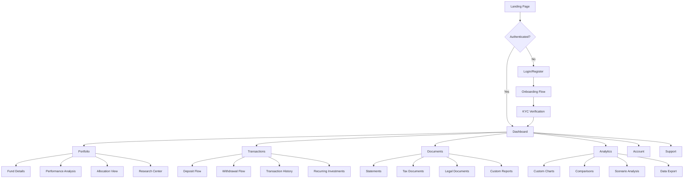

# Indigo Yield Platform - Navigation Flows & User Journeys

## 1. Master Navigation Flow



## 2. Critical User Journeys

### 2.1 NEW INVESTOR ONBOARDING JOURNEY

```yaml
Journey: First-Time Investor Onboarding
Duration: 20-25 minutes
Success Rate Target: 85%

Steps:
  1. Landing Page:
     - View value proposition
     - Click "Get Started"
     - Time: 1 min

  2. Registration:
     - Enter email/password
     - Verify email
     - Time: 2 min

  3. Account Type:
     - Select Individual/Entity
     - Enter basic info
     - Time: 2 min

  4. KYC Process:
     - Upload ID (passport/license)
     - Selfie verification
     - Address proof
     - Time: 5 min

  5. Tax Information:
     - Complete W-9/W-8
     - Tax ID verification
     - Time: 3 min

  6. Investment Profile:
     - Risk assessment quiz
     - Investment goals
     - Time horizon
     - Time: 3 min

  7. Initial Funding:
     - Choose deposit method
     - Link bank account
     - Initial deposit amount
     - Time: 4 min

  8. Welcome Dashboard:
     - Tour key features
     - Set preferences
     - Enable notifications
     - Time: 2 min

Exit Points:
  - Email verification (5% drop)
  - Document upload (8% drop)
  - Bank linking (7% drop)

Recovery Strategies:
  - Save progress
  - Email reminders
  - Live chat support
  - Mobile document capture
```

### 2.2 DEPOSIT FLOW JOURNEY

```yaml
Journey: Making a Deposit
Duration: 3-5 minutes
Success Rate Target: 95%

Entry Points:
  - Dashboard quick action
  - Portfolio page
  - Transaction menu
  - Push notification

Flow Variants:

ACH Transfer:
  1. Select "Deposit"
  2. Choose "Bank Transfer"
  3. Select linked bank
  4. Enter amount
  5. Select fund allocation
  6. Review details
  7. Confirm with 2FA
  8. Success confirmation

Wire Transfer:
  1. Select "Deposit"
  2. Choose "Wire Transfer"
  3. Generate wire instructions
  4. Reference number
  5. Send to bank
  6. Track status

Crypto Deposit:
  1. Select "Deposit"
  2. Choose "Crypto"
  3. Select cryptocurrency
  4. Generate wallet address
  5. QR code display
  6. Confirm receipt
  7. Convert to fund

Mobile Optimizations:
  - Apple Pay integration
  - Google Pay support
  - Biometric confirmation
  - Camera for check deposit
```

### 2.3 WITHDRAWAL JOURNEY

```yaml
Journey: Fund Withdrawal
Duration: 5-7 minutes
Success Rate Target: 92%

Security Checkpoints:
  - Login verification
  - 2FA confirmation
  - Withdrawal limits check
  - Fraud detection
  - Final confirmation

Steps:
  1. Portfolio Review:
     - Current balance check
     - Available funds
     - Pending transactions

  2. Initiate Withdrawal:
     - Click "Withdraw"
     - Select fund(s)
     - Enter amount

  3. Destination Selection:
     - Linked bank account
     - New account (verify)
     - Crypto wallet

  4. Tax Implications:
     - Show tax preview
     - Capital gains estimate
     - Withholding options

  5. Review & Confirm:
     - Summary display
     - Fee disclosure
     - Processing time
     - Terms acceptance

  6. Security Verification:
     - 2FA code
     - Biometric (mobile)
     - Security questions

  7. Confirmation:
     - Transaction ID
     - Email confirmation
     - Status tracking
     - Expected arrival

Post-Withdrawal:
  - Status updates
  - Email notifications
  - Tax document generation
  - Portfolio rebalancing alert
```

### 2.4 TAX DOCUMENT ACCESS JOURNEY

```yaml
Journey: Accessing Tax Documents
Duration: 2-3 minutes
Peak Season: January-April

User Goals:
  - Find current year forms
  - Download for tax software
  - Review cost basis
  - Export transaction history

Steps:
  1. Navigate to Documents:
     - Via dashboard alert (tax season)
     - Documents menu
     - Tax center shortcut

  2. Tax Document Hub:
     - Year selector
     - Document type filter
     - Generation status

  3. Document Selection:
     - 1099-DIV
     - 1099-INT
     - 1099-B
     - K-1 forms

  4. View Options:
     - Preview in-app
     - Download PDF
     - Email copy

  5. Export Options:
     - TurboTax integration
     - CSV export
     - API access
     - Print version

Mobile Considerations:
  - Document viewer
  - Secure download
  - Share to tax apps
  - Offline access
```

## 3. Mobile-First User Flows

### 3.1 iOS QUICK ACTIONS FLOW

```yaml
Feature: 3D Touch / Haptic Touch
Available Actions:
  - Check Balance
  - Quick Deposit
  - Recent Activity
  - Market Status

Implementation:
  1. Hard Press App Icon
  2. Select Quick Action
  3. Biometric Auth
  4. Direct Navigation
  5. Complete Action

Widget Integration:
  - Balance widget
  - Performance widget
  - Activity widget
  - Market widget
```

### 3.2 FACE ID TRANSACTION FLOW

```yaml
Feature: Biometric Transaction Authorization
Supported Transactions:
  - Deposits > $10,000
  - All withdrawals
  - Profile changes
  - Beneficiary updates

Flow:
  1. Initiate Transaction
  2. Review Details
  3. Face ID Prompt
  4. Scan Face
  5. Process Transaction
  6. Haptic Confirmation

Fallback:
  - Passcode option
  - 2FA SMS
  - Security questions
```

## 4. Progressive Disclosure Patterns

### 4.1 DASHBOARD INFORMATION HIERARCHY

```yaml
Level 1 - Immediate Visibility:
  - Total Portfolio Value
  - Today's Change
  - YTD Return
  - Quick Actions

Level 2 - One Tap/Click:
  - Individual Fund Performance
  - Recent Transactions
  - Pending Actions
  - Market Summary

Level 3 - Detailed Views:
  - Historical Charts
  - Detailed Analytics
  - Transaction History
  - Document Archive

Progressive Loading:
  - Initial: Core metrics (< 1s)
  - Secondary: Charts (< 2s)
  - Tertiary: History (< 3s)
  - On-demand: Reports
```

### 4.2 PORTFOLIO DETAIL PROGRESSION

```yaml
Collapsed State:
  - Fund Name
  - Current Value
  - Daily Change
  - Allocation %

Expanded State:
  - Performance Chart
  - Key Metrics
  - Recent Activity
  - Quick Actions

Detail View:
  - Full Analytics
  - Historical Data
  - Transactions
  - Documents
  - Research
```

## 5. Error Recovery Flows

### 5.1 FAILED TRANSACTION RECOVERY

```yaml
Error Types:
  - Insufficient Funds
  - Technical Error
  - Verification Failed
  - Limit Exceeded
  - Network Issue

Recovery Flow:
  1. Clear Error Message
  2. Specific Guidance
  3. Alternative Options
  4. Save Progress
  5. Support Access
  6. Retry Mechanism

Example - Insufficient Funds:
  Message: "Insufficient funds in linked account"
  Actions:
    - Check account balance
    - Try different amount
    - Use different account
    - Schedule for later
    - Contact support
```

### 5.2 KYC FAILURE RECOVERY

```yaml
Common Failures:
  - Document unclear
  - Expired ID
  - Address mismatch
  - Selfie verification failed

Recovery Process:
  1. Specific Error:
     "ID photo is unclear - corners must be visible"

  2. Visual Guide:
     Show example of correct photo

  3. Retry Options:
     - Retake photo
     - Upload from gallery
     - Use different document

  4. Alternative Path:
     - Manual verification
     - Schedule video call
     - Visit branch

  5. Save Progress:
     - Partial completion saved
     - Resume later option
     - Email reminder
```

## 6. Accessibility Navigation Patterns

### 6.1 KEYBOARD NAVIGATION MAP

```yaml
Tab Order:
  1. Skip to main content
  2. Primary navigation
  3. Main content area
  4. Secondary actions
  5. Footer navigation

Keyboard Shortcuts:
  - Alt+D: Dashboard
  - Alt+P: Portfolio
  - Alt+T: Transactions
  - Alt+H: Help
  - Esc: Close modal
  - /: Search

Focus Management:
  - Visible focus indicators
  - Focus trap in modals
  - Return focus on close
  - Skip repetitive elements
```

### 6.2 SCREEN READER FLOW

```yaml
Announcement Pattern:
  - Page title
  - Section heading
  - Content summary
  - Available actions

Dynamic Updates:
  - ARIA live regions
  - Status announcements
  - Error alerts
  - Success confirmations

Navigation Aids:
  - Landmark regions
  - Heading hierarchy
  - List structures
  - Table headers
```

## 7. Cross-Platform Handoff Flows

### 7.1 WEB TO MOBILE HANDOFF

```yaml
Scenario: Start on Web, Continue on Mobile

Triggers:
  - QR code on web
  - Email magic link
  - SMS deep link
  - Push notification

Example Flow:
  1. Complex form started on web
  2. Save progress
  3. Generate continue link
  4. Send to mobile
  5. Open in app
  6. Resume exactly where left off
  7. Complete on mobile

Supported Handoffs:
  - Onboarding process
  - Document upload
  - Transaction approval
  - Report viewing
```

### 7.2 MOBILE TO WEB HANDOFF

```yaml
Scenario: Start on Mobile, Complete on Web

Use Cases:
  - Complex analytics
  - Bulk operations
  - Document printing
  - Advanced trading

Implementation:
  1. Save state on mobile
  2. Generate session token
  3. Email/SMS link
  4. Open on desktop
  5. Restore full context
  6. Enhanced capabilities

Data Sync:
  - Real-time sync
  - Conflict resolution
  - Offline capability
  - Version control
```

## 8. Notification-Driven Flows

### 8.1 PUSH NOTIFICATION ACTIONS

```yaml
Rich Notifications:

Price Alert:
  Title: "Fund XYZ up 5%"
  Body: "Current value: $125,000"
  Actions:
    - View Details
    - Buy More
    - Dismiss

Transaction Complete:
  Title: "Deposit Successful"
  Body: "$10,000 added to account"
  Actions:
    - View Portfolio
    - Make Another
    - Share

Document Ready:
  Title: "Tax Documents Available"
  Body: "2023 1099 forms ready"
  Actions:
    - Download
    - View
    - Email
```

### 8.2 EMAIL WORKFLOW TRIGGERS

```yaml
Transactional Emails:

Triggers:
  - Account opened
  - KYC approved
  - Deposit received
  - Withdrawal processed
  - Statement available
  - Tax document ready
  - Security alert

Smart Actions:
  - One-click verify
  - Quick approve
  - Direct download
  - Instant support
```

## 9. Advanced Search & Filter Flows

### 9.1 GLOBAL SEARCH PATTERN

```yaml
Search Triggers:
  - Header search bar
  - CMD+K (web)
  - Spotlight (iOS)
  - Voice search

Search Modes:
  1. Quick Search:
     - Funds
     - Transactions
     - Documents
     - Help articles

  2. Advanced Search:
     - Date ranges
     - Amount ranges
     - Document types
     - Multiple criteria

  3. Smart Suggestions:
     - Recent searches
     - Popular searches
     - Contextual hints
     - Typo correction

Results Display:
  - Grouped by type
  - Preview on hover
  - Quick actions
  - Save search
```

### 9.2 CONTEXTUAL FILTERING

```yaml
Transaction Filters:
  - Date range
  - Amount range
  - Transaction type
  - Fund
  - Status

Applied Filter Display:
  - Chip/badge UI
  - Clear individual
  - Clear all
  - Save filter set

Smart Defaults:
  - Last 30 days
  - Current tax year
  - This month
  - Custom range
```

## 10. Performance Optimization Flows

### 10.1 LAZY LOADING PATTERN

```yaml
Initial Load:
  - Critical content
  - Above the fold
  - Core metrics

Progressive Enhancement:
  - Charts on scroll
  - Images on demand
  - History pagination
  - Infinite scroll

Preloading Strategy:
  - Next likely page
  - User patterns
  - Popular paths
  - Predictive fetch
```

### 10.2 OFFLINE CAPABILITY FLOW

```yaml
Offline Features:
  - View cached data
  - Queue transactions
  - Read documents
  - Calculate projections

Sync on Reconnect:
  1. Detect connection
  2. Queue sync
  3. Validate data
  4. Update UI
  5. Notify user

Conflict Resolution:
  - Server priority
  - User confirmation
  - Merge changes
  - Version history
```

---

*This document provides comprehensive navigation flows and user journey specifications for the Indigo Yield Platform, ensuring consistent and optimized experiences across all platforms.*