# System Architecture

> Last updated: 2026-01-12

## Overview

This is a **Financial Fund Management Platform** built with React, TypeScript, and Supabase. It manages investor portfolios, yield distributions, withdrawals, and comprehensive audit trails for a regulated financial environment.

## Technology Stack

| Layer | Technology |
|-------|------------|
| **Frontend** | React 18, TypeScript, Vite |
| **Styling** | Tailwind CSS, shadcn/ui, Framer Motion |
| **State** | React Query (TanStack Query v5), Zustand |
| **Backend** | Supabase (PostgreSQL, Edge Functions, Auth) |
| **Security** | Row Level Security (RLS), JWT, TOTP 2FA |

## Directory Structure

```
src/
├── components/           # UI components (admin/, investor/, common/, ui/)
├── hooks/
│   ├── data/
│   │   ├── admin/       # Admin-only data hooks (60+)
│   │   ├── investor/    # Investor-facing hooks (14+)
│   │   └── shared/      # Shared hooks (27+)
│   └── ui/              # UI-specific hooks
├── services/
│   ├── admin/           # Admin business logic
│   ├── investor/        # Investor business logic
│   ├── core/            # Shared core services
│   └── auth/            # Authentication (AuthContext, MFA)
├── pages/               # Route pages
├── routing/             # Route definitions
├── types/               # TypeScript types & interfaces
├── utils/               # Pure utility functions
├── lib/                 # Configuration & validation
└── integrations/        # External service integrations (Supabase)
```

## Authentication Flow

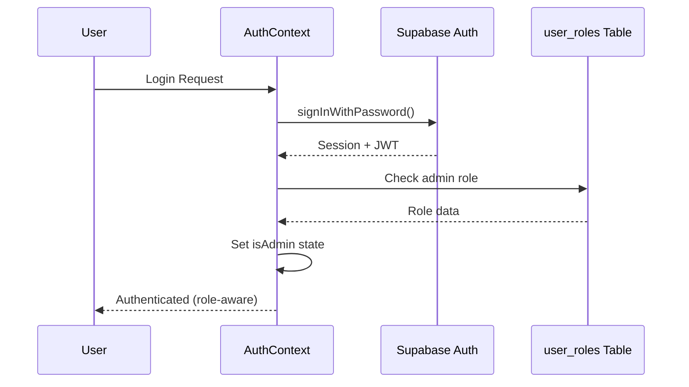

### Security Patterns

1. **Fail-Closed Design**: If role check fails, user is treated as non-admin
2. **Double-Admin Verification**: Admin status checked in both `user_roles` table AND JWT
3. **Session Persistence**: Uses Supabase session with automatic refresh

## Row Level Security (RLS)

All tables use RLS with these patterns:

| Pattern | Description |
|---------|-------------|
| `auth.uid() = user_id` | User can only access own data |
| `OR is_admin()` | Admins can access all data |
| `is_super_admin()` | Super admin bypass for critical operations |

### Critical Security Function

```sql
CREATE FUNCTION is_admin() RETURNS boolean AS $$
  SELECT EXISTS (
    SELECT 1 FROM user_roles
    WHERE user_id = auth.uid()
    AND role IN ('admin', 'super_admin')
  );
$$ LANGUAGE sql SECURITY DEFINER SET search_path = public;
```

> **Note**: All SECURITY DEFINER functions have `SET search_path = public` to prevent search-path injection attacks.

## Data Integrity Patterns

### Ledger-Derived Positions

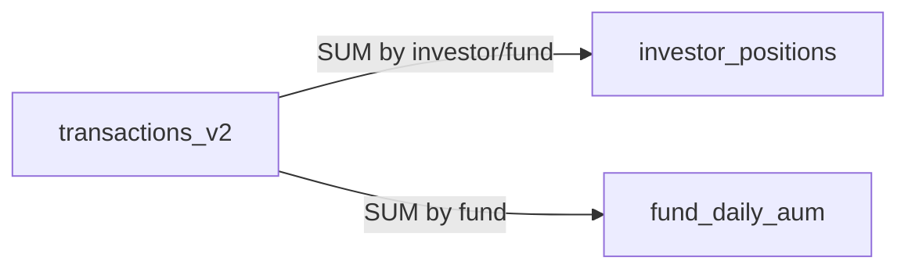

Positions are **always** derivable from the transaction ledger. The `recompute_investor_position()` RPC recalculates positions from non-voided transactions.

### Void-Recompute Chain

When a transaction is voided:

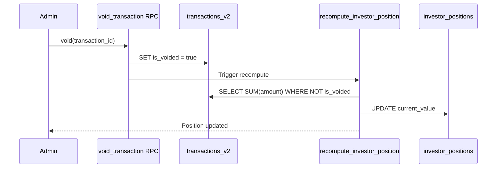

### Idempotency

- `transactions_v2.reference_id` has a UNIQUE constraint
- Yield distributions use deterministic reference IDs: `yield-{fundId}-{date}-{investorId}`
- Re-running the same distribution is a no-op

## React Query Patterns

### Query Key Structure

```typescript
// Hierarchical keys for cache invalidation
QUERY_KEYS = {
  adminTransactions: (filters) => ["admin", "transactions", filters],
  investorPositions: (investorId) => ["investor", investorId, "positions"],
  fundAum: (fundId) => ["fund", fundId, "aum"],
};
```

### Optimistic Updates

Mutations use optimistic updates with rollback:

```typescript
useMutation({
  onMutate: async (newData) => {
    await queryClient.cancelQueries({ queryKey });
    const previous = queryClient.getQueryData(queryKey);
    queryClient.setQueryData(queryKey, optimisticData);
    return { previous };
  },
  onError: (err, newData, context) => {
    queryClient.setQueryData(queryKey, context.previous); // Rollback
  },
  onSettled: () => {
    queryClient.invalidateQueries({ queryKey });
  },
});
```

## Yield Distribution Flow (Enhanced)

The yield distribution process includes temporal lock enforcement, conservation checks, and dust routing:

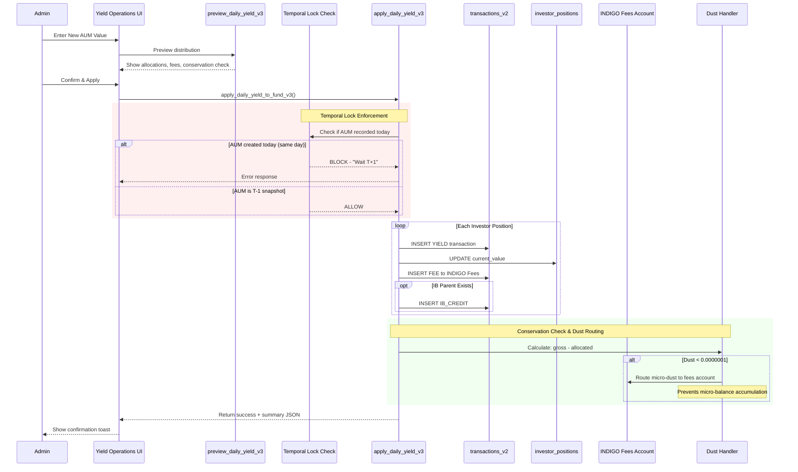

> **Temporal Lock**: Yield must be calculated against a T-1 AUM snapshot. Same-day distributions are blocked unless `temporal_lock_bypass = true`.

> **Dust Routing**: Micro-amounts below `0.0000001` are routed to the INDIGO Fees account to prevent accumulation of "dust" balances that display as ~0.

### Detailed Yield Distribution Logic

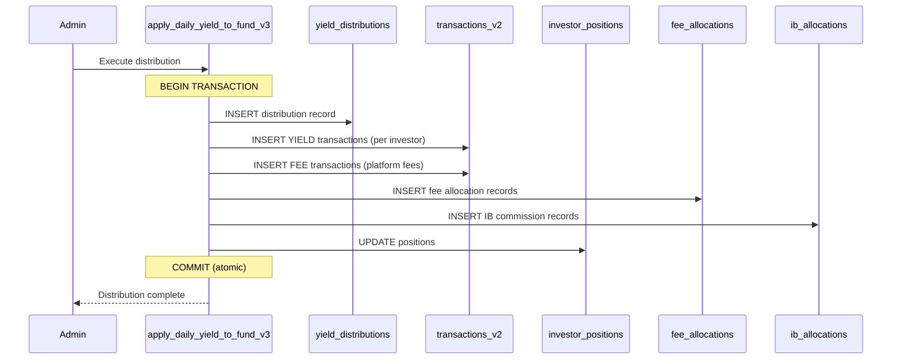

> **Atomicity**: The entire distribution is wrapped in a single database transaction. If any step fails, everything rolls back.

## Yield-to-Fee-to-IB Waterfall

The yield distribution follows a strict fee waterfall to ensure conservation of funds:

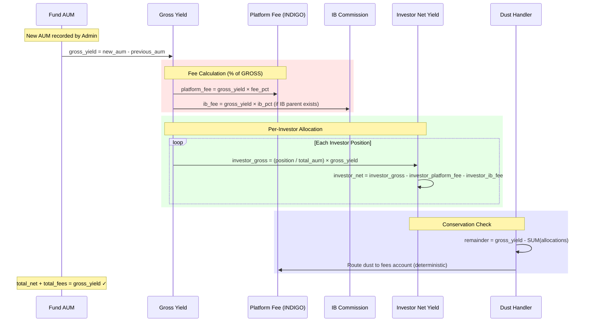

### Fee Calculation Standard

| Fee Type | Calculation Base | Recipient |
|----------|------------------|-----------|
| Platform Fee (INDIGO) | % of **GROSS** yield | INDIGO Fees account |
| Introducing Broker (IB) | % of **GROSS** yield | IB Parent investor |
| Investor Net Yield | Gross - Platform - IB | Source investor |

> **Critical**: Both fees are calculated from GROSS yield, not NET yield. This prevents circular dependencies and ensures deterministic results.

### Dust Handling

Rounding residuals from allocation are deterministically routed to the **INDIGO Fees account** to ensure:
1. **Conservation**: SUM(allocations) = gross_yield exactly
2. **Determinism**: Same inputs always produce same outputs
3. **Auditability**: Dust recorded in `yield_distributions.dust_amount`
4. **Threshold**: Only residuals `< 0.0000001` (10⁻⁷) are routed as dust

> **Note:** Dust is routed to the fees account (not largest position holder) to prevent micro-balance accumulation on investor accounts and simplify reconciliation.

## Withdrawal Lock-in Flow

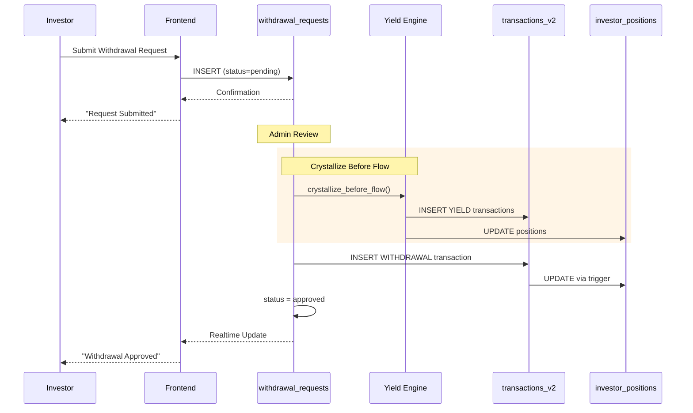

The `useAvailableBalance` hook prevents over-withdrawal:

```typescript
availableBalance = positionValue - pendingWithdrawals
```

**Server-Side Validation**: The `validate_withdrawal_request` trigger enforces this at the database level.

## Temporal Lock (T-1 Snapshot Rule)

Yield must be calculated against a T-1 AUM snapshot. The `validate_yield_temporal_lock` RPC blocks distributions where AUM was recorded on the same day as the yield date, ensuring NAV integrity.

## Immutable Field Protection

Critical audit fields are protected by database triggers:

| Table | Protected Fields | Trigger |
|-------|------------------|---------|
| `transactions_v2` | `created_at`, `reference_id`, `investor_id`, `fund_id` | `protect_transactions_immutable` |
| `fee_allocations` | `created_at`, `distribution_id`, `investor_id` | `protect_fee_allocations_immutable` |
| `ib_allocations` | `created_at`, `distribution_id`, `source_investor_id`, `ib_investor_id` | `protect_ib_allocations_immutable` |
| `audit_log` | ALL fields | `protect_audit_log_immutable` |

## Delta Audit System

The platform uses a high-efficiency **delta audit pattern** that logs only the changed fields rather than entire rows, reducing storage by ~80-90%.

### Components

| Component | Description |
|-----------|-------------|
| `compute_jsonb_delta(old, new)` | Computes the difference between two JSONB objects |
| `audit_delta_trigger()` | Universal trigger function attached to critical tables |

### Covered Tables

| Table | Trigger Name | Event |
|-------|--------------|-------|
| `transactions_v2` | `delta_audit_transactions_v2` | AFTER UPDATE |
| `investor_positions` | `delta_audit_investor_positions` | AFTER UPDATE |
| `yield_distributions` | `delta_audit_yield_distributions` | AFTER UPDATE |
| `withdrawal_requests` | `delta_audit_withdrawal_requests` | AFTER UPDATE |

### Delta Format in audit_log

```json
{
  "is_voided": { "old": false, "new": true },
  "void_reason": { "old": null, "new": "Duplicate entry correction" }
}
```

> **Verification Query**: `SELECT tgname, tgrelid::regclass FROM pg_trigger WHERE tgname LIKE 'delta_audit_%';`

> **Security**: Even super admins cannot modify these fields—ensures audit trail integrity.

## Financial Error Boundary

The `FinancialErrorBoundary` component provides a safety net for financial operations:

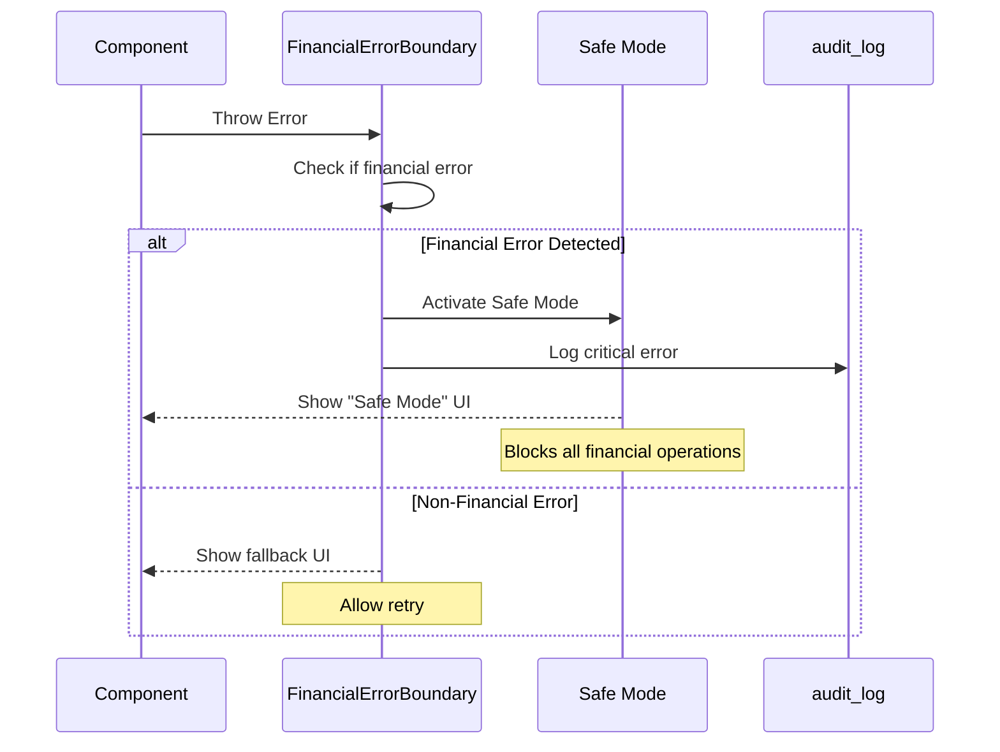

Financial errors are detected by keywords: `ledger`, `balance`, `transaction`, `position`, `yield`, `fee`, `aum`, `conservation`.

## Error Handling

1. **Service Layer**: Throws typed errors with context
2. **Hook Layer**: Catches and transforms to user-friendly messages
3. **UI Layer**: Displays via Sonner toast notifications
4. **Audit**: All errors logged to `audit_log` table

## Optimistic Updates Pattern

All mutation hooks implement revert-on-failure:

```typescript
useMutation({
  onMutate: async (newData) => {
    await queryClient.cancelQueries({ queryKey });
    const previous = queryClient.getQueryData(queryKey);
    queryClient.setQueryData(queryKey, optimisticData);
    return { previous }; // Snapshot for rollback
  },
  onError: (err, newData, context) => {
    queryClient.setQueryData(queryKey, context.previous); // Rollback
    toast.error(err.message);
  },
  onSettled: () => {
    queryClient.invalidateQueries({ queryKey }); // Always refetch
  },
});
```

## Monitoring Views

### Core Integrity Views (2026-01-12 Update)

| View | Purpose | Used By |
|------|---------|---------|
| `v_ledger_reconciliation` | Position vs transaction totals mismatch | SystemHealthPage, Integrity Scheduler |
| `fund_aum_mismatch` | Reported AUM vs sum of positions | SystemHealthPage, Integrity Scheduler |
| `v_orphaned_positions` | Positions without valid profiles or funds | SystemHealthPage, Integrity Scheduler |
| `v_orphaned_transactions` | Transactions without valid profiles | SystemHealthPage, Integrity Scheduler |
| `v_fee_calculation_orphans` | Fee calculations without valid positions | SystemHealthPage, Integrity Scheduler |
| `v_position_transaction_variance` | Detailed position vs transaction breakdown | SystemHealthPage, Integrity Scheduler |
| `v_security_definer_audit` | Audit SECURITY DEFINER functions for search_path | Security audit |

### Automated Integrity Scheduler

The platform includes an automated integrity checking system:

| Component | Description |
|-----------|-------------|
| `system_health_snapshots` table | Stores historical integrity check results |
| `run_integrity_check(trigger_type)` RPC | Executes all integrity views and stores snapshot |
| `get_health_trend(days)` RPC | Returns daily aggregated health metrics |
| `get_latest_health_status()` RPC | Returns most recent snapshot with status |
| `scheduled-integrity-check` Edge Function | HTTP endpoint for scheduled/manual triggers |

**Scheduled Execution**: The integrity check runs daily via scheduled trigger (cron or external scheduler) and stores results for historical trend analysis.

**Alert Thresholds**:
- `healthy`: 0 anomalies
- `warning`: 1-5 anomalies
- `critical`: >5 anomalies (triggers alert logging)

## Real-Time Integrity Architecture (2026-01 Upgrade)

The platform has migrated from batch-based reconciliation to a **real-time-first** integrity system.

### Architecture Overview

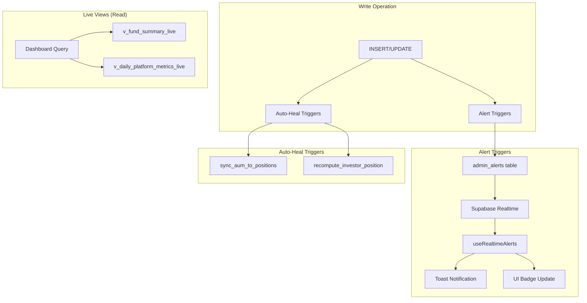

### Real-Time Alert Triggers

| Trigger | Table | Detects |
|---------|-------|---------|
| `trg_alert_aum_position_mismatch` | `investor_positions` | Position change causing AUM drift |
| `trg_alert_yield_conservation` | `yield_distributions` | Gross ≠ net + fees violation |
| `trg_alert_ledger_drift` | `transactions_v2` | Ledger sum vs position mismatch |

### Auto-Healing Triggers

| Trigger | Table | Repairs |
|---------|-------|---------|
| `trg_auto_heal_aum` | `investor_positions` | Syncs fund_daily_aum to position totals |
| `trg_auto_heal_position` | `transactions_v2` | Recomputes position from ledger |

### Live Views (Replaced Materialized Views)

| Live View | Replaces | Benefit |
|-----------|----------|---------|
| `v_fund_summary_live` | `mv_fund_summary` | Instant accuracy, no refresh needed |
| `v_daily_platform_metrics_live` | `mv_daily_platform_metrics` | Real-time dashboard metrics |

### Frontend Integration

```typescript
// Real-time alert subscription
import { useRealtimeAlerts } from "@/hooks/data/admin/useRealtimeAlerts";

// In admin dashboard:
useRealtimeAlerts(); // Shows toast on new alerts, invalidates queries

// Live metrics (no MV refresh needed)
import { useLivePlatformMetrics } from "@/hooks/data/shared/useLivePlatformMetrics";
const { metrics, fundSummaries } = useLivePlatformMetrics();
```

### Cron Jobs (Now Audit-Only)

| Job | Previous Role | Current Role |
|-----|---------------|--------------|
| `nightly_aum_reconciliation` | Primary repair | Secondary verification |
| `scheduled-integrity-check` | Batch detection | Historical audit trail |

> **Key Benefit**: Issues are detected and fixed at write-time, not during nightly batch runs.

### Legacy Integrity Views

| View | Purpose | Status |
|------|---------|--------|
| `investor_position_ledger_mismatch` | Legacy position/ledger sync check | Superseded by `v_ledger_reconciliation` |
| `v_orphaned_user_roles` | Orphaned role entries | Available |
| `yield_distribution_conservation_check` | Validates yield math | Available |
| `v_fee_allocation_orphans` | Orphan fee allocation records | Available |
| `v_ib_allocation_orphans` | Orphan IB allocation records | Available |
| `v_period_orphans` | Orphaned statement periods | Available |
| `v_transaction_distribution_orphans` | Orphaned transaction-distribution links | Available |
| `position_transaction_reconciliation` | Alternative reconciliation check | Available |

### Integrity RPCs

| Function | Purpose |
|----------|---------|
| `run_integrity_check(p_triggered_by)` | Executes all integrity views and stores snapshot |
| `get_health_trend(p_days)` | Returns historical health trend data |
| `get_latest_health_status()` | Returns most recent health snapshot |
| `check_duplicate_transaction_refs()` | Detects duplicate transaction references |
| `check_duplicate_ib_allocations()` | Detects duplicate IB allocation entries |

## Key Design Decisions

1. **Snake_case (DB) → camelCase (Frontend)**: All data mappers handle this conversion
2. **Unified Investor ID**: `profiles.id` is the single source of truth for investor identity
3. **Audit Everything**: All mutations create audit trail entries
4. **Fail-Safe RLS**: Logging tables have permissive INSERT policies to ensure logs always succeed
5. **Server-Side Validation**: Critical business rules enforced in database triggers, not just UI

## Schema Synchronization

### Column Naming Convention

| Layer | Convention | Example |
|-------|------------|---------|
| PostgreSQL | snake_case | `tx_date`, `investor_id`, `fund_class` |
| TypeScript (DB Types) | snake_case | `tx_date: string` |
| UI Components | camelCase | `txDate`, `investorId` |

### Transform Boundary

All camelCase → snake_case transformation happens at the **Zod schema layer** using `.transform()`:

```typescript
// src/lib/validation/schemas.ts
export const adminTransactionDbSchema = z.object({
  investorId: z.string().uuid(),
  txDate: z.string(),
  // ...
}).transform((data) => ({
  investor_id: data.investorId,
  tx_date: data.txDate,
  // ...
}));
```

This ensures that by the time data reaches the service layer, it is already in the correct database format.

### Verified Trigger Column References

| Trigger Function | Table | Column Used | Status |
|------------------|-------|-------------|--------|
| `validate_transaction_has_aum` | transactions_v2 | `tx_date` | ✅ Fixed 2026-01-10 |
| `void_transaction` | transactions_v2 | `tx_date` | ✅ Fixed 2026-01-10 |
| `create_withdrawal_request` | withdrawal_requests | N/A | ✅ Advisory Lock Added 2026-01-10 |
| `delta_audit_transactions_v2` | transactions_v2 | `*` (all columns) | ✅ Active |
| `protect_transactions_immutable` | transactions_v2 | `created_at`, `reference_id` | ✅ Active |
| `delta_audit_investor_positions` | investor_positions | `*` (all columns) | ✅ Active |
| `cascade_void_to_yield_events` | yield_distributions | `::uuid` cast | ✅ Fixed 2026-01-10 |
| `delta_audit_yield_distributions` | yield_distributions | `*` (all columns) | ✅ Active |

### Advisory Lock Coverage

| Function | Lock Present | Lock Key Pattern |
|----------|--------------|------------------|
| `apply_daily_yield_to_fund_v3` | ✅ Yes | `yield:fund_id:date` |
| `approve_withdrawal` | ✅ Yes | `withdrawal:request_id` |
| `complete_withdrawal` | ✅ Yes | `withdrawal:request_id` |
| `admin_create_transaction` | ✅ Yes | `tx:investor_id:fund_id` |
| `create_withdrawal_request` | ✅ Yes | `withdrawal_request:investor_id:fund_id` |

### Transform Schema Reference

| Schema | Source (camelCase) | Target (snake_case) |
|--------|-------------------|---------------------|
| `adminTransactionDbSchema` | `txDate` | `tx_date` |
| `voidTransactionDbSchema` | `transactionId` | `transaction_id` |
| `withdrawalApprovalDbSchema` | `requestId` | `request_id` |
| `yieldPreviewDbSchema` | `fundId`, `targetDate` | `p_fund_id`, `p_target_date` |
| `aumRecordDbSchema` | `fundId`, `aumDate` | `fund_id`, `aum_date` |

### Realtime Subscription Privacy Filters

Investor-facing realtime subscriptions are scoped to the current user:

```typescript
useRealtimeSubscription({
  channel: `investor-overview-positions-${user?.id}`,
  table: "investor_positions",
  filter: `investor_id=eq.${user.id}`,  // Privacy filter
  onChange: () => invalidateQueries(),
});
```

This prevents cross-user data leakage in realtime updates.

---

## Transaction Lifecycle with Advisory Locking

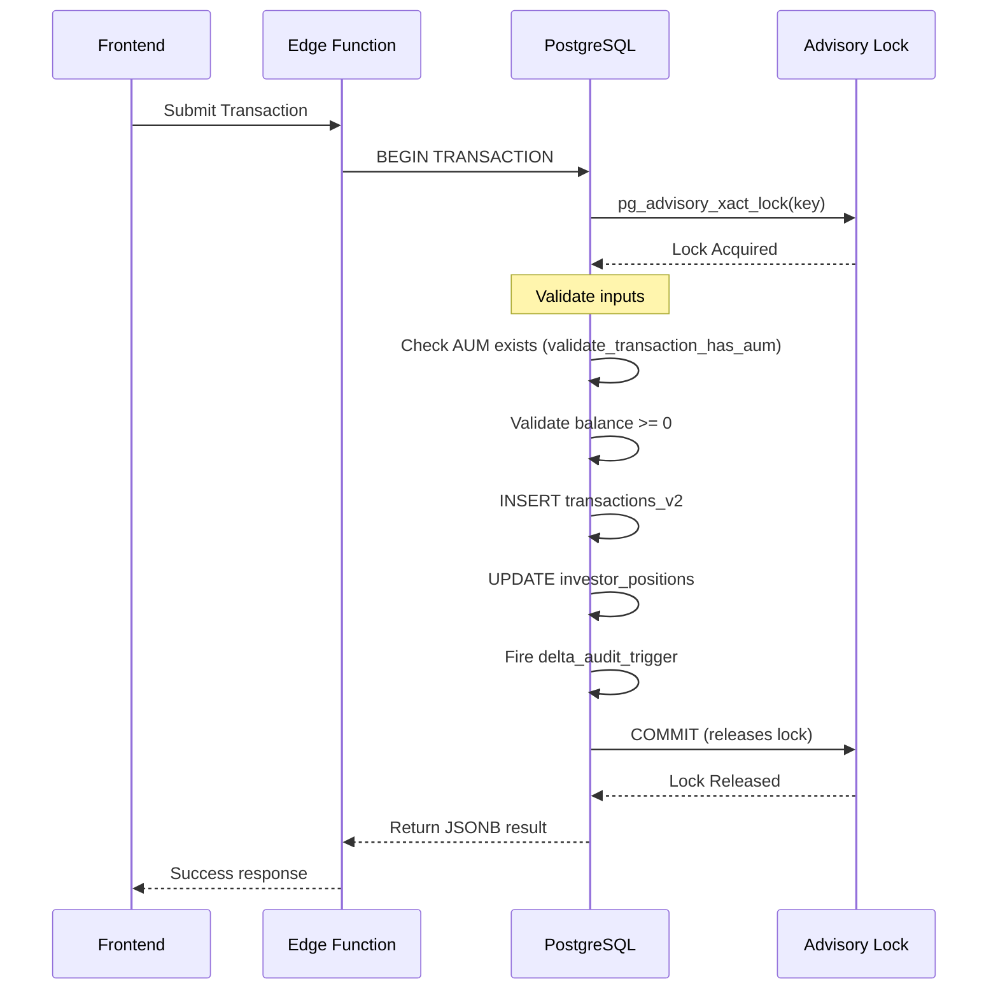

### Void Transaction Flow

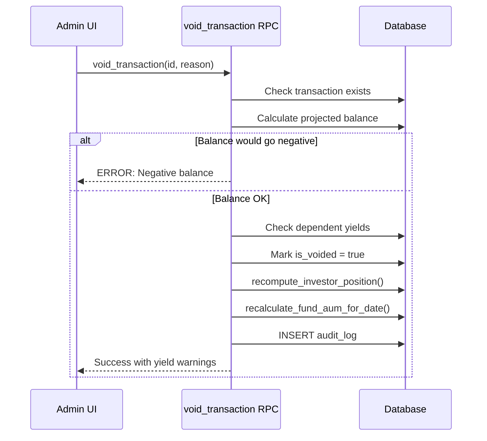

---

## Type-Safety & Casting Standards

### UUID vs Text Handling

| Table | Column | Type | Cast Pattern |
|-------|--------|------|--------------|
| `audit_log` | `entity_id` | text | `value::text` (flexible for multiple table types) |
| `data_edit_audit` | `record_id` | uuid | `value::uuid` (strict) |
| `yield_edit_audit` | `record_id` | uuid | `value::uuid` (strict) |

### Database Casting Rules

1. **audit_log.entity_id**: Always cast to `::text` (supports multiple table types)
2. **data_edit_audit.record_id**: Always cast to `::uuid` (strict table-specific)
3. **yield_edit_audit.record_id**: Always cast to `::uuid` (strict)

### Function Patterns

```sql
-- For audit_log (text entity_id):
INSERT INTO audit_log (entity_id, ...) VALUES (NEW.id::text, ...);

-- For data_edit_audit (uuid record_id):
INSERT INTO data_edit_audit (record_id, ...) VALUES (COALESCE(NEW.id, OLD.id)::uuid, ...);

-- For comparisons on uuid columns:
WHERE record_id = p_id::uuid
```

### Zod Frontend Guard

All ID fields use `strictUuidSchema` for validation before network requests:

```typescript
export const strictUuidSchema = z
  .string()
  .uuid("Invalid UUID format")
  .refine(
    (val) => /^[0-9a-f]{8}-[0-9a-f]{4}-...$/i.test(val),
    "UUID must be in standard format"
  );

// Usage in schemas:
investorId: strictUuidSchema,
fundId: strictUuidSchema,
transactionId: strictUuidSchema,
```

---

## Sovereign System Health Certificate

> **Certification Date:** 2026-01-12 (Security Hardening & Integrity Views)
> **Previous Certification:** 2026-01-11
> **Status:** ✅ INSTITUTIONALLY READY - All Critical Checks Pass

### Security Layer

| Check | Status | Details |
|-------|--------|---------|
| SECURITY DEFINER Functions | ✅ HARDENED | All 65 functions now have `SET search_path = public` (remediation 2026-01-12) |
| View Security Invoker | ✅ PASS | `v_ledger_reconciliation` uses `security_invoker=true` |
| Field Immutability Triggers | ✅ PASS | `created_at`, `reference_id`, `actor_user` protected |
| Idempotency Constraints | ✅ PASS | Unique constraints on `(fund_id, purpose, period_end)` |
| Advisory Locking | ✅ ENHANCED | 7 critical functions protected (added `get_void_transaction_impact` 2026-01-12) |
| Delta Audit Triggers | ✅ ACTIVE | 4 tables: transactions_v2, investor_positions, yield_distributions, withdrawal_requests |
| Void Yield Dependency | ✅ ACTIVE | `void_transaction` returns yield warnings with advisory lock |
| Two-Key MFA Protocol | ✅ ACTIVE | Super-admin signature required for MFA resets |
| UUID Type-Safety | ✅ PASS | `::uuid` casts in all 5 audit triggers |
| Security Definer Audit View | ✅ ACTIVE | `v_security_definer_audit` for ongoing monitoring |

### Data Integrity Layer

| Metric | Status | Verified By |
|--------|--------|-------------|
| Ledger ↔ Position Sync | ✅ 0 mismatches | `v_ledger_reconciliation` |
| AUM Conservation | ✅ 0 violations | `fund_aum_mismatch` |
| Yield Conservation | ✅ 0 violations | `yield_distribution_conservation_check` |
| Reference ID Uniqueness | ✅ PASS | Unique index active |
| Orphan Positions | ✅ PASS | `v_orphaned_positions` |
| Orphan Transactions | ✅ PASS | `v_orphaned_transactions` |
| Fee Calculation Orphans | ✅ PASS | `v_fee_calculation_orphans` |
| Position/Tx Variance | ✅ PASS | `v_position_transaction_variance` |
| Column Naming | ✅ PASS | All triggers use `tx_date` (not `transaction_date`) |
| Type Casting | ✅ PASS | All UUID/text assignments explicitly cast |
| TypeScript Financial Types | ✅ HARDENED | All financial fields use `string` for NUMERIC(28,10) precision |
| Automated Health Checks | ✅ NEW | `system_health_snapshots` with daily scheduler |

### UI Safety Layer

| Check | Status | Details |
|-------|--------|---------|
| FinancialErrorBoundary | ✅ Active | Graceful error handling for financial displays |
| FinancialValue Precision | ✅ 95%+ | Consistent decimal formatting across platform |
| ResponsiveTable Coverage | ✅ Active | Mobile-friendly data tables (5+ pages) |
| Withdrawal Lock-in | ✅ PASS | Server-side validation active |
| Optimistic Updates | ✅ PASS | All mutations implement rollback |
| Zod Transform Schemas | ✅ PASS | 8 schemas with camelCase → snake_case transforms |
| strictUuidSchema Guard | ✅ PASS | 12 schemas standardized: `adminDepositSchema`, `adminWithdrawalSchema`, `adminTransactionDbSchema`, `withdrawalApprovalDbSchema`, `yieldPreviewDbSchema`, `aumRecordDbSchema`, `investorPositionQueryDbSchema`, `voidTransactionDbSchema`, `withdrawalCreationDbSchema`, `dataEditAuditQuerySchema`, `investmentFormSchema`, `depositSchema` |

---

## Related Documentation

- [Database ERD](./DATABASE_ERD.md) - Entity relationship diagrams
- [Full-Stack Audit Report](./FULL_STACK_AUDIT_REPORT.md) - Forensic audit dated 2026-01-11
- [Admin Guide](./ADMIN_GUIDE.md) - Administrative operations manual
- [Operations Manual](./OPERATIONS_MANUAL.md) - Day-to-day operations
- [Investor Management Regression](../src/docs/INVESTOR_MANAGEMENT_REGRESSION.md) - QA checklist

---

## Audit History

| Date | Type | Findings | Status |
|------|------|----------|--------|
| 2026-01-12 | Security Hardening & Integrity | 57 functions remediated, 6 integrity views created | All remediated |
| 2026-01-11 | Full-Stack Forensic Audit | 0 critical, 4 high, 3 medium | All remediated |
| 2026-01-10 | Schema Consistency Audit | 1 trigger fix | Resolved |

---

*This document is maintained as part of the platform's operational excellence program.*
*Next scheduled audit: 2026-02-12*
