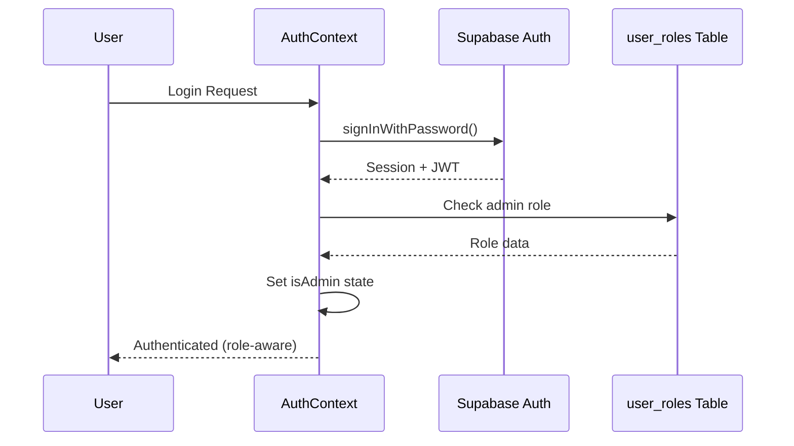
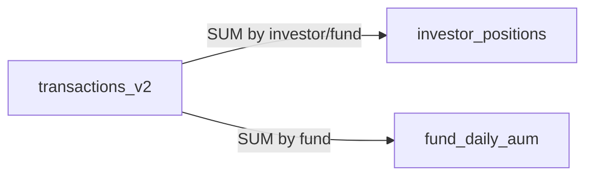
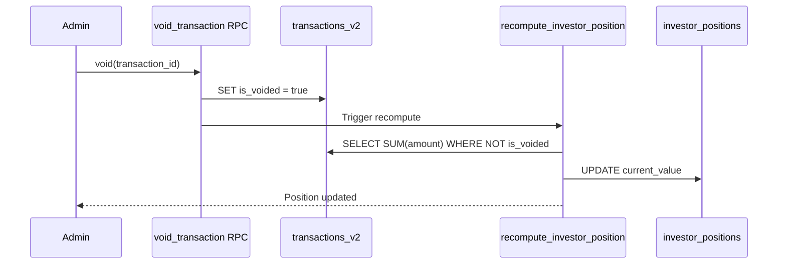
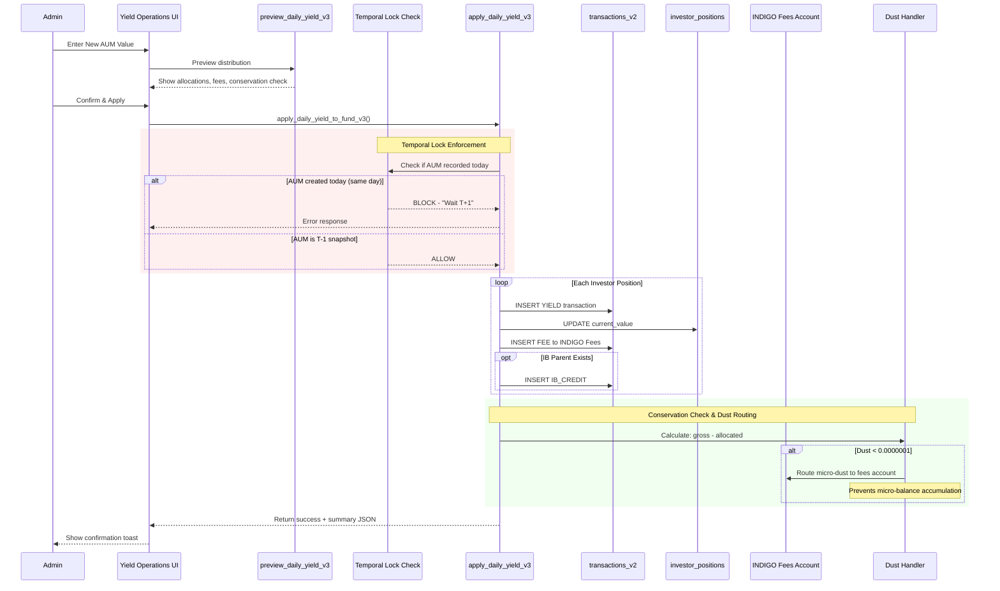
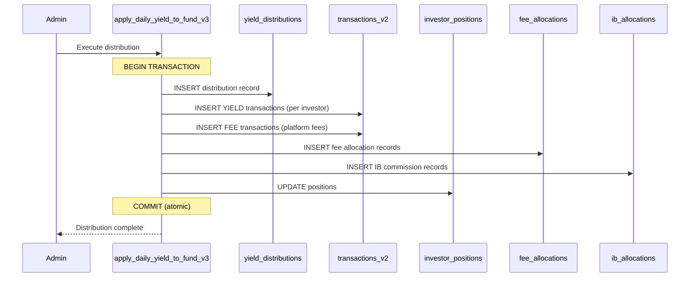
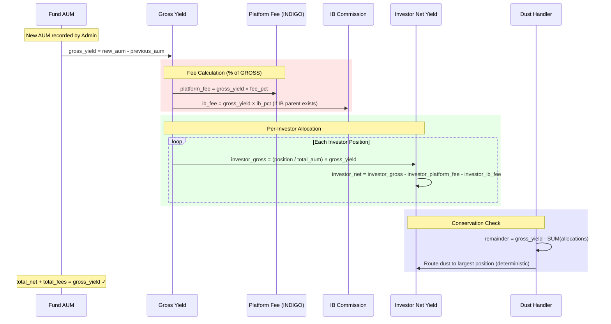
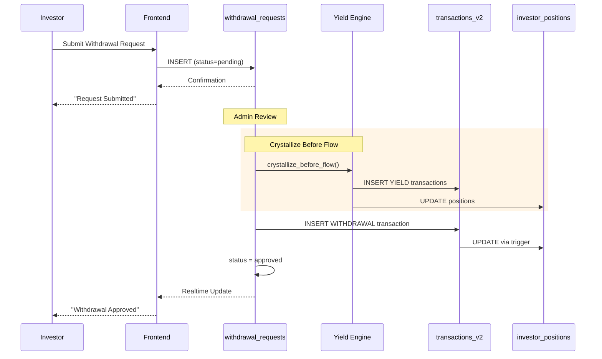
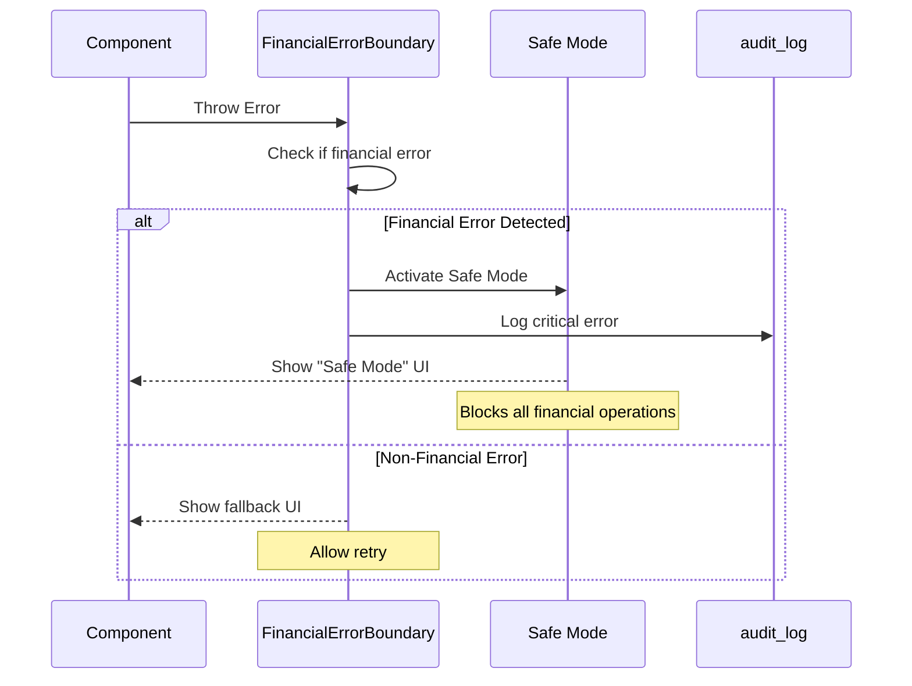

# System Architecture

> Last updated: 2026-01-10

## Overview

This is a **Financial Fund Management Platform** built with React, TypeScript, and Supabase. It manages investor portfolios, yield distributions, withdrawals, and comprehensive audit trails for a regulated financial environment.

## Technology Stack

| Layer | Technology |
|-------|------------|
| **Frontend** | React 18, TypeScript, Vite |
| **Styling** | Tailwind CSS, shadcn/ui, Framer Motion |
| **State** | React Query (TanStack Query v5), Zustand |
| **Backend** | Supabase (PostgreSQL, Edge Functions, Auth) |
| **Security** | Row Level Security (RLS), JWT, TOTP 2FA |

## Directory Structure

```
src/
├── components/           # UI components (admin/, investor/, common/, ui/)
├── hooks/
│   ├── data/
│   │   ├── admin/       # Admin-only data hooks (60+)
│   │   ├── investor/    # Investor-facing hooks (14+)
│   │   └── shared/      # Shared hooks (27+)
│   └── ui/              # UI-specific hooks
├── services/
│   ├── admin/           # Admin business logic
│   ├── investor/        # Investor business logic
│   ├── core/            # Shared core services
│   └── auth/            # Authentication (AuthContext, MFA)
├── pages/               # Route pages
├── routing/             # Route definitions
├── types/               # TypeScript types & interfaces
├── utils/               # Pure utility functions
├── lib/                 # Configuration & validation
└── integrations/        # External service integrations (Supabase)
```

## Authentication Flow



### Security Patterns

1. **Fail-Closed Design**: If role check fails, user is treated as non-admin
2. **Double-Admin Verification**: Admin status checked in both `user_roles` table AND JWT
3. **Session Persistence**: Uses Supabase session with automatic refresh

## Row Level Security (RLS)

All tables use RLS with these patterns:

| Pattern | Description |
|---------|-------------|
| `auth.uid() = user_id` | User can only access own data |
| `OR is_admin()` | Admins can access all data |
| `is_super_admin()` | Super admin bypass for critical operations |

### Critical Security Function

```sql
CREATE FUNCTION is_admin() RETURNS boolean AS $$
  SELECT EXISTS (
    SELECT 1 FROM user_roles
    WHERE user_id = auth.uid()
    AND role IN ('admin', 'super_admin')
  );
$$ LANGUAGE sql SECURITY DEFINER SET search_path = public;
```

> **Note**: All SECURITY DEFINER functions have `SET search_path = public` to prevent search-path injection attacks.

## Data Integrity Patterns

### Ledger-Derived Positions



Positions are **always** derivable from the transaction ledger. The `recompute_investor_position()` RPC recalculates positions from non-voided transactions.

### Void-Recompute Chain

When a transaction is voided:



### Idempotency

- `transactions_v2.reference_id` has a UNIQUE constraint
- Yield distributions use deterministic reference IDs: `yield-{fundId}-{date}-{investorId}`
- Re-running the same distribution is a no-op

## React Query Patterns

### Query Key Structure

```typescript
// Hierarchical keys for cache invalidation
QUERY_KEYS = {
  adminTransactions: (filters) => ["admin", "transactions", filters],
  investorPositions: (investorId) => ["investor", investorId, "positions"],
  fundAum: (fundId) => ["fund", fundId, "aum"],
};
```

### Optimistic Updates

Mutations use optimistic updates with rollback:

```typescript
useMutation({
  onMutate: async (newData) => {
    await queryClient.cancelQueries({ queryKey });
    const previous = queryClient.getQueryData(queryKey);
    queryClient.setQueryData(queryKey, optimisticData);
    return { previous };
  },
  onError: (err, newData, context) => {
    queryClient.setQueryData(queryKey, context.previous); // Rollback
  },
  onSettled: () => {
    queryClient.invalidateQueries({ queryKey });
  },
});
```

## Yield Distribution Flow (Enhanced)

The yield distribution process includes temporal lock enforcement, conservation checks, and dust routing:



> **Temporal Lock**: Yield must be calculated against a T-1 AUM snapshot. Same-day distributions are blocked unless `temporal_lock_bypass = true`.

> **Dust Routing**: Micro-amounts below `0.0000001` are routed to the INDIGO Fees account to prevent accumulation of "dust" balances that display as ~0.

### Detailed Yield Distribution Logic



> **Atomicity**: The entire distribution is wrapped in a single database transaction. If any step fails, everything rolls back.

## Yield-to-Fee-to-IB Waterfall

The yield distribution follows a strict fee waterfall to ensure conservation of funds:



### Fee Calculation Standard

| Fee Type | Calculation Base | Recipient |
|----------|------------------|-----------|
| Platform Fee (INDIGO) | % of **GROSS** yield | INDIGO Fees account |
| Introducing Broker (IB) | % of **GROSS** yield | IB Parent investor |
| Investor Net Yield | Gross - Platform - IB | Source investor |

> **Critical**: Both fees are calculated from GROSS yield, not NET yield. This prevents circular dependencies and ensures deterministic results.

### Dust Handling

Rounding residuals from allocation are deterministically routed to the **largest position holder** (tie-break by `investor_id ASC`) to ensure:
1. **Conservation**: SUM(allocations) = gross_yield exactly
2. **Determinism**: Same inputs always produce same outputs
3. **Auditability**: Dust recorded in `yield_distributions.dust_amount`

## Withdrawal Lock-in Flow



The `useAvailableBalance` hook prevents over-withdrawal:

```typescript
availableBalance = positionValue - pendingWithdrawals
```

**Server-Side Validation**: The `validate_withdrawal_request` trigger enforces this at the database level.

## Temporal Lock (T-1 Snapshot Rule)

Yield must be calculated against a T-1 AUM snapshot. The `validate_yield_temporal_lock` RPC blocks distributions where AUM was recorded on the same day as the yield date, ensuring NAV integrity.

## Immutable Field Protection

Critical audit fields are protected by database triggers:

| Table | Protected Fields | Trigger |
|-------|------------------|---------|
| `transactions_v2` | `created_at`, `reference_id`, `investor_id`, `fund_id` | `protect_transactions_immutable` |
| `fee_allocations` | `created_at`, `distribution_id`, `investor_id` | `protect_fee_allocations_immutable` |
| `ib_allocations` | `created_at`, `distribution_id`, `source_investor_id`, `ib_investor_id` | `protect_ib_allocations_immutable` |
| `audit_log` | ALL fields | `protect_audit_log_immutable` |

## Delta Audit System

The platform uses a high-efficiency **delta audit pattern** that logs only the changed fields rather than entire rows, reducing storage by ~80-90%.

### Components

| Component | Description |
|-----------|-------------|
| `compute_jsonb_delta(old, new)` | Computes the difference between two JSONB objects |
| `audit_delta_trigger()` | Universal trigger function attached to critical tables |

### Covered Tables

| Table | Trigger Name | Event |
|-------|--------------|-------|
| `transactions_v2` | `delta_audit_transactions_v2` | AFTER UPDATE |
| `investor_positions` | `delta_audit_investor_positions` | AFTER UPDATE |
| `yield_distributions` | `delta_audit_yield_distributions` | AFTER UPDATE |
| `withdrawal_requests` | `delta_audit_withdrawal_requests` | AFTER UPDATE |

### Delta Format in audit_log

```json
{
  "is_voided": { "old": false, "new": true },
  "void_reason": { "old": null, "new": "Duplicate entry correction" }
}
```

> **Verification Query**: `SELECT tgname, tgrelid::regclass FROM pg_trigger WHERE tgname LIKE 'delta_audit_%';`

> **Security**: Even super admins cannot modify these fields—ensures audit trail integrity.

## Financial Error Boundary

The `FinancialErrorBoundary` component provides a safety net for financial operations:



Financial errors are detected by keywords: `ledger`, `balance`, `transaction`, `position`, `yield`, `fee`, `aum`, `conservation`.

## Error Handling

1. **Service Layer**: Throws typed errors with context
2. **Hook Layer**: Catches and transforms to user-friendly messages
3. **UI Layer**: Displays via Sonner toast notifications
4. **Audit**: All errors logged to `audit_log` table

## Optimistic Updates Pattern

All mutation hooks implement revert-on-failure:

```typescript
useMutation({
  onMutate: async (newData) => {
    await queryClient.cancelQueries({ queryKey });
    const previous = queryClient.getQueryData(queryKey);
    queryClient.setQueryData(queryKey, optimisticData);
    return { previous }; // Snapshot for rollback
  },
  onError: (err, newData, context) => {
    queryClient.setQueryData(queryKey, context.previous); // Rollback
    toast.error(err.message);
  },
  onSettled: () => {
    queryClient.invalidateQueries({ queryKey }); // Always refetch
  },
});
```

## Monitoring Views

| View | Purpose |
|------|---------|
| `investor_position_ledger_mismatch` | Detects position/ledger sync issues |
| `fund_aum_mismatch` | Detects fund AUM calculation errors |
| `v_orphaned_user_roles` | Detects orphaned role entries |
| `yield_distribution_conservation_check` | Validates yield math |

## Key Design Decisions

1. **Snake_case (DB) → camelCase (Frontend)**: All data mappers handle this conversion
2. **Unified Investor ID**: `profiles.id` is the single source of truth for investor identity
3. **Audit Everything**: All mutations create audit trail entries
4. **Fail-Safe RLS**: Logging tables have permissive INSERT policies to ensure logs always succeed
5. **Server-Side Validation**: Critical business rules enforced in database triggers, not just UI

## Sovereign System Health Certificate

> **Certification Date:** 2026-01-10  
> **Status:** ✅ FULLY ACTIVE - All Integrity Gaps Closed

### Security Layer

| Check | Status | Details |
|-------|--------|---------|
| SECURITY DEFINER Functions | ✅ PASS | 183 functions with `SET search_path = public` |
| View Security Invoker | ✅ PASS | `v_ledger_reconciliation` uses `security_invoker=true` |
| Field Immutability Triggers | ✅ PASS | `created_at`, `reference_id`, `actor_user` protected |
| Idempotency Constraints | ✅ PASS | Unique constraints on `(fund_id, purpose, period_end)` |
| Advisory Locking | ✅ PASS | `pg_advisory_xact_lock` for yield distribution |
| Delta Audit Triggers | ✅ ACTIVE | 4 tables: transactions_v2, investor_positions, yield_distributions, withdrawal_requests |
| Void Yield Dependency | ✅ ACTIVE | `get_void_transaction_impact` returns yield warnings before confirm |
| Two-Key MFA Protocol | ✅ ACTIVE | Super-admin signature required for MFA resets |

### Data Integrity Layer

| Metric | Status | Verified By |
|--------|--------|-------------|
| Ledger ↔ Position Sync | ✅ 0 mismatches | `v_ledger_reconciliation` |
| AUM Conservation | ✅ 0 violations | `fund_aum_mismatch` |
| Yield Conservation | ✅ 0 violations | `yield_distribution_conservation_check` |
| Reference ID Uniqueness | ✅ PASS | Unique index active |
| Orphan Positions | ✅ PASS | Zero-balance orphans cleaned |

### UI Safety Layer

| Check | Status | Details |
|-------|--------|---------|
| FinancialErrorBoundary | ✅ Active | Graceful error handling for financial displays |
| FinancialValue Precision | ✅ 95%+ | Consistent decimal formatting across platform |
| ResponsiveTable Coverage | ✅ Active | Mobile-friendly data tables |
| Withdrawal Lock-in | ✅ PASS | Server-side validation active |
| Optimistic Updates | ✅ PASS | All mutations implement rollback |

---

## Related Documentation

- [Database ERD](./DATABASE_ERD.md) - Entity relationship diagrams
- [Investor Management Regression](../src/docs/INVESTOR_MANAGEMENT_REGRESSION.md) - QA checklist

---

*This document is maintained as part of the platform's operational excellence program.*
