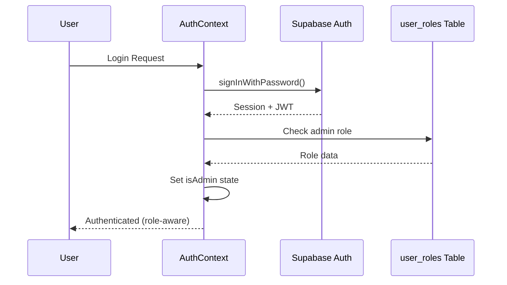
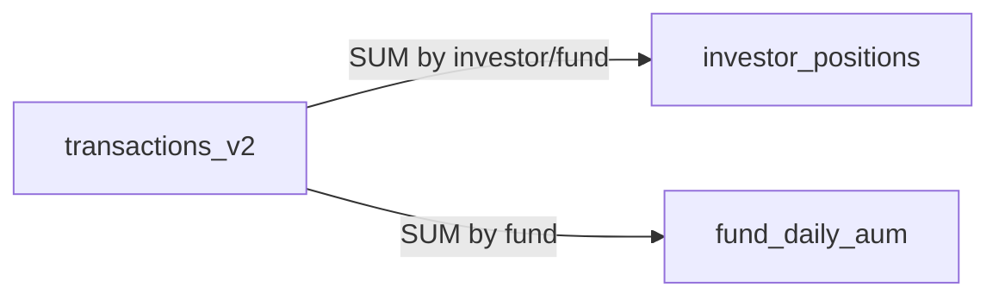
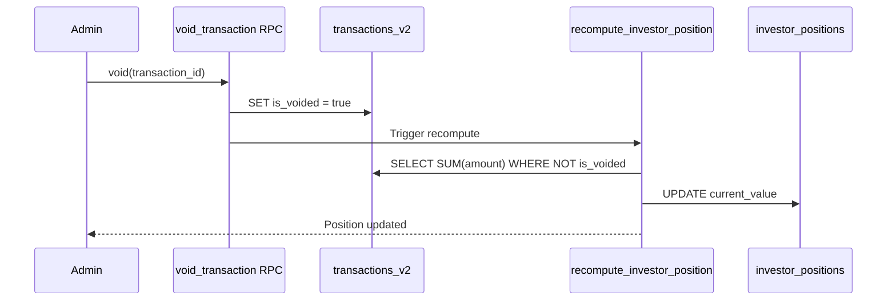
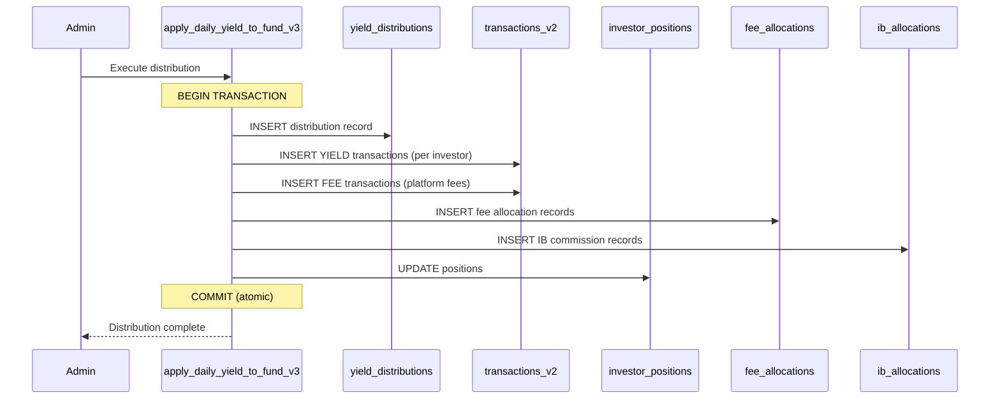

# System Architecture

> Last updated: 2026-01-10

## Overview

This is a **Financial Fund Management Platform** built with React, TypeScript, and Supabase. It manages investor portfolios, yield distributions, withdrawals, and comprehensive audit trails for a regulated financial environment.

## Technology Stack

| Layer | Technology |
|-------|------------|
| **Frontend** | React 18, TypeScript, Vite |
| **Styling** | Tailwind CSS, shadcn/ui, Framer Motion |
| **State** | React Query (TanStack Query v5), Zustand |
| **Backend** | Supabase (PostgreSQL, Edge Functions, Auth) |
| **Security** | Row Level Security (RLS), JWT, TOTP 2FA |

## Directory Structure

```
src/
├── components/           # UI components (admin/, investor/, common/, ui/)
├── hooks/
│   ├── data/
│   │   ├── admin/       # Admin-only data hooks (60+)
│   │   ├── investor/    # Investor-facing hooks (14+)
│   │   └── shared/      # Shared hooks (27+)
│   └── ui/              # UI-specific hooks
├── services/
│   ├── admin/           # Admin business logic
│   ├── investor/        # Investor business logic
│   ├── core/            # Shared core services
│   └── auth/            # Authentication (AuthContext, MFA)
├── pages/               # Route pages
├── routing/             # Route definitions
├── types/               # TypeScript types & interfaces
├── utils/               # Pure utility functions
├── lib/                 # Configuration & validation
└── integrations/        # External service integrations (Supabase)
```

## Authentication Flow



### Security Patterns

1. **Fail-Closed Design**: If role check fails, user is treated as non-admin
2. **Double-Admin Verification**: Admin status checked in both `user_roles` table AND JWT
3. **Session Persistence**: Uses Supabase session with automatic refresh

## Row Level Security (RLS)

All tables use RLS with these patterns:

| Pattern | Description |
|---------|-------------|
| `auth.uid() = user_id` | User can only access own data |
| `OR is_admin()` | Admins can access all data |
| `is_super_admin()` | Super admin bypass for critical operations |

### Critical Security Function

```sql
CREATE FUNCTION is_admin() RETURNS boolean AS $$
  SELECT EXISTS (
    SELECT 1 FROM user_roles
    WHERE user_id = auth.uid()
    AND role IN ('admin', 'super_admin')
  );
$$ LANGUAGE sql SECURITY DEFINER SET search_path = public;
```

> **Note**: All SECURITY DEFINER functions have `SET search_path = public` to prevent search-path injection attacks.

## Data Integrity Patterns

### Ledger-Derived Positions



Positions are **always** derivable from the transaction ledger. The `recompute_investor_position()` RPC recalculates positions from non-voided transactions.

### Void-Recompute Chain

When a transaction is voided:



### Idempotency

- `transactions_v2.reference_id` has a UNIQUE constraint
- Yield distributions use deterministic reference IDs: `yield-{fundId}-{date}-{investorId}`
- Re-running the same distribution is a no-op

## React Query Patterns

### Query Key Structure

```typescript
// Hierarchical keys for cache invalidation
QUERY_KEYS = {
  adminTransactions: (filters) => ["admin", "transactions", filters],
  investorPositions: (investorId) => ["investor", investorId, "positions"],
  fundAum: (fundId) => ["fund", fundId, "aum"],
};
```

### Optimistic Updates

Mutations use optimistic updates with rollback:

```typescript
useMutation({
  onMutate: async (newData) => {
    await queryClient.cancelQueries({ queryKey });
    const previous = queryClient.getQueryData(queryKey);
    queryClient.setQueryData(queryKey, optimisticData);
    return { previous };
  },
  onError: (err, newData, context) => {
    queryClient.setQueryData(queryKey, context.previous); // Rollback
  },
  onSettled: () => {
    queryClient.invalidateQueries({ queryKey });
  },
});
```

## Yield Distribution Flow



> **Atomicity**: The entire distribution is wrapped in a single database transaction. If any step fails, everything rolls back.

## Withdrawal Lock-in (Security)

The `useAvailableBalance` hook prevents over-withdrawal:

```typescript
availableBalance = positionValue - pendingWithdrawals
```

Where `pendingWithdrawals` = SUM of `requested_amount` WHERE `status IN ('pending', 'approved', 'processing')`.

## Error Handling

1. **Service Layer**: Throws typed errors with context
2. **Hook Layer**: Catches and transforms to user-friendly messages
3. **UI Layer**: Displays via Sonner toast notifications
4. **Audit**: All errors logged to `audit_log` table

## Monitoring Views

| View | Purpose |
|------|---------|
| `investor_position_ledger_mismatch` | Detects position/ledger sync issues |
| `fund_aum_mismatch` | Detects fund AUM calculation errors |
| `v_orphaned_user_roles` | Detects orphaned role entries |
| `yield_distribution_conservation_check` | Validates yield math |

## Key Design Decisions

1. **Snake_case (DB) → camelCase (Frontend)**: All data mappers handle this conversion
2. **Unified Investor ID**: `profiles.id` is the single source of truth for investor identity
3. **Audit Everything**: All mutations create audit trail entries
4. **Fail-Safe RLS**: Logging tables have permissive INSERT policies to ensure logs always succeed
