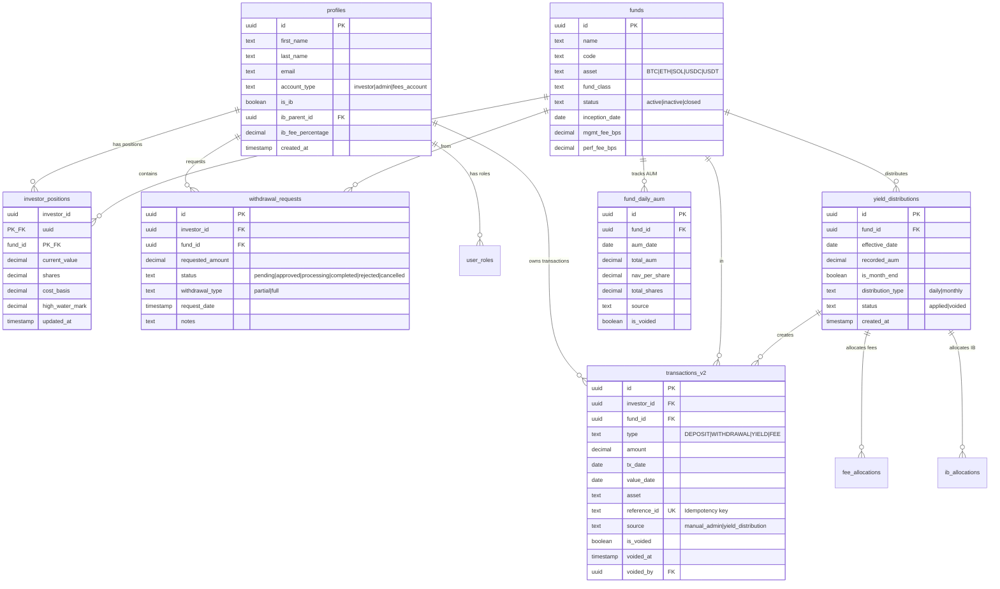
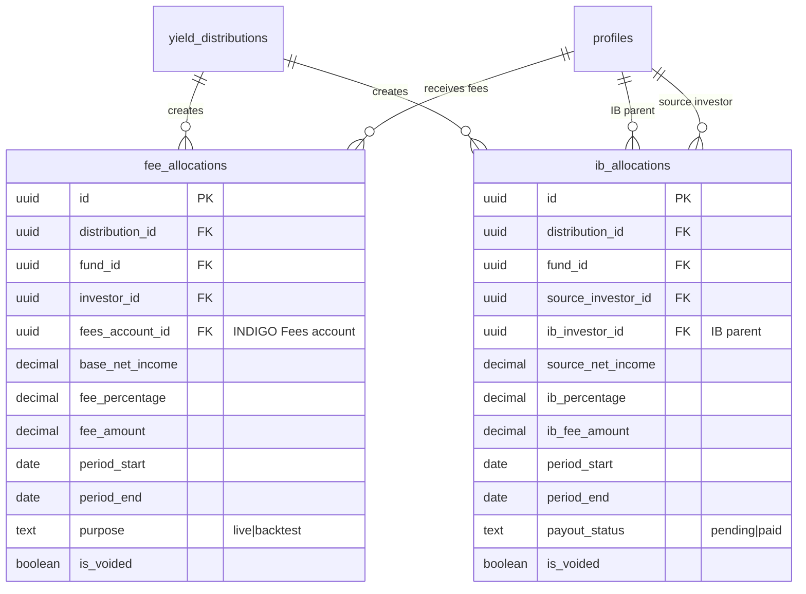
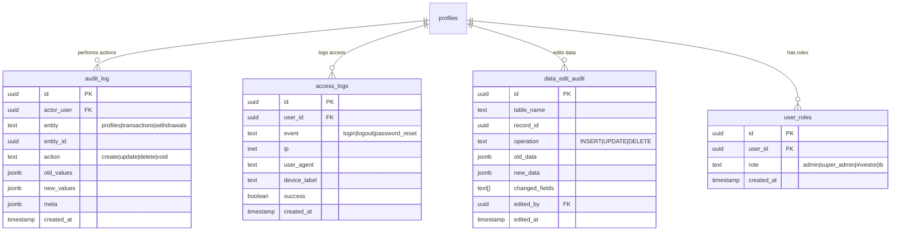
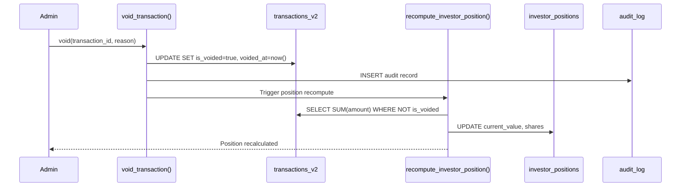

# Database Entity Relationship Diagram

> Last updated: 2026-01-10

## Core Ledger Entities



## Fee & IB Allocation Entities



## Audit & Security Entities



## Key Relationships

### Primary Keys (Composite)

| Table | Primary Key |
|-------|-------------|
| `investor_positions` | `(investor_id, fund_id)` |
| `daily_nav` | `(fund_id, nav_date, purpose)` |

### Unique Constraints

| Table | Constraint | Purpose |
|-------|------------|---------|
| `transactions_v2` | `reference_id` | Idempotency |
| `profiles` | `email` | Unique identity |
| `funds` | `code` | Fund identifier |

### Foreign Key Cascades

| Parent | Child | On Delete |
|--------|-------|-----------|
| `profiles` | `investor_positions` | CASCADE |
| `profiles` | `transactions_v2` | RESTRICT |
| `funds` | `investor_positions` | RESTRICT |

---

## Void-Recompute Chain

When voiding a transaction, the system maintains integrity:



### Data Flow

1. **Void Transaction**: Sets `is_voided = true`, `voided_at = now()`, `voided_by = auth.uid()`
2. **Audit Log**: Creates immutable record of the void action
3. **Recompute Position**: Recalculates position from ALL non-voided transactions
4. **Result**: Position reflects true ledger state

---

## Integrity Monitoring Views

### `investor_position_ledger_mismatch`

Detects when `investor_positions.current_value` diverges from the sum of non-voided transactions:

```sql
SELECT 
  ip.investor_id,
  ip.fund_id,
  ip.current_value AS position_value,
  COALESCE(SUM(t.amount), 0) AS ledger_value,
  ip.current_value - COALESCE(SUM(t.amount), 0) AS mismatch
FROM investor_positions ip
LEFT JOIN transactions_v2 t ON t.investor_id = ip.investor_id 
  AND t.fund_id = ip.fund_id 
  AND NOT t.is_voided
GROUP BY ip.investor_id, ip.fund_id, ip.current_value
HAVING ABS(ip.current_value - COALESCE(SUM(t.amount), 0)) > 0.01;
```

### `fund_aum_mismatch`

Detects when fund AUM doesn't match sum of investor positions:

```sql
SELECT
  f.id AS fund_id,
  f.name,
  fda.total_aum AS recorded_aum,
  COALESCE(SUM(ip.current_value), 0) AS position_sum,
  fda.total_aum - COALESCE(SUM(ip.current_value), 0) AS mismatch
FROM funds f
JOIN fund_daily_aum fda ON fda.fund_id = f.id
LEFT JOIN investor_positions ip ON ip.fund_id = f.id
WHERE fda.aum_date = CURRENT_DATE AND NOT fda.is_voided
GROUP BY f.id, f.name, fda.total_aum
HAVING ABS(fda.total_aum - COALESCE(SUM(ip.current_value), 0)) > 0.01;
```

---

## Asset Codes (Enum)

```sql
CREATE TYPE asset_code AS ENUM (
  'BTC', 'ETH', 'SOL', 'USDC', 'USDT', 'EURC', 'XAUT', 'XRP'
);
```

## Transaction Types (Enum)

```sql
CREATE TYPE transaction_type AS ENUM (
  'DEPOSIT', 'WITHDRAWAL', 'YIELD', 'FEE', 'TRANSFER', 'ADJUSTMENT'
);
```

## Withdrawal Status (Enum)

```sql
CREATE TYPE withdrawal_status AS ENUM (
  'pending', 'approved', 'processing', 'completed', 'rejected', 'cancelled'
);
```
