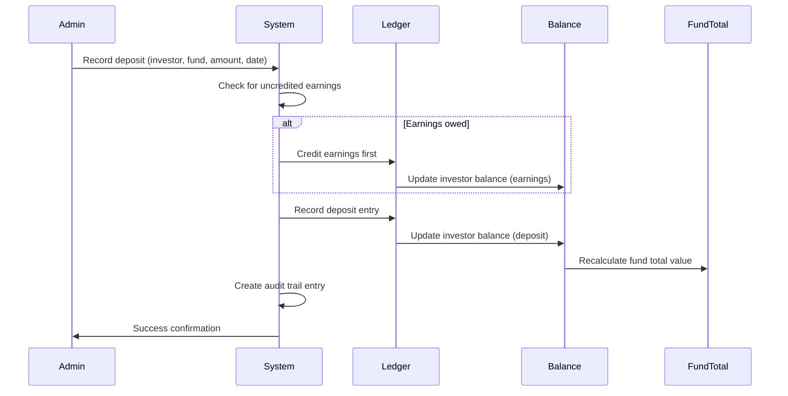
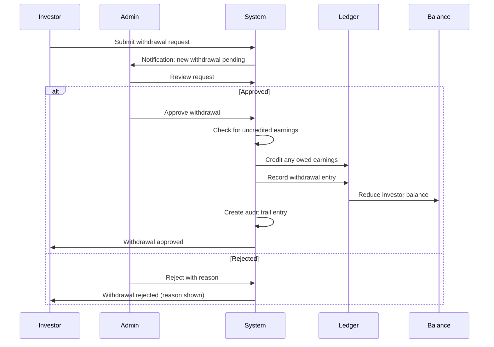
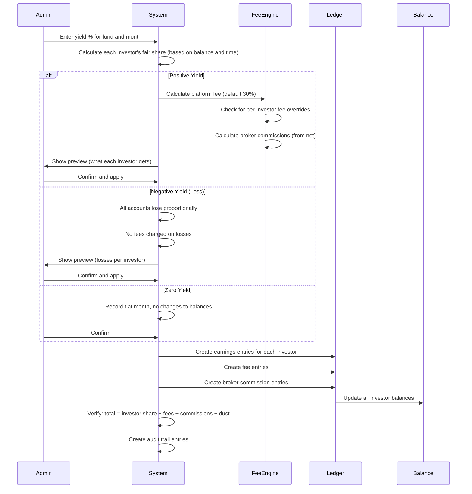
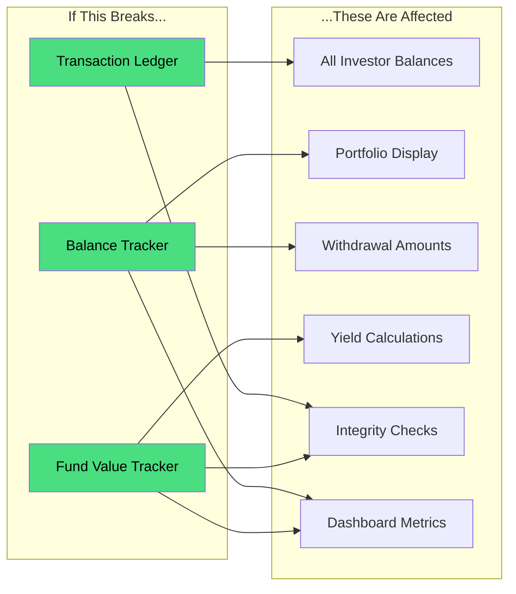

# Feature Dependency Map

> **Last Updated**: February 17, 2026
> **Purpose**: Shows how platform features connect to each other and what depends on what.

---

## How to Read This Map

- **Green items** = Fully working and tested
- **Yellow items** = Working with minor display issues
- **Red items** = Known display bug
- **Grey items** = Not yet active

Arrows show dependencies: Feature A --> Feature B means "A needs B to work."

---

## Master Dependency Diagram

```mermaid
flowchart TB
    subgraph core["Core Platform (All Working)"]
        AUTH["User Authentication
        & Role Assignment"]
        RLS["Data Isolation
        (investors see only their data)"]
        AUDIT["Audit Trail
        (every action logged)"]
        LEDGER["Transaction Ledger
        (permanent record)"]
        POS["Balance Tracker
        (auto-calculated from ledger)"]
        AUM["Fund Value Tracker
        (sum of all investor balances)"]
    end

    subgraph money_in["Money In"]
        DEP["Record Deposit"]
        CRYST["Earnings Protection
        (credit owed earnings before deposit)"]
    end

    subgraph money_out["Money Out"]
        WD_REQ["Investor Requests Withdrawal"]
        WD_APPROVE["Admin Reviews & Approves"]
        WD_PROCESS["Process Withdrawal"]
    end

    subgraph yield_engine["Yield Engine"]
        YLD_RECORD["Record Monthly Yield %"]
        YLD_PREVIEW["Preview Distribution"]
        YLD_APPLY["Apply Distribution"]
        YLD_VOID["Void & Redo"]
        NEG_YLD["Negative Yield (Losses)"]
        ZERO_YLD["Zero Yield (Flat Month)"]
    end

    subgraph fees["Fees & Commissions"]
        PLAT_FEE["Platform Fee (30% default)"]
        FEE_OVERRIDE["Per-Investor Fee Override"]
        FEE_SCHEDULE["Fee Schedule (date-based)"]
        IB_COMM["Broker Commission"]
        IB_SCHEDULE["Broker Commission Schedule"]
    end

    subgraph portals["User Portals"]
        ADMIN["Admin Portal (20 pages)"]
        INV["Investor Portal (8 pages)"]
        IB_MGMT["Broker Management (admin-only)"]
    end

    subgraph integrity["System Health"]
        CHECKS["16 Integrity Checks"]
        RECONCILE["Balance Verification"]
        CONSERVE["Earnings Math Check"]
        AUM_CHECK["Fund Total Check"]
    end

    %% Core dependencies
    AUTH --> RLS
    AUTH --> ADMIN
    AUTH --> INV
    LEDGER --> POS
    POS --> AUM

    %% Deposit flow
    DEP --> CRYST
    CRYST --> LEDGER
    DEP --> LEDGER
    DEP --> AUDIT

    %% Withdrawal flow
    WD_REQ --> AUTH
    WD_REQ --> WD_APPROVE
    WD_APPROVE --> WD_PROCESS
    WD_PROCESS --> CRYST
    WD_PROCESS --> LEDGER
    WD_PROCESS --> AUDIT

    %% Yield flow
    YLD_RECORD --> YLD_PREVIEW
    YLD_RECORD --> YLD_APPLY
    YLD_APPLY --> PLAT_FEE
    YLD_APPLY --> IB_COMM
    YLD_APPLY --> LEDGER
    YLD_APPLY --> AUDIT
    YLD_APPLY --> AUM
    YLD_VOID --> LEDGER
    NEG_YLD --> YLD_APPLY
    ZERO_YLD --> YLD_APPLY

    %% Fee dependencies
    PLAT_FEE --> FEE_OVERRIDE
    PLAT_FEE --> FEE_SCHEDULE
    IB_COMM --> IB_SCHEDULE

    %% Integrity dependencies
    CHECKS --> RECONCILE
    CHECKS --> CONSERVE
    CHECKS --> AUM_CHECK
    RECONCILE --> POS
    RECONCILE --> LEDGER
    CONSERVE --> YLD_APPLY
    AUM_CHECK --> AUM
    AUM_CHECK --> POS

    %% Portal dependencies
    ADMIN --> DEP
    ADMIN --> WD_APPROVE
    ADMIN --> YLD_RECORD
    ADMIN --> CHECKS
    INV --> WD_REQ
    IB_MGMT --> IB_COMM

    %% Styling
    style AUTH fill:#4ade80,color:#000
    style RLS fill:#4ade80,color:#000
    style AUDIT fill:#4ade80,color:#000
    style LEDGER fill:#4ade80,color:#000
    style POS fill:#4ade80,color:#000
    style AUM fill:#4ade80,color:#000
    style DEP fill:#4ade80,color:#000
    style CRYST fill:#4ade80,color:#000
    style WD_REQ fill:#4ade80,color:#000
    style WD_APPROVE fill:#4ade80,color:#000
    style WD_PROCESS fill:#4ade80,color:#000
    style YLD_RECORD fill:#4ade80,color:#000
    style YLD_PREVIEW fill:#4ade80,color:#000
    style YLD_APPLY fill:#4ade80,color:#000
    style YLD_VOID fill:#4ade80,color:#000
    style NEG_YLD fill:#4ade80,color:#000
    style ZERO_YLD fill:#4ade80,color:#000
    style PLAT_FEE fill:#4ade80,color:#000
    style FEE_OVERRIDE fill:#4ade80,color:#000
    style FEE_SCHEDULE fill:#4ade80,color:#000
    style IB_COMM fill:#4ade80,color:#000
    style IB_SCHEDULE fill:#4ade80,color:#000
    style ADMIN fill:#4ade80,color:#000
    style INV fill:#facc15,color:#000
    style IB_MGMT fill:#4ade80,color:#000
    style CHECKS fill:#4ade80,color:#000
    style RECONCILE fill:#4ade80,color:#000
    style CONSERVE fill:#4ade80,color:#000
    style AUM_CHECK fill:#4ade80,color:#000
```

---

## Deposit Flow

---

## Withdrawal Flow

---

## Yield Distribution Flow

---

## Feature Dependency Table

This table shows what each feature needs to function. If a dependency has issues, the dependent feature may also be affected.

| Feature | Depends On | Depended On By |
|---------|-----------|----------------|
| **User Authentication** | Nothing (foundational) | Everything else |
| **Data Isolation** | Authentication | All portal features |
| **Transaction Ledger** | Authentication | Balances, Fund Totals, Integrity Checks |
| **Balance Tracker** | Transaction Ledger | Fund Totals, Portfolio View, Dashboard |
| **Fund Value Tracker** | Balance Tracker | Dashboard, Yield Calculations |
| **Deposits** | Earnings Protection, Ledger, Audit | Investor Balances, Fund Totals |
| **Earnings Protection** | Fund Value Tracker, Ledger | Deposits, Withdrawals |
| **Withdrawals** | Authentication, Approval, Earnings Protection | Investor Balances |
| **Yield Distribution** | Fund Value, Fee Engine, Ledger | Investor Earnings, Fee Revenue, Broker Commissions |
| **Platform Fees** | Yield Distribution, Fee Overrides | Fee Revenue, Platform Fee Account |
| **Broker Commissions** | Yield Distribution, Commission Schedule | Broker Payouts |
| **Integrity Checks** | Ledger, Balances, Fund Totals | System Health Dashboard |
| **Audit Trail** | Nothing (always records) | Compliance, Debugging |

---

## Risk Propagation

If a core component had an issue, here's what would be affected:

**Current status**: All three core components (Ledger, Balance Tracker, Fund Value Tracker) are **fully working** with zero drift. This means all dependent features have a solid foundation.

---

## Status Summary by Layer

| Layer | Features | Status |
|-------|----------|--------|
| **Foundation** (Auth, Ledger, Balances, Audit) | 6 features | All WORKING |
| **Money Flows** (Deposits, Withdrawals) | 11 features | All WORKING |
| **Yield Engine** (Distribution, Fees, Commissions) | 15 features | All WORKING |
| **Admin Portal** | 12 features | All WORKING |
| **Investor Portal** | 8 features | 5 WORKING, 3 PARTIAL (display only) |
| **Reporting** | 5 features | 3 WORKING, 2 NOT ACTIVE |
| **Integrity** | 4 features | All WORKING |
