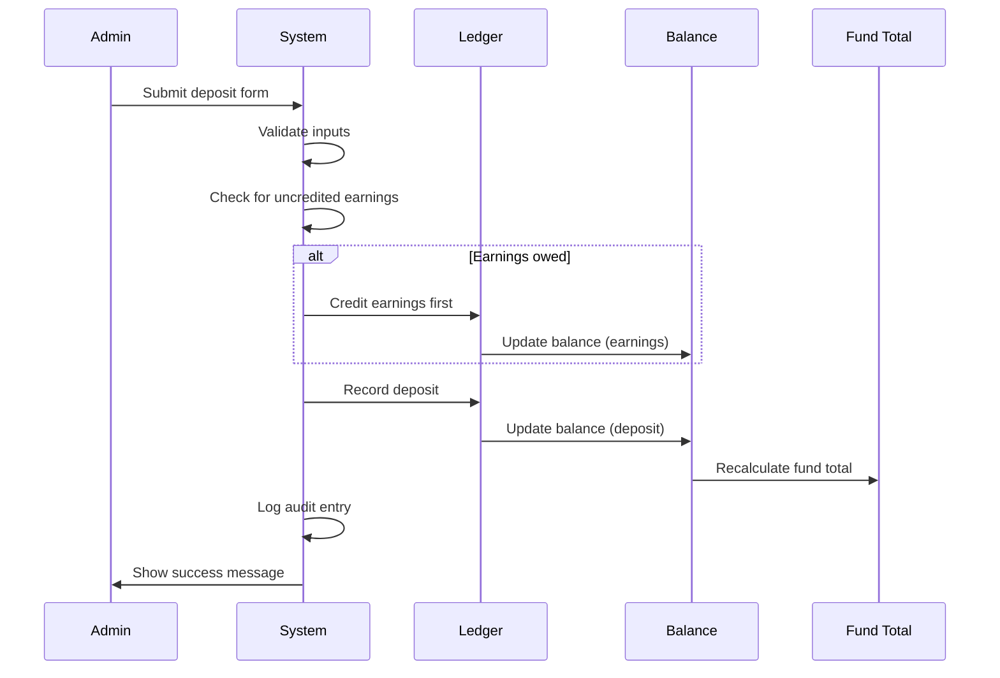
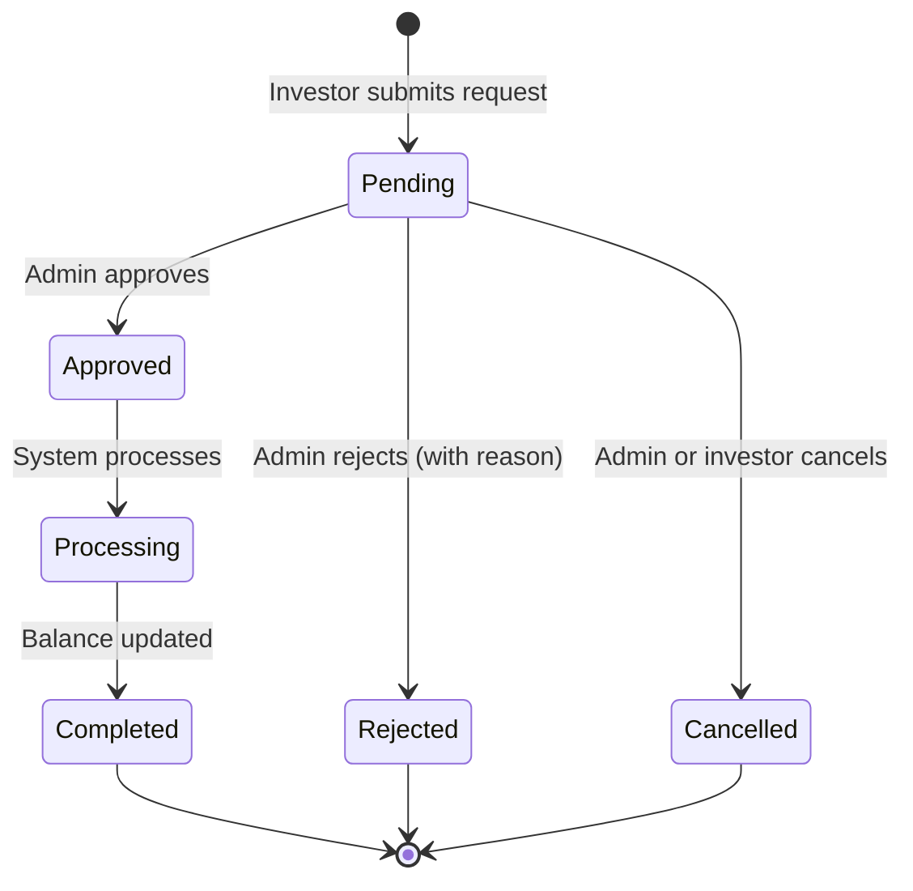
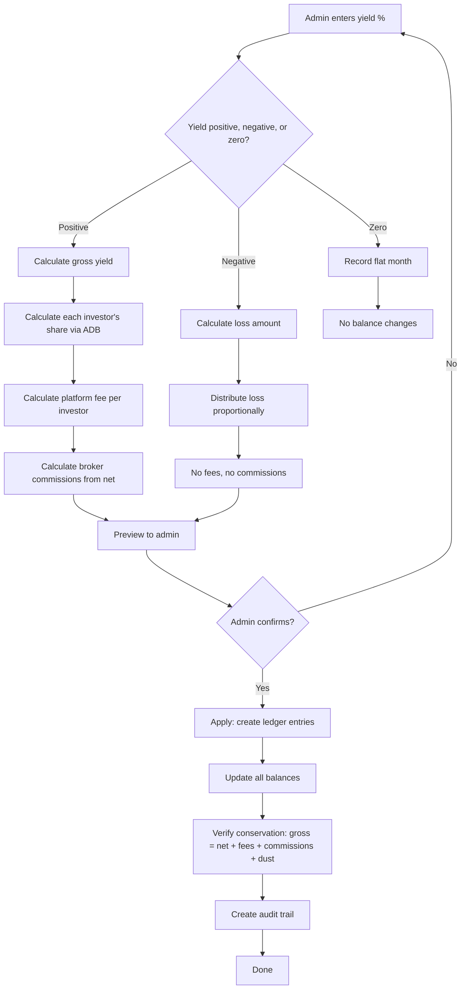
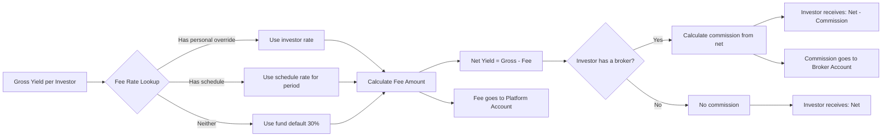
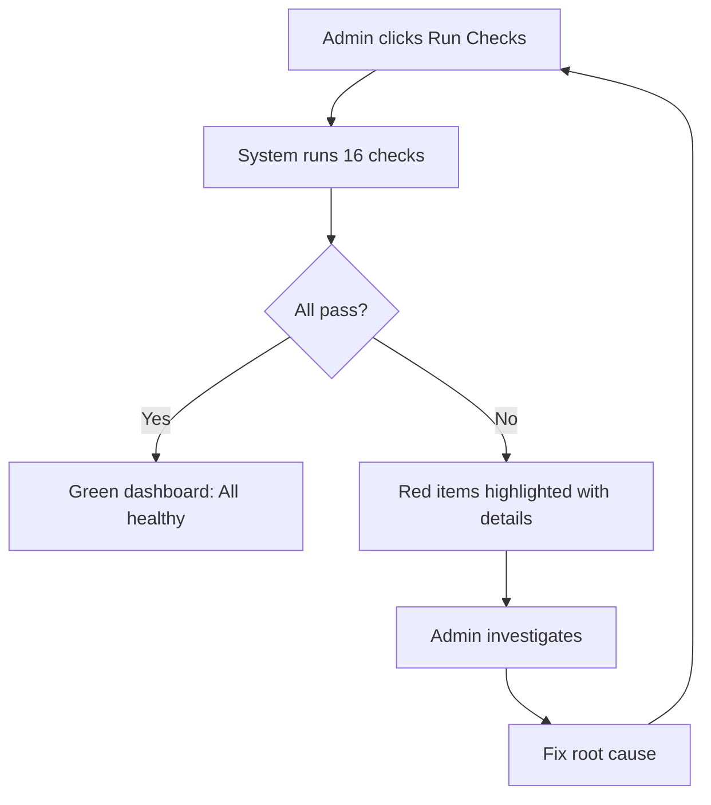

# Feature Validation Book

> **Last Updated**: February 17, 2026
> **Purpose**: Detailed validation of every platform feature with checklists, flow diagrams, and known issues.
> **Companion Documents**: [Feature Map](../PLATFORM_FEATURE_MAP.md) | [Dependency Map](FEATURE_DEPENDENCY_MAP.md)

---

## Table of Contents

1. [Money In (Deposits)](#1-money-in-deposits)
2. [Money Out (Withdrawals)](#2-money-out-withdrawals)
3. [Yield (Returns & Earnings)](#3-yield-returns--earnings)
4. [Fees & Commissions](#4-fees--commissions)
5. [Investor Portal](#5-investor-portal-what-investors-see)
6. [Admin Portal](#6-admin-portal-what-admins-use)
7. [Broker Features](#7-broker-ib-features)
8. [Reporting & Statements](#8-reporting--statements)
9. [Security & Access Control](#9-security--access-control)
10. [System Health & Integrity](#10-system-health--integrity)

---

## 1. Money In (Deposits)

### What You See

Admin navigates to **Transactions > New Transaction**. A form appears with fields for:
- Select investor (dropdown of all investors)
- Select fund (dropdown of active funds, e.g., IND-BTC, IND-ETH)
- Enter amount (decimal numbers accepted)
- Select date (defaults to today)
- Transaction type set to "Deposit"

After clicking **Apply**, a success message appears. The investor's balance on their dashboard updates immediately.

### What Happens Behind the Scenes

1. The system checks if the investor has any uncredited earnings since the last yield distribution
2. If yes, those earnings are credited first (this protects existing investors from having their earnings diluted by new money)
3. The deposit amount is recorded as a permanent entry in the transaction ledger
4. The investor's balance is automatically recalculated from all their transactions
5. The fund's total value (AUM) is updated to reflect the new deposit
6. An audit trail entry is created recording who made the deposit, when, and all details
7. A unique reference ID prevents the same deposit from being recorded twice (safety against double-clicks)

### Validation Checklist

- [x] Admin can select an investor from the dropdown
- [x] Admin can select a fund from the dropdown
- [x] Amount field accepts decimal values (e.g., 0.50000000 BTC)
- [x] Date field defaults to today
- [x] Success message appears after submission
- [x] Investor balance increases by the exact deposit amount
- [x] Transaction appears in admin transaction history
- [x] Transaction appears in investor transaction history
- [x] Fund total value (AUM) increases by the deposit amount
- [x] Audit log entry is created with full details
- [x] Cannot deposit a negative amount
- [x] Cannot deposit to an inactive fund
- [x] Earnings protection fires before deposit (verified in 7-fund harness)
- [x] Double-click protection prevents duplicate deposits
- [x] All 7 asset types tested (BTC, ETH, SOL, USDT, EURC, xAUT, XRP)

### Known Issues

None. Deposits are fully working and tested across all fund types.

### Dependencies

- Investor must exist in the system
- Fund must be active
- Admin must be logged in with admin permissions

### Flow

---

## 2. Money Out (Withdrawals)

### What You See

**Investor side**: Investor navigates to **Withdrawals > New Withdrawal**. They select a fund, enter an amount, and submit. The request appears with status "Pending."

**Admin side**: Admin navigates to **Withdrawals**. They see a list of pending requests with investor name, fund, amount, and date. Admin clicks a request and can:
- **Approve**: Process the withdrawal
- **Reject**: Decline with a reason (investor sees the reason)
- **Cancel**: Cancel the request

After approval, the investor's balance decreases and the transaction appears in history.

### What Happens Behind the Scenes

1. Investor submits a withdrawal request (this does NOT change their balance yet)
2. Admin reviews and decides
3. If approved: the system credits any uncredited earnings first (same as deposits)
4. The withdrawal amount is recorded in the ledger as a negative transaction
5. The investor's balance decreases automatically
6. The fund's total value decreases
7. If rejected: the investor sees the rejection reason, balance unchanged
8. Every step is logged in the audit trail

### Validation Checklist

- [x] Investor can select a fund to withdraw from
- [x] Investor can enter a withdrawal amount
- [x] Cannot withdraw more than current balance
- [x] Request appears as "Pending" after submission
- [x] Admin sees pending requests in withdrawal management
- [x] Admin can approve a withdrawal
- [x] Admin can reject with a reason
- [x] Admin can cancel a request
- [x] After approval, investor balance decreases correctly
- [x] After rejection, investor balance is unchanged
- [x] After cancellation, investor balance is unchanged
- [x] Transaction appears in both admin and investor history
- [x] Fund total value decreases after approval
- [x] Status progression works: Pending > Approved > Completed
- [x] Investor can see rejection reason
- [x] Audit trail created for all actions

### Known Issues

None. Full withdrawal lifecycle has been tested including edge cases.

### Dependencies

- Investor must have sufficient balance
- Fund must have sufficient AUM
- Admin must be logged in to approve/reject

### Flow

---

## 3. Yield (Returns & Earnings)

### What You See

Admin navigates to **Yield Operations**. For each fund:
1. Enters the yield percentage for the month (e.g., 5% means the fund grew 5%)
2. Clicks **Preview** to see what each investor will receive
3. Reviews the breakdown: gross amount, platform fee, broker commissions, net to each investor
4. Clicks **Apply** to distribute the yield
5. Success message confirms distribution

For negative months (fund lost value), admin enters a negative percentage (e.g., -2%).

### What Happens Behind the Scenes

1. System looks at the fund's total value at the start and end of the period
2. Calculates the gross yield (how much the fund earned or lost)
3. For each investor, calculates their fair share based on:
   - How much they had invested (bigger balance = bigger share)
   - How long they were invested during the period (deposited mid-month = smaller share)
   - This is called "Average Daily Balance" (ADB) weighting
4. **If positive yield**:
   - Platform fee is calculated (default 30% of gross, or custom rate per investor)
   - Broker commissions are calculated from the net yield (after platform fee)
   - Net yield (what the investor actually receives) = gross - fees - commissions
   - Dust (tiny rounding remainders, less than 1 satoshi) goes to the platform
5. **If negative yield**:
   - All accounts (investor, platform, broker) lose proportionally
   - No fees are charged on losses
   - No broker commissions on losses
6. **If zero yield**: System records a flat month, no balance changes
7. System verifies the math: gross = net + fees + commissions + dust (conservation check)
8. All entries recorded in the ledger, balances updated, audit trail created

### Validation Checklist

- [x] Admin can enter yield percentage per fund
- [x] Preview shows per-investor breakdown before applying
- [x] Preview matches actual applied amounts
- [x] Positive yield: investors receive correct net amount
- [x] Positive yield: platform fee calculated correctly (default 30%)
- [x] Positive yield: broker commissions calculated correctly (from net yield)
- [x] Negative yield: all accounts lose proportionally
- [x] Negative yield: no fees charged
- [x] Negative yield: no broker commissions charged
- [x] Zero yield: recorded as flat month, no balance changes
- [x] ADB weighting: mid-period depositors get proportionally less
- [x] Conservation check passes: gross = net + fees + commissions + dust
- [x] All investor balances update correctly after distribution
- [x] Fund total value updates correctly
- [x] 28 distributions tested across 7 funds (BTC, ETH, SOL, USDT, EURC, xAUT, XRP)
- [x] Void capability: admin can undo a distribution and redo it
- [x] Void cascades: all related records (fees, commissions, transactions) are reversed
- [x] After void: investor balances return to exact pre-distribution amounts
- [x] Compound yield: all wallet types (investor, platform, broker) compound over multiple months

### Known Issues

None. The yield engine is the most thoroughly tested component of the platform.

### Dependencies

- Fund must have recorded AUM for the period
- Investors must have active positions in the fund
- Admin must be logged in

### Flow

---

## 4. Fees & Commissions

### What You See

**Fee configuration**: Admin can set fee rates at three levels:
1. **Fund default**: Each fund has a default fee percentage (typically 30%)
2. **Investor override**: Individual investors can have a custom rate (e.g., 25% for a VIP)
3. **Fee schedule**: Different rates for different time periods (e.g., 2% in October, 5% from November onward)

**Fee tracking**: Admin navigates to **Fees** page to see:
- All fee transactions grouped by period
- Fee amounts per investor
- Platform fee account balance

**Broker commissions**: Admin navigates to **IB Management** to see:
- Commission rates per broker
- Commission amounts per distribution
- Payout status (pending or paid)

### What Happens Behind the Scenes

1. When yield is distributed, the system determines each investor's fee rate:
   - First checks: does this investor have a personal fee override?
   - Then checks: is there a date-based fee schedule for this investor?
   - Finally falls back to: the fund's default fee rate
2. Fee is calculated: `fee = gross_yield * fee_rate`
3. Broker commission is calculated from the net (after platform fee): `commission = net_yield * broker_rate`
4. Fee amount goes to the Indigo platform fee account
5. Commission amount goes to the broker's account
6. Both create permanent ledger entries with audit trail

### Validation Checklist

- [x] Default fund fee rate applies when no override exists
- [x] Per-investor fee override takes priority over fund default
- [x] Date-based fee schedule applies for the correct time period
- [x] Fee schedule changes mid-period work correctly
- [x] Broker commission calculated from net yield (gross minus platform fee)
- [x] Broker commission rates can be customized per broker
- [x] Broker commission schedule allows different rates over time
- [x] Platform fees flow to the Indigo fees account
- [x] All fee transactions have audit trail
- [x] Fee amounts visible on admin Fees page
- [x] Commission amounts visible on admin IB Management page
- [x] No fees charged on negative yield (losses)
- [x] No broker commissions on negative yield
- [x] Tested overrides: 2%, 5%, 13.5%, 18%, 25%, 30% rates

### Known Issues

None. Fee calculations are verified through the conservation identity (gross = net + fees + commissions + dust).

### Dependencies

- Yield distribution must be applied first (fees are part of yield distribution)
- Investor must have an active position
- Broker must be linked to investor (for commissions)

### Flow

---

## 5. Investor Portal (What Investors See)

### What You See

After logging in, investors land on their **Dashboard** showing:
- Total portfolio value across all funds
- Recent transactions
- Welcome message

**Portfolio page**: Shows each investment broken down by asset (BTC, ETH, etc.) with current values.

**Transaction history**: Lists all deposits, withdrawals, and earnings with date, type, and amount. Filterable by fund and type.

**Yield history**: Shows earnings received over time, broken down by period and fund.

**Withdrawals**: Submit new withdrawal requests and track existing ones.

**Settings**: Update profile information.

### What Happens Behind the Scenes

- All data comes from the investor's own records only (data isolation enforced)
- Balances are calculated from the transaction ledger (not stored separately)
- Only "investor visible" transactions appear (admin-only operations are hidden)
- Yield amounts show net earnings (after fees and commissions)

### Validation Checklist

**Dashboard**
- [x] Shows correct total portfolio value
- [x] Shows recent transactions
- [x] Displays welcome message
- [ ] YTD Return shows actual percentage (currently shows 0.00%) -- KNOWN ISSUE
- [ ] Total Earned shows actual amount (currently shows 0.00) -- KNOWN ISSUE

**Portfolio**
- [x] Shows investments by asset type
- [x] Current values are correct
- [x] Fund cards display correctly
- [ ] MTD Net Change shows actual value (currently shows 0.00) -- KNOWN ISSUE

**Transaction History**
- [x] All deposits visible
- [x] All withdrawals visible
- [x] Yield earnings visible (net amounts only)
- [x] Filter by fund works
- [x] Filter by type works
- [x] Amounts are correct

**Yield History**
- [x] Shows yield events by period
- [x] Net amounts per investor are correct
- [ ] Cross-currency summing: totals may mix BTC + USDT amounts -- PARTIAL

**Withdrawals**
- [x] Can submit new withdrawal request
- [x] Can see pending requests
- [x] Can see approved/rejected status
- [x] Can see rejection reason

**Settings**
- [x] Can view profile information
- [x] Can update profile

### Known Issues

| Issue | Description | Impact | Data Affected? |
|-------|-------------|--------|----------------|
| YTD Return shows 0% | Dashboard metric not calculating from yield data | Display only | No - balances correct |
| Total Earned shows 0 | Dashboard metric not calculating from yield data | Display only | No - balances correct |
| MTD Net Change shows 0 | Portfolio metric not calculating from monthly data | Display only | No - balances correct |
| Cross-currency summing | Yield history totals may mix different currencies | Confusing display | No - individual amounts correct |

**Important**: All underlying data is correct. These are display calculation issues only. Investor balances, transaction amounts, and yield earnings are accurate.

### Dependencies

- Investor must be authenticated
- Data isolation (row-level security) must be active
- Transaction ledger must be accurate (it is -- zero drift verified)

---

## 6. Admin Portal (What Admins Use)

### What You See

The admin portal has 20 active pages organized into sections:

**Dashboard**: Platform overview showing total AUM, investor count, recent activity.

**Investor Management**: Searchable table of all investors. Click any investor to see their full details -- positions, transactions, yield history, fee settings.

**Transactions**: Record new transactions (deposits/withdrawals), view transaction history, void transactions that need correction.

**Yield Operations**: Record monthly yield percentages, preview distributions, apply them, view past distributions. Access recorded yields and distribution details.

**Withdrawal Management**: Review pending withdrawal requests, approve or reject them.

**Fund Management**: View all funds, configure fee rates, manage fund status (active/inactive).

**Fees**: View all platform fees earned, audit fee calculations, see internal routing.

**IB Management**: Manage broker settings, view referral relationships, track commissions.

**System Health**: Run 16 automated integrity checks. View data integrity dashboard.

**Audit Logs**: Complete history of all platform actions with search and CSV export.

**Settings**: Platform configuration, database utilities, invitation management.

### Validation Checklist

- [x] Dashboard loads with correct metrics
- [x] Investor list shows all investors with search and filter
- [x] Investor detail page shows complete investor profile
- [x] Can create new deposit transactions
- [x] Can create new withdrawal transactions
- [x] Can void transactions with cascade
- [x] Transaction history shows all transactions with filters
- [x] Yield operations page allows recording yield percentage
- [x] Yield preview shows correct per-investor breakdown
- [x] Yield apply creates all ledger entries correctly
- [x] Yield distributions page shows past distributions
- [x] Withdrawal management shows pending requests
- [x] Can approve withdrawals
- [x] Can reject withdrawals with reason
- [x] Fund management shows all 8 funds
- [x] Fee page shows fee audit trail
- [x] IB management shows broker relationships
- [x] System health runs all 16 checks (16/16 pass)
- [x] Audit logs display with search and CSV export (288+ entries)
- [x] Settings page loads correctly
- [x] All 20 pages load without errors

### Known Issues

None. All admin portal pages are fully functional.

### Dependencies

- User must have admin role
- Database must be accessible
- All dependent services must be running

---

## 7. Broker (IB) Features

### What You See

**Current state**: The dedicated broker portal has been removed. Brokers now access the investor portal (seeing their own investments) and broker-specific data is managed through the **Admin > IB Management** page.

**Admin IB Management page** shows:
- List of brokers and their referral relationships
- Commission rates per broker
- Commission history
- Payout status

### What Happens Behind the Scenes

1. When an investor is linked to a broker (via their profile), the system tracks the relationship
2. During yield distribution, the broker's commission is calculated from net yield
3. Commission entries are created in the ledger
4. For transaction-purpose yields: commissions are marked "pending" (awaiting manual payout)
5. For reporting-purpose yields: commissions are automatically marked "paid"

### Validation Checklist

- [x] Broker relationships tracked (investor linked to broker)
- [x] Commission calculated correctly from net yield (after platform fee)
- [x] Commission rates per broker configurable
- [x] Commission schedule allows different rates over time
- [x] Commission entries created in ledger
- [x] Payout status tracked (pending vs paid)
- [x] Admin can view all broker relationships
- [x] Admin can view commission history
- [x] IB Management page loads correctly
- [ ] Source investor name shows "Unknown" in some commission displays -- PARTIAL

### Known Issues

| Issue | Description | Impact |
|-------|-------------|--------|
| "Unknown" source investor | Some commission display entries show "Unknown" instead of the investor name | Display only -- commission amounts are correct |

### Dependencies

- Investor must be linked to a broker in their profile
- Yield distribution must be applied (commissions are part of yield distribution)

---

## 8. Reporting & Statements

### What You See

**Currently active**:
- **Yield Distribution Reports**: Detailed breakdown of each yield distribution accessible from admin portal
- **Performance Reports**: Fund performance and rate of return data
- **Audit Log Export**: Download complete audit history as CSV

**Not yet active**:
- **Monthly Statements**: Infrastructure is built (database tables, services, UI pages) but statements are not yet being generated automatically
- **Email Delivery**: Infrastructure is wired up but not yet triggered

### Validation Checklist

**Yield Distribution Reports**
- [x] Shows per-investor breakdown
- [x] Shows gross, net, fees, commissions
- [x] Conservation check visible (gross = net + fees + commissions + dust)
- [x] All 28 distributions have accurate reports

**Performance Reports**
- [x] Rate of return calculated correctly
- [x] Historical performance data available
- [x] Fund-level performance dashboard

**Audit Log Export**
- [x] CSV export downloads correctly
- [x] All audit entries included
- [x] Delta tracking (shows what changed)

**Monthly Statements** -- NOT ACTIVE
- [ ] Statements generated automatically at month-end
- [ ] Statements accessible from investor portal
- [ ] Statements show beginning balance, transactions, ending balance

**Email Delivery** -- NOT ACTIVE
- [ ] Reports sent to investors via email
- [ ] Delivery tracking available

### Known Issues

Monthly statements and email delivery are infrastructure-ready but not yet activated. This is expected for the soft-launch phase and can be turned on when needed.

### Dependencies

- Yield distributions must be applied for distribution reports
- Fund performance data must exist for performance reports

---

## 9. Security & Access Control

### What You See

**Login**: Users access the platform through a secure login page. Different roles are routed to different areas:
- Investors see the investor portal
- Admins see the admin portal
- Brokers are redirected to the investor portal

**Data isolation**: Investors can only see their own transactions, balances, and history. They cannot see other investors' data.

**Admin controls**: Only admins can record transactions, approve withdrawals, and distribute yield. Super admins have additional configuration access.

### What Happens Behind the Scenes

1. Every database table has row-level security (RLS) rules
2. When an investor queries data, the database automatically filters to show only their records
3. Admin actions are verified against the `user_roles` table (not just a flag in the profile)
4. Protected tables (positions, audit log) cannot be modified directly -- even by admins using database tools
5. Financial mutations go through controlled processes (RPCs) that enforce business rules
6. The audit log is fully immutable -- no one can edit or delete audit entries

### Validation Checklist

- [x] Investor can only see own data
- [x] Investor cannot access admin pages (redirected)
- [x] Admin can access admin portal
- [x] Super admin has additional privileges
- [x] Broker redirected to investor portal
- [x] Row-level security active on all tables
- [x] Protected tables cannot be modified directly
- [x] Audit log is immutable (no edits, no deletes)
- [x] Login routes correctly by role
- [x] Password reset flow works
- [x] Invitation system works for new investors and admins
- [x] Admin verification requires `user_roles` entry

### Known Issues

None. Security features are fully operational.

### Dependencies

- Supabase authentication service must be running
- Row-level security policies must be active (they are -- verified on all tables)

---

## 10. System Health & Integrity

### What You See

Admin navigates to **System Health** page. A dashboard shows 16 automated checks that verify the platform's data integrity. Each check shows:
- Check name (in plain language)
- Status: PASS or FAIL
- Details if failed

Admin can click **Run Checks** to execute all 16 checks on demand.

### What Happens Behind the Scenes

The system runs these verification checks:

| # | Check | What It Verifies |
|---|-------|-----------------|
| 1 | Balance matches transactions | Every investor's balance equals the sum of their transactions |
| 2 | No orphaned positions | Every position belongs to a real investor |
| 3 | No orphaned transactions | Every transaction links to a real investor and fund |
| 4 | Fund totals match balances | Each fund's total value equals the sum of investor balances |
| 5 | Yield math is correct | For every distribution: gross = net + fees + commissions + dust |
| 6 | No orphaned fees | Every fee record links to a real distribution |
| 7 | No orphaned commissions | Every commission links to a real distribution |
| 8 | No duplicate commissions | Each investor gets only one commission per distribution |
| 9 | No dust overflow | Rounding remainders are within acceptable tolerance |
| 10 | Cost basis tracking | Deposit/withdrawal cost tracking is consistent |
| 11 | Withdrawal completeness | Every approved withdrawal has a matching transaction |
| 12 | Transaction type coverage | All transaction types are properly summed |
| 13 | Statement period integrity | Statement periods don't overlap |
| 14 | Audit log completeness | Key operations have audit entries |
| 15 | Position activity status | Active/inactive flags are consistent |
| 16 | AUM vs positions | Fund AUM matches current active positions |

### Validation Checklist

- [x] All 16 checks pass (16/16)
- [x] Balance-ledger reconciliation: zero drift across all 41 positions
- [x] Yield conservation: exact zero residual for 23/28 distributions, sub-satoshi for remaining 5
- [x] Fund AUM matches position sums
- [x] No orphaned records in any table
- [x] No duplicate allocations
- [x] Dust within tolerance (1 satoshi for crypto, 0.0001 for stablecoins)
- [x] Admin can run checks on demand
- [x] Results display immediately
- [x] Check history available

### Known Issues

None. All 16 integrity checks pass.

### Dependencies

- Database must be accessible
- Admin must be logged in

### Flow

---

## Appendix: Test Data Summary

The platform has been validated with the following test data:

| Metric | Value |
|--------|-------|
| Funds tested | 7 (BTC, ETH, SOL, USDT, EURC, xAUT, XRP) |
| Investors tested | 15 curated across 7 funds |
| Transactions seeded | 400 (Sep-Dec 2025) |
| Total transactions after yields | 595 |
| Yield distributions | 28 (7 funds x 4 months) |
| Active positions | 41 |
| Position drift | Zero (exact match) |
| Conservation violations | Zero |
| Integrity check failures | Zero (16/16 pass) |
| Audit log entries | 288+ |
| Admin pages tested | 20 |
| Investor pages tested | 8 |
| Fee override rates tested | 2%, 5%, 13.5%, 18%, 25%, 30% |
| Negative yield tested | -2%, -15% |
| Zero yield tested | 0% (flat month) |
| Void/unvoid tested | Transaction and distribution cascades |

---

## Appendix: Plain Language Glossary

| Term Used in Platform | What It Means |
|----------------------|---------------|
| AUM | Assets Under Management -- the total value of all money in a fund |
| ADB | Average Daily Balance -- a fair way to calculate each investor's share by weighing both amount and time |
| Yield | The return (profit or loss) a fund generates in a given period |
| Gross yield | Total return before any fees are taken out |
| Net yield | What the investor actually receives (gross minus fees and commissions) |
| Distribution | The process of splitting yield among all investors in a fund |
| Crystallization | Calculating and crediting any owed earnings before a deposit or withdrawal, so new money doesn't affect existing earnings |
| Conservation | The math check that verifies: total yield = investor share + platform fee + broker commission + tiny rounding remainder |
| Dust | A tiny rounding remainder (less than 1 satoshi) that occurs when dividing yield among multiple investors |
| Void | Reversing a transaction or distribution -- marks it as cancelled but keeps the record for audit purposes |
| RLS | Row-Level Security -- database rules that ensure investors can only see their own data |
| Ledger | The permanent record of all transactions -- like a financial journal that cannot be altered |
| Position | An investor's holding in a specific fund (their balance and cost basis) |
