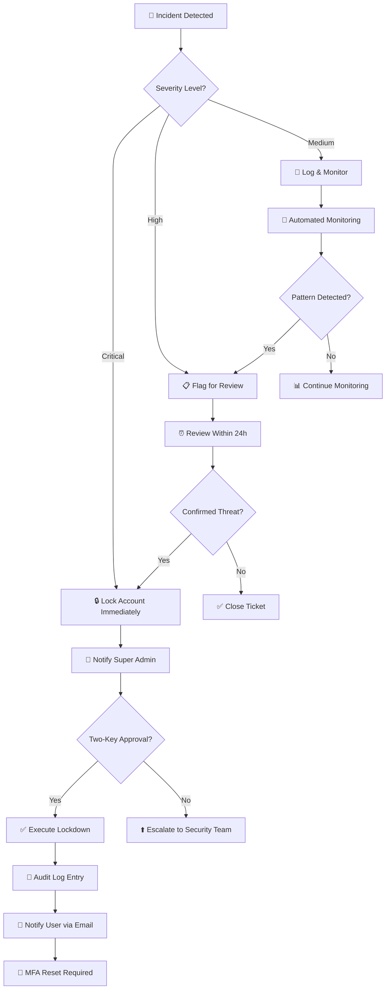
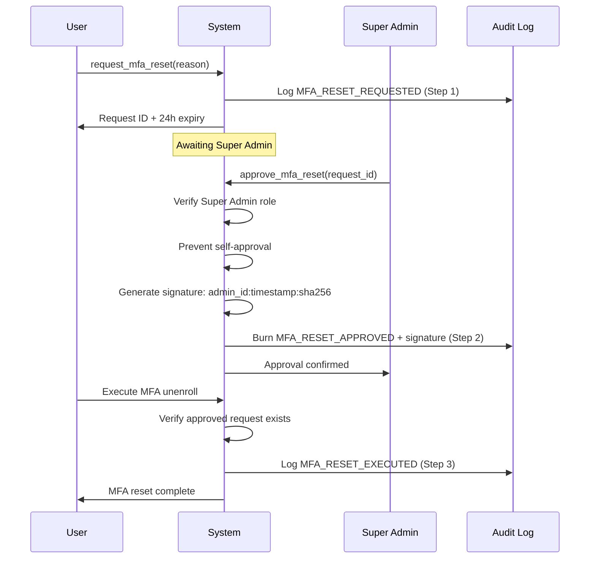

# Indigo Fund Operations Manual

## System Integrity Certificate

This document certifies the operational hardening measures implemented in the Indigo Fund platform.

| Guarantee | Mechanism | Status |
|-----------|-----------|--------|
| **Self-Documenting Evolution** | Delta Audit captures all changes with minimal storage | ✅ Active |
| **Race Condition Prevention** | Advisory locks on all critical financial RPCs | ✅ Active |
| **Temporal Integrity** | T-1 snapshot rule via `validate_yield_temporal_lock` | ✅ Active |
| **Void Safety** | Dependent yields flagged for recalculation | ✅ Active |
| **MFA Sovereignty** | Two-key approval with cryptographic signature | ✅ Active |
| **Immutable Audit Trail** | Protected fields cannot be modified | ✅ Active |
| **Automated Hygiene** | 30-day session / 90-day log purge | ✅ Active |
| **Fail-Safe UI** | Financial errors activate Safe Mode | ✅ Active |

---

## Security Incident Response Flow



---

## Critical RPC Reference

### Financial Operations (Advisory Locked)

| RPC | Purpose | Lock Pattern |
|-----|---------|--------------|
| `admin_create_transaction` | Create ledger entry | `position:{investor_id}:{fund_id}` |
| `approve_withdrawal` | Approve withdrawal request | `withdrawal:{request_id}` |
| `complete_withdrawal` | Execute withdrawal | `withdrawal:{request_id}` |
| `apply_daily_yield_to_fund_v3` | Distribute daily yield | `yield:{fund_id}:{date}` |

### Void Transaction with Yield Dependency Check

When a transaction is voided, the system:
1. Checks for yields calculated after the transaction date
2. Flags affected yields for recalculation review
3. Logs `VOID_YIELD_DEPENDENCY_WARNING` to audit_log
4. Returns warning in response JSON

---

## Two-Key MFA Reset Protocol



### Signature Format
```
{admin_uuid}:{timestamp}:{sha256(request_id + admin_id + timestamp)}
```

---

## Delta Audit Pattern

All changes to critical tables are logged with **delta compression** - only changed fields are stored.

### Monitored Tables
- `transactions_v2` - Core ledger
- `investor_positions` - Balance tracking
- `yield_distributions` - Yield calculations
- `withdrawal_requests` - Withdrawal lifecycle

### Query Patterns

```sql
-- Recent changes to a specific entity
SELECT * FROM audit_log 
WHERE entity = 'transactions_v2' 
  AND entity_id = 'uuid-here'
ORDER BY created_at DESC;

-- All delta updates in last 24h
SELECT * FROM audit_log 
WHERE action = 'DELTA_UPDATE' 
  AND created_at > now() - interval '24 hours'
ORDER BY created_at DESC;

-- Changes by specific actor
SELECT * FROM audit_log 
WHERE actor_user = 'admin-uuid'
ORDER BY created_at DESC
LIMIT 100;
```

---

## Session Management

### Automated Cleanup
The `session-cleanup` edge function runs daily and:
- Deletes `user_sessions` older than **30 days**
- Deletes `access_logs` older than **90 days**
- Expires pending `mfa_reset_requests` past their 24h window
- Runs `cleanup_dormant_positions` for zero-balance cleanup

### Manual Trigger
```bash
curl -X POST https://your-project.supabase.co/functions/v1/session-cleanup \
  -H "Authorization: Bearer YOUR_SERVICE_KEY"
```

---

## Temporal Locking

Yield calculations enforce **T-1 AUM snapshot rule**:

1. Before applying yield for date D, system checks if AUM snapshot exists for D-1
2. If no snapshot: operation blocked with `TEMPORAL_LOCK_VIOLATION`
3. Bypass available via `temporal_lock_bypass` column (requires super_admin)

---

## Residual Dust Handling

Any rounding difference Δ < 10⁻¹⁰ is routed to the platform residual account:
- `dust_amount` column tracks micro-remainders
- `dust_receiver_id` identifies the fees account
- Ensures: `Yield + Fees + IB + Dust = Gross Yield` (exact)

---

## Financial Error Boundary

The UI wraps all financial pages in `FinancialErrorBoundary`:
- On ledger/calculation errors, activates **Safe Mode**
- Disables transaction buttons
- Displays diagnostic information
- Logs error to console and audit

---

## Immutable Fields

The following fields are protected by triggers and cannot be updated:
- `created_at` - Original creation timestamp
- `reference_id` - External reference identifiers
- `actor_user` (in audit_log) - Action performer

Any attempt to modify these fields will raise an exception.
