# Indigo Yield Platform - Operations Flowcharts

> Last Updated: February 18, 2026
> Paste each mermaid block into mermaid.live or any Mermaid renderer to see the diagrams.
> Notion: use /code block with "mermaid" language, or paste into mermaid.live and screenshot.

---

## Master Operations Map

Shows how every operation connects. Green = working, arrows = data flow.

```mermaid
flowchart TB
    subgraph ADMIN["ADMIN PORTAL"]
        A_DASH["Command Center"]
        A_TX["New Transaction"]
        A_WD["Withdrawal Mgmt"]
        A_YIELD["Yield Operations"]
        A_VOID["Void / Corrections"]
        A_REPORTS["Statement Manager"]
        A_FEES["INDIGO Fees"]
        A_FUNDS["Fund Management"]
        A_INTEGRITY["Operations / Health"]
        A_AUDIT["Audit Trail"]
        A_IB["IB Management"]
        A_SETTINGS["Settings"]
    end

    subgraph INVESTOR["INVESTOR PORTAL"]
        I_DASH["Dashboard"]
        I_PORT["Portfolio"]
        I_PERF["Performance"]
        I_YIELD["Yield History"]
        I_TX["Transactions"]
        I_WD["Withdrawals"]
        I_STMT["Statements"]
        I_DOCS["Documents"]
        I_SET["Settings"]
    end

    subgraph ENGINE["FINANCIAL ENGINE"]
        CRYSTAL["Crystallization"]
        LEDGER["Transaction Ledger"]
        POSITION["Position Tracker"]
        AUM["AUM Tracker"]
        FEE_CALC["Fee Calculator"]
        IB_CALC["IB Commission"]
        CONSERVE["Conservation Check"]
        AUDIT_LOG["Audit Log"]
    end

    subgraph DB["DATABASE"]
        T_TX["transactions_v2"]
        T_POS["investor_positions"]
        T_YD["yield_distributions"]
        T_YA["yield_allocations"]
        T_FA["fee_allocations"]
        T_IA["ib_allocations"]
        T_AUM["fund_daily_aum"]
        T_WR["withdrawal_requests"]
        T_AL["audit_log"]
        T_IYE["investor_yield_events"]
    end

    %% Admin actions
    A_TX -->|deposit/withdrawal| CRYSTAL
    A_YIELD -->|preview + apply| FEE_CALC
    A_WD -->|approve| CRYSTAL
    A_VOID -->|void| LEDGER
    A_REPORTS -->|generate| T_IYE

    %% Engine flows
    CRYSTAL -->|credit owed earnings| LEDGER
    FEE_CALC --> IB_CALC
    IB_CALC --> LEDGER
    LEDGER --> POSITION
    POSITION --> AUM
    LEDGER --> CONSERVE
    LEDGER --> AUDIT_LOG

    %% DB writes
    LEDGER --> T_TX
    POSITION --> T_POS
    AUM --> T_AUM
    FEE_CALC --> T_FA
    IB_CALC --> T_IA
    AUDIT_LOG --> T_AL
    CRYSTAL --> T_IYE

    %% Investor reads
    I_DASH --> T_POS
    I_PORT --> T_POS
    I_TX --> T_TX
    I_YIELD --> T_IYE
    I_WD --> T_WR
    I_PERF --> T_POS

    style CRYSTAL fill:#4ade80,color:#000
    style LEDGER fill:#4ade80,color:#000
    style POSITION fill:#4ade80,color:#000
    style AUM fill:#4ade80,color:#000
    style FEE_CALC fill:#4ade80,color:#000
    style IB_CALC fill:#4ade80,color:#000
    style CONSERVE fill:#4ade80,color:#000
    style AUDIT_LOG fill:#4ade80,color:#000
```

---

## 1. Deposit Flow

What happens when admin records a deposit for an investor.

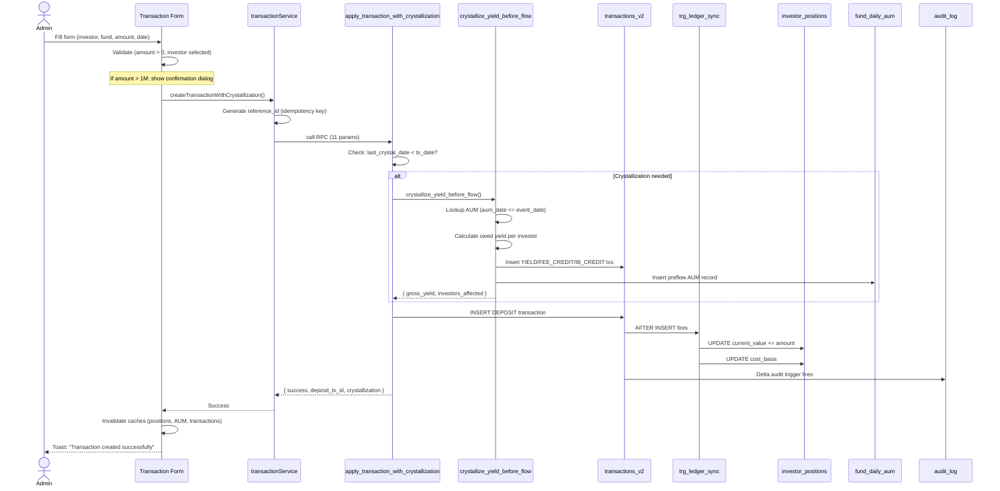

---

## 2. Withdrawal Flow

Full lifecycle from investor request to admin approval.

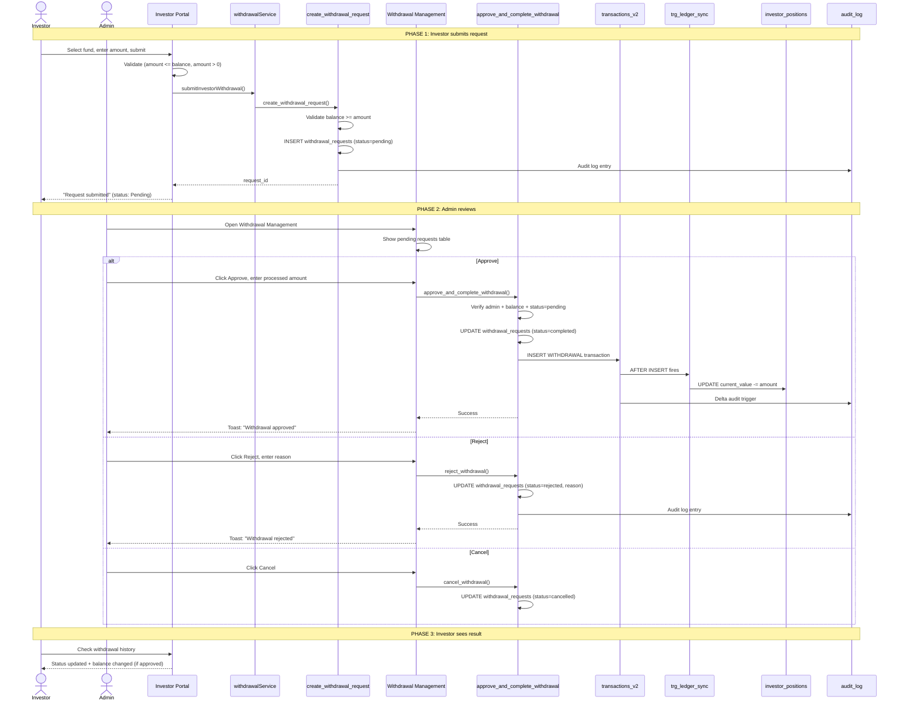

---

## 3. Yield Distribution Flow

Preview, apply, and post-processing.

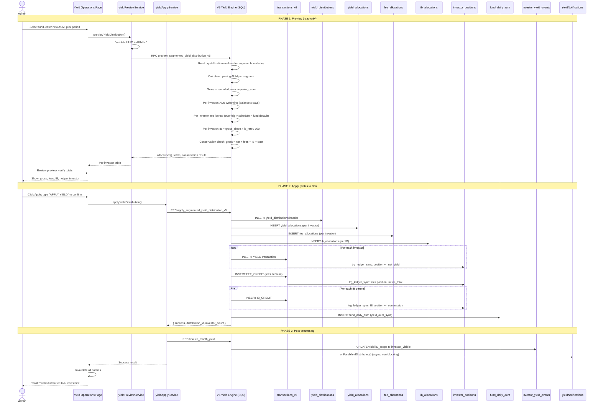

---

## 4. Fee & Commission Calculation

How fees and IB commissions are determined during yield distribution.

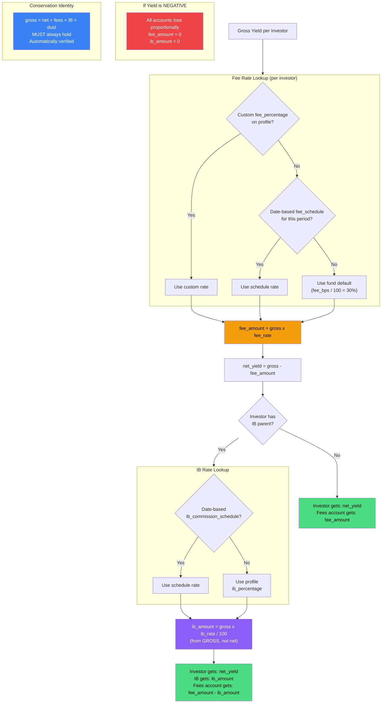

---

## 5. Crystallization Flow

Automatic earnings protection before any deposit or withdrawal.

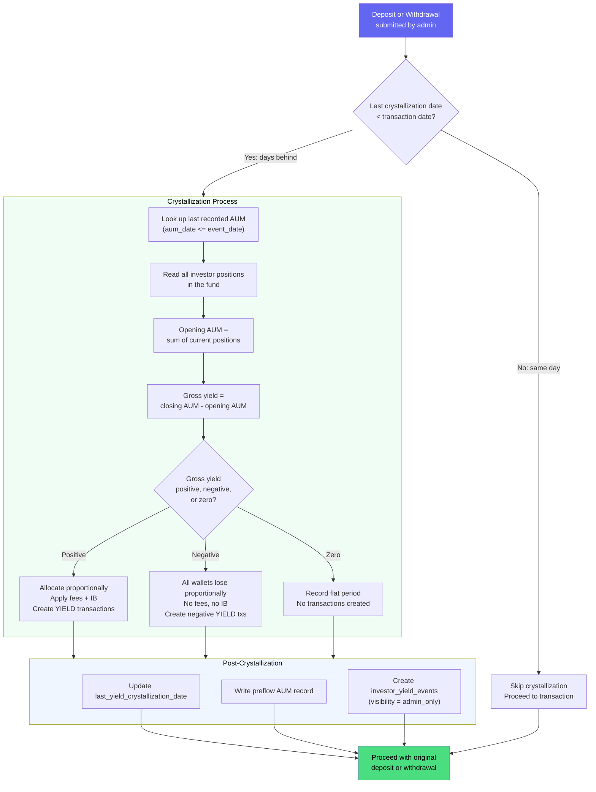

---

## 6. Void Operations

How corrections work for transactions and yield distributions.

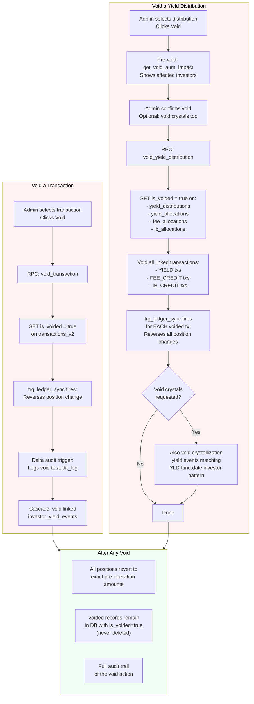

---

## 7. Report & Statement Flow

How monthly statements are generated and delivered.

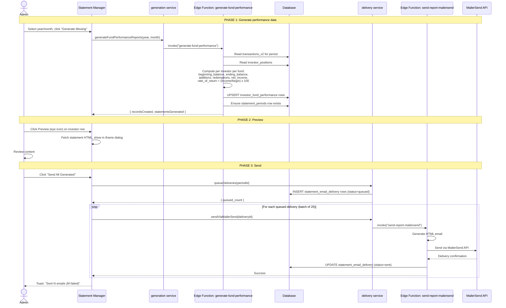

---

## 8. Integrity Check Flow

Three tiers of system health verification.

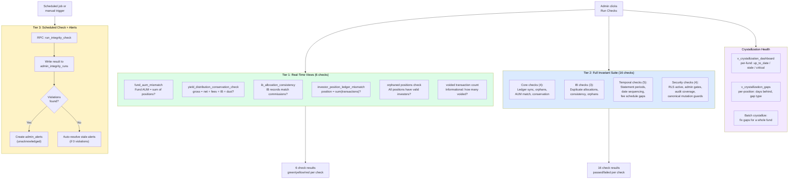

---

## 9. Data Flow: What Writes Where

Every write operation and which tables it touches.

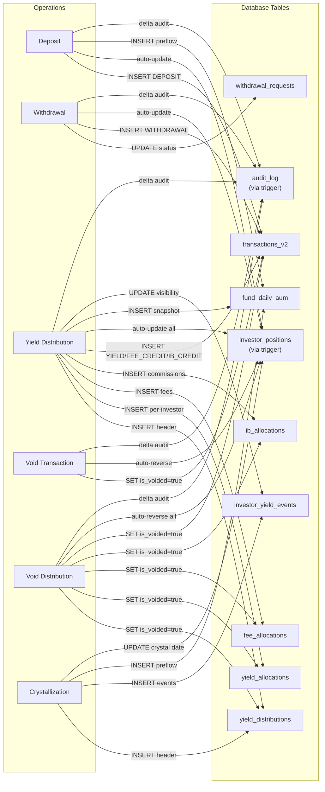

---

## 10. User Journey: Investor Lifecycle

Complete journey from onboarding to earning yield.

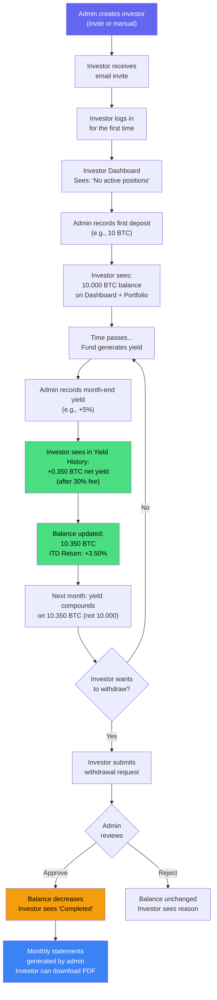

---

## 11. Admin Monthly Operations Sequence

What admin does at month-end in order.

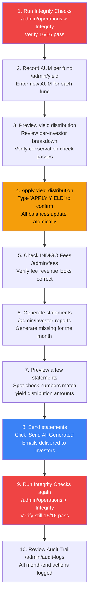

---

## How to Render These Diagrams

**Option 1 -- mermaid.live (easiest)**
1. Go to [mermaid.live](https://mermaid.live)
2. Paste any code block above
3. Screenshot or download the SVG/PNG

**Option 2 -- Notion**
1. Type `/code` in Notion
2. Set language to "Mermaid"
3. Paste the diagram code
4. Notion renders it inline (requires Notion plan with Mermaid support)

**Option 3 -- VS Code**
1. Install "Markdown Preview Mermaid Support" extension
2. Open this file
3. Preview renders all diagrams

**Option 4 -- GitHub**
1. Push this file to any GitHub repo
2. GitHub renders Mermaid natively in markdown files
