# Entity Relationship Diagram

## Overview

This document defines the canonical data model for the Indigo Fund platform, covering all core financial entities and their relationships.

## Core Entity Diagram

```mermaid
erDiagram
    %% Core Entities
    profiles ||--o{ investor_positions : "has"
    profiles ||--o{ transactions_v2 : "owns"
    profiles ||--o{ withdrawal_requests : "creates"
    profiles ||--o{ ib_allocations : "receives (as IB)"
    profiles ||--o{ fee_allocations : "charged"
    profiles }o--o| profiles : "ib_parent_id (IB relationship)"
    
    funds ||--o{ investor_positions : "contains"
    funds ||--o{ transactions_v2 : "records"
    funds ||--o{ yield_distributions : "distributes"
    funds ||--o{ fund_daily_aum : "tracks AUM"
    funds ||--o{ withdrawal_requests : "processes"
    
    yield_distributions ||--o{ fee_allocations : "generates"
    yield_distributions ||--o{ ib_allocations : "generates"
    yield_distributions ||--o{ transactions_v2 : "creates (via distribution_id)"
    
    statement_periods ||--o{ fund_period_snapshot : "captures"
    statement_periods ||--o{ investor_period_snapshot : "captures"
    statement_periods ||--o{ generated_statements : "generates"
    
    fund_period_snapshot ||--o{ investor_period_snapshot : "contains"
    
    %% Entity Definitions
    profiles {
        uuid id PK
        string email
        string first_name
        string last_name
        uuid ib_parent_id FK "Self-reference for IB"
        decimal ib_percentage "IB commission rate"
        decimal fee_percentage "Custom fee rate"
        boolean is_admin
        boolean is_system_account
        boolean include_in_reporting
        string status
        string kyc_status
        string account_type
        timestamp onboarding_date
    }
    
    funds {
        uuid id PK
        string code UK "Fund identifier (e.g., INDIGO-BTC)"
        string name
        string asset "Primary asset (BTC, ETH, USDT)"
        string fund_class
        string strategy
        fund_status status
        integer mgmt_fee_bps "Management fee in basis points"
        integer perf_fee_bps "Performance fee in basis points"
        decimal high_water_mark
        decimal min_investment
        integer lock_period_days
        date inception_date
    }
    
    investor_positions {
        uuid investor_id PK,FK
        uuid fund_id PK,FK
        decimal shares "Unit shares held"
        decimal cost_basis "Total invested"
        decimal current_value "Current position value"
        decimal unrealized_pnl
        decimal realized_pnl
        decimal high_water_mark "Individual HWM"
        decimal mgmt_fees_paid
        decimal perf_fees_paid
        decimal aum_percentage "% of fund AUM"
        string fund_class
        date last_transaction_date
        date lock_until_date
    }
    
    transactions_v2 {
        uuid id PK
        uuid investor_id FK
        uuid fund_id FK
        tx_type type "deposit, withdrawal, interest, fee, adjustment"
        decimal amount
        string asset
        date tx_date "Transaction date"
        date value_date
        uuid distribution_id FK "Links to yield distribution"
        string reference_id UK "Idempotency key"
        aum_purpose purpose "transaction vs reporting"
        boolean is_voided
        string notes
        decimal balance_before
        decimal balance_after
    }
    
    yield_distributions {
        uuid id PK
        uuid fund_id FK
        date effective_date
        decimal recorded_aum "AUM at distribution time"
        decimal previous_aum
        decimal gross_yield "Total yield amount"
        aum_purpose purpose
        string status "draft, applied, voided"
        boolean is_month_end
        string distribution_type "daily, correction"
        uuid parent_distribution_id FK "For corrections"
        json summary_json
    }
    
    fee_allocations {
        uuid id PK
        uuid distribution_id FK
        uuid fund_id FK
        uuid investor_id FK
        uuid fees_account_id FK "Platform fees account"
        date period_start
        date period_end
        decimal base_net_income "Investor net yield before fee"
        decimal fee_percentage
        decimal fee_amount "Calculated fee"
        aum_purpose purpose
        boolean is_voided
        uuid credit_transaction_id FK
        uuid debit_transaction_id FK
    }
    
    ib_allocations {
        uuid id PK
        uuid distribution_id FK
        uuid fund_id FK
        uuid source_investor_id FK "Investor who generated yield"
        uuid ib_investor_id FK "IB who receives commission"
        decimal source_net_income
        decimal ib_percentage
        decimal ib_fee_amount "Commission amount"
        date period_start
        date period_end
        aum_purpose purpose
        string payout_status "pending, paid"
        boolean is_voided
    }
    
    withdrawal_requests {
        uuid id PK
        uuid investor_id FK
        uuid fund_id FK
        decimal requested_amount
        decimal approved_amount
        decimal processed_amount
        withdrawal_status status
        string withdrawal_type "partial, full"
        date request_date
        date settlement_date
        string notes
        uuid approved_by FK
    }
    
    fund_daily_aum {
        uuid id PK
        uuid fund_id FK
        date aum_date
        decimal total_aum
        decimal total_shares
        decimal nav_per_share
        aum_purpose purpose
        boolean is_month_end
        string source
        boolean is_voided
    }
    
    statement_periods {
        uuid id PK
        integer year
        integer month
        date period_start
        date period_end_date
        boolean is_closed
        timestamp closed_at
    }
    
    fund_period_snapshot {
        uuid id PK
        uuid fund_id FK
        uuid period_id FK
        date snapshot_date
        decimal total_aum
        integer investor_count
        boolean is_locked
    }
    
    investor_period_snapshot {
        uuid id PK
        uuid investor_id FK
        uuid fund_id FK
        uuid period_id FK
        uuid fund_period_snapshot_id FK
        decimal balance_at_snapshot
        decimal ownership_pct "% ownership at snapshot"
    }
    
    generated_statements {
        uuid id PK
        uuid investor_id FK
        uuid period_id FK
        uuid user_id FK
        string html_content
        string pdf_url
        string[] fund_names
    }
```



## Table Schemas Summary

### Core Financial Tables

| Table | Primary Key | Key Foreign Keys | Purpose |
|-------|-------------|------------------|---------|
| `profiles` | `id` (UUID) | `ib_parent_id` → `profiles.id` | User/investor accounts |
| `funds` | `id` (UUID) | - | Fund definitions |
| `investor_positions` | `(investor_id, fund_id)` | Both → FK | Current holdings |
| `transactions_v2` | `id` (UUID) | `investor_id`, `fund_id`, `distribution_id` | Ledger entries |

### Yield Distribution Tables

| Table | Primary Key | Key Foreign Keys | Purpose |
|-------|-------------|------------------|---------|
| `yield_distributions` | `id` (UUID) | `fund_id` | Yield application records |
| `fee_allocations` | `id` (UUID) | `distribution_id`, `investor_id` | Fee deductions |
| `ib_allocations` | `id` (UUID) | `distribution_id`, `source_investor_id`, `ib_investor_id` | IB commissions |

### Reporting Tables

| Table | Primary Key | Key Foreign Keys | Purpose |
|-------|-------------|------------------|---------|
| `statement_periods` | `id` (UUID) | - | Monthly periods |
| `fund_period_snapshot` | `id` (UUID) | `fund_id`, `period_id` | Fund state at period end |
| `investor_period_snapshot` | `id` (UUID) | `investor_id`, `fund_id`, `period_id` | Investor state at period end |
| `generated_statements` | `id` (UUID) | `investor_id`, `period_id` | Generated reports |

### AUM Tracking Tables

| Table | Primary Key | Key Foreign Keys | Purpose |
|-------|-------------|------------------|---------|
| `fund_daily_aum` | `(fund_id, aum_date, purpose)` | `fund_id` | Daily AUM records |
| `daily_nav` | `(fund_id, nav_date)` | `fund_id` | NAV calculations |

## Key Relationships

### IB (Introducing Broker) Chain
```
profiles.ib_parent_id → profiles.id
```
- Self-referential FK creating IB hierarchy
- `ib_percentage` defines commission rate (0-100%)
- IB allocations created when referral generates yield

### Yield Distribution Flow
```
yield_distributions → fee_allocations → transactions_v2
                   → ib_allocations
                   → transactions_v2 (interest entries)
```

### Position Reconciliation
```
investor_positions.current_value = Σ transactions_v2 (by investor_id, fund_id)
```

### Snapshot System
```
statement_periods → fund_period_snapshot → investor_period_snapshot
```
- Snapshots lock ownership percentages at period end
- Yield allocation uses snapshot data, not live positions

## Cascade and Delete Rules

| Relationship | On Delete | Rationale |
|--------------|-----------|-----------|
| `profiles` → `investor_positions` | RESTRICT | Cannot delete investor with positions |
| `funds` → `investor_positions` | RESTRICT | Cannot delete fund with positions |
| `yield_distributions` → `fee_allocations` | CASCADE | Voiding distribution voids allocations |
| `yield_distributions` → `ib_allocations` | CASCADE | Voiding distribution voids IB allocations |
| `profiles.ib_parent_id` → `profiles` | SET NULL | IB deletion orphans referrals |

## Unique Constraints (Idempotency)

| Table | Unique Constraint | Purpose |
|-------|-------------------|---------|
| `transactions_v2` | `reference_id` (partial, WHERE NOT NULL) | Prevent duplicate transactions |
| `fund_daily_aum` | `(fund_id, aum_date, purpose)` | One AUM record per fund/date/purpose |
| `fee_allocations` | `(distribution_id, investor_id)` | One fee per distribution per investor |
| `ib_allocations` | `(distribution_id, source_investor_id, ib_investor_id)` | One IB alloc per distribution |
| `investor_positions` | `(investor_id, fund_id)` | One position per investor per fund |

## Enums

| Enum | Values | Usage |
|------|--------|-------|
| `aum_purpose` | `transaction`, `reporting` | Separates operational vs reporting data |
| `tx_type` | `deposit`, `withdrawal`, `interest`, `fee`, `adjustment`, `transfer` | Transaction types |
| `withdrawal_status` | `pending`, `approved`, `processing`, `completed`, `rejected`, `cancelled` | Withdrawal workflow |
| `fund_status` | `active`, `closed`, `suspended` | Fund lifecycle |
