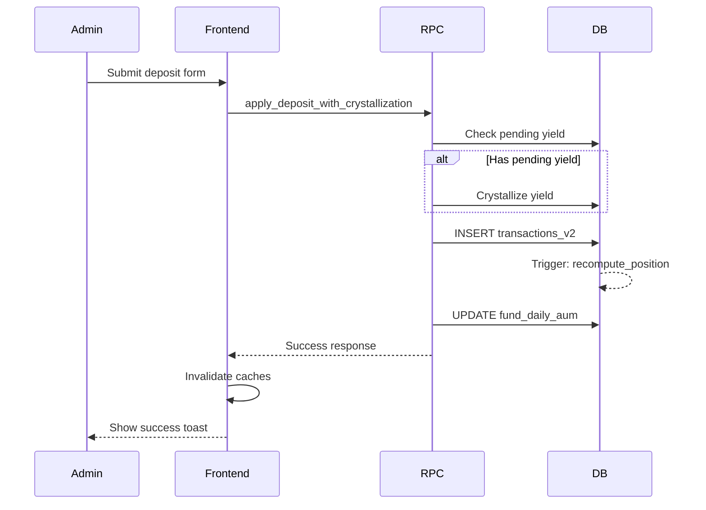

# Deposit Flow

> **Status**: Active | **Last Updated**: 2026-01-19

## Overview

Admin creates deposits for investors, which update positions and fund AUM.
Deposits use the crystallization pathway to properly account for any pending yield.

## ⚠️ CRITICAL: Crystallization is MANDATORY

Crystallization is **NOT optional**. The system enforces this via a database trigger:

```sql
-- Trigger: enforce_crystallization_before_flow
-- Raises: EXCEPTION 'CRYSTALLIZATION_REQUIRED: Must crystallize yield before deposit/withdrawal'
```

**Why it's mandatory**:
1. Ensures yield is captured at correct AUM before capital flows change the base
2. Prevents yield dilution (deposits) or over-distribution (withdrawals)
3. Maintains accounting invariant: `Position = Sum(Ledger)`

## RPC: `apply_deposit_with_crystallization`

This is the **canonical** deposit pathway that:
1. **MANDATORY**: Crystallizes any pending yield for the investor before the deposit
2. Creates the deposit transaction in the ledger
3. Updates investor position
4. Updates fund AUM

**Preconditions**:
- Admin authenticated (`is_admin()` check)
- Investor exists and is active
- Fund exists and is active
- AUM snapshot exists for the effective date (or can be created)

**Inputs**:
| Parameter | Type | Description |
|-----------|------|-------------|
| `p_investor_id` | UUID | Target investor |
| `p_fund_id` | UUID | Target fund |
| `p_amount` | NUMERIC | Deposit amount (positive) |
| `p_effective_date` | DATE | Value date for the deposit |
| `p_closing_aum` | NUMERIC | Fund AUM after the deposit |
| `p_notes` | TEXT | Optional notes |
| `p_reference_id` | TEXT | Idempotency key |

**Writes**:
- `transactions_v2` - Creates DEPOSIT transaction
- `investor_positions` - Updates via position recompute trigger
- `fund_daily_aum` - Updates AUM snapshot

**Idempotency**: 
- Uses `reference_id` unique constraint on `transactions_v2`
- Duplicate calls with same reference_id will fail gracefully

**Postconditions**:
- `Position = Sum(Ledger WHERE is_voided=false)`
- AUM updated to `p_closing_aum`
- Pending yield crystallized if applicable

## Alternative: `admin_create_transaction`

For simple deposits without crystallization context (e.g., first investment with no prior position), use:

```typescript
rpc.call("admin_create_transaction", {
  p_investor_id: investorId,
  p_fund_id: fundId,
  p_amount: amount,
  p_type: "DEPOSIT",
  p_effective_date: date,
  p_notes: notes,
});
```

This creates a transaction without the crystallization pre-check.

## Cache Invalidation

```typescript
import { invalidateAfterTransaction } from "@/utils/cacheInvalidation";

// After successful deposit
invalidateAfterTransaction(queryClient, investorId, fundId);
```

This invalidates:
- `['deposits']`
- `['transactions']`
- `['investor-positions']`
- `['admin', 'investors']`
- Fund-specific queries

## Flow Diagram



## Related Documentation

- [FLOW_MATRIX.md](./FLOW_MATRIX.md) - Crystallization section
- [TRANSACTION_FUNCTIONS.md](../patterns/TRANSACTION_FUNCTIONS.md) - Transaction function architecture
- [YIELD_FLOW.md](./YIELD_FLOW.md) - Yield distribution flow

## Status: ✅ PASS
