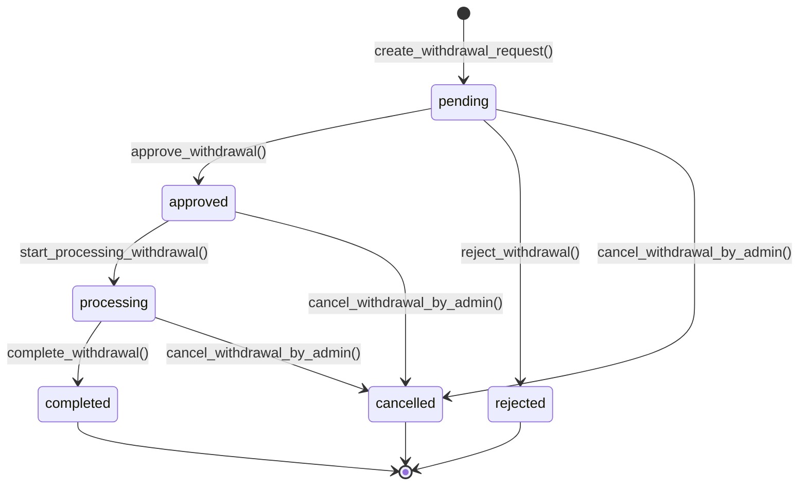

# Withdrawal Flow

> **Status**: Active | **Last Updated**: 2026-01-19 | **P1-02 Consolidated**

This document defines the canonical withdrawal request lifecycle.

---

## State Machine



## State Transition Validator

A canonical helper function validates all transitions:

```sql
SELECT validate_withdrawal_transition('pending', 'approved');     -- true
SELECT validate_withdrawal_transition('pending', 'processing');   -- false (must go through approved)
SELECT validate_withdrawal_transition('processing', 'pending');   -- false (can't go back)
SELECT validate_withdrawal_transition('processing', 'cancelled'); -- true
```

## Valid State Transitions

| From | To | Actor | RPC Function | Notes |
|------|-----|-------|--------------|-------|
| (new) | pending | Investor/Admin | `create_withdrawal_request()` | Validates available balance |
| pending | approved | Admin | `approve_withdrawal()` | Uses advisory lock |
| pending | rejected | Admin | `reject_withdrawal()` | Terminal state |
| pending | cancelled | Admin | `cancel_withdrawal_by_admin()` | Terminal state |
| approved | processing | Super Admin | `start_processing_withdrawal()` | Uses advisory lock |
| approved | cancelled | Admin | `cancel_withdrawal_by_admin()` | Terminal state |
| processing | completed | Super Admin | `complete_withdrawal()` | **MANDATORY crystallization** then ledger impact |
| processing | cancelled | Admin | `cancel_withdrawal_by_admin()` | No ledger impact |

## ⚠️ CRITICAL: Crystallization is MANDATORY

Crystallization is **NOT optional** for withdrawal completion. The system enforces this via a database trigger:

```sql
-- Trigger: enforce_crystallization_before_flow
-- Raises: EXCEPTION 'CRYSTALLIZATION_REQUIRED: Must crystallize yield before deposit/withdrawal'
```

The `complete_withdrawal()` RPC internally calls `apply_withdrawal_with_crystallization()` which:
1. Captures pending yield at pre-withdrawal AUM
2. Deducts the withdrawal amount from investor position
3. Updates fund AUM to the provided closing value

## Database Tables

### withdrawal_requests
Core withdrawal data table.

| Column | Type | Description |
|--------|------|-------------|
| id | uuid | Primary key |
| investor_id | uuid | FK to profiles |
| fund_id | uuid | FK to funds |
| requested_amount | numeric | Original request amount |
| processed_amount | numeric | Final processed amount (may differ) |
| status | withdrawal_status | Current state |
| withdrawal_type | text | 'partial' or 'full' |
| notes | text | Investor notes |
| admin_notes | text | Admin notes |
| tx_hash | text | Blockchain transaction hash |
| rejection_reason | text | Reason if rejected |
| cancellation_reason | text | Reason if cancelled |
| request_date | timestamp | When created |
| processed_at | timestamp | When completed |
| approved_by | uuid | Admin who approved |
| rejected_by | uuid | Admin who rejected |
| cancelled_by | uuid | Admin who cancelled |

### withdrawal_audit_logs (canonical)
Audit trail for all withdrawal actions. **Note**: A view alias `withdrawal_audit_log` (singular) exists for compatibility.

| Column | Type | Description |
|--------|------|-------------|
| id | uuid | Primary key |
| request_id | uuid | FK to withdrawal_requests |
| action | withdrawal_action | Action performed |
| actor_id | uuid | Who performed action |
| details | jsonb | Additional context |
| created_at | timestamp | When action occurred |

## RPC Functions Reference

### State Transition Functions

| Function | Signature | Security | Description |
|----------|-----------|----------|-------------|
| `create_withdrawal_request` | `(p_investor_id, p_fund_id, p_amount, p_type, p_notes)` | Authenticated | Creates pending request |
| `approve_withdrawal` | `(p_request_id, p_approved_amount, p_admin_notes)` | Admin | pending → approved |
| `reject_withdrawal` | `(p_request_id, p_reason, p_admin_notes)` | Admin | pending → rejected |
| `start_processing_withdrawal` | `(p_request_id, p_processed_amount, p_tx_hash, p_settlement_date, p_admin_notes)` | Super Admin | approved → processing |
| `complete_withdrawal` | `(p_request_id, p_closing_aum, p_event_ts, p_transaction_hash, p_admin_notes)` | Super Admin | processing → completed |
| `cancel_withdrawal_by_admin` | `(p_request_id, p_reason)` | Admin | pending/approved/processing → cancelled |

### Helper Functions

| Function | Signature | Description |
|----------|-----------|-------------|
| `validate_withdrawal_transition` | `(p_current_status, p_new_status)` | Returns boolean if transition is valid |
| `acquire_withdrawal_lock` | `(p_request_id)` | Advisory lock for concurrency |
| `log_withdrawal_action` | `(p_request_id, p_action, p_details)` | Inserts audit log entry |
| `update_withdrawal` | `(p_withdrawal_id, p_requested_amount, p_withdrawal_type, p_notes, p_reason)` | Edit pending request |
| `delete_withdrawal` | `(p_withdrawal_id, p_reason, p_hard_delete)` | Soft/hard delete |
| `route_withdrawal_to_fees` | `(p_request_id, p_reason)` | Route to INDIGO FEES |

## Invariants

1. **Audit Trail Complete**: Every status change MUST have a corresponding `withdrawal_audit_logs` entry
2. **No Orphan Audits**: Every audit log MUST reference a valid `withdrawal_requests.id`
3. **Terminal State Immutable**: Once in `rejected`, `completed`, or `cancelled`, status cannot change
4. **Amount Conservation**: `processed_amount` ≤ `requested_amount` (enforced by RPC)
5. **Ledger Impact Only on Complete**: Only `complete_withdrawal()` affects positions/transactions

## Frontend Cache Invalidation

After any withdrawal mutation:
```typescript
invalidateAfterWithdrawal(queryClient, investorId, fundId, withdrawalId);
```

This invalidates: withdrawals, positions, transactions, and stats queries.

## Error Handling

| Error Code | Description | Resolution |
|------------|-------------|------------|
| `WITHDRAWAL_NOT_FOUND` | Request ID doesn't exist | Verify ID |
| `INVALID_STATE_TRANSITION` | Invalid status change | Check current status |
| `WITHDRAWAL_LOCKED` | Concurrent operation in progress | Retry after delay |
| `UNAUTHORIZED` | Missing required role | Check admin/super_admin status |
| `INSUFFICIENT_BALANCE` | Amount exceeds available | Reduce amount |

## Testing Checklist

### Manual QA
- [ ] Create withdrawal request
- [ ] Approve withdrawal
- [ ] Start processing
- [ ] Complete withdrawal (verify ledger impact)
- [ ] Cancel from pending state
- [ ] Cancel from approved state
- [ ] Cancel from processing state
- [ ] Reject withdrawal
- [ ] Verify audit logs for each action

### Database Assertions
```sql
-- All withdrawals have at least one audit entry
SELECT w.id FROM withdrawal_requests w
LEFT JOIN withdrawal_audit_logs a ON a.request_id = w.id
WHERE a.id IS NULL;  -- Should return empty

-- Test state transition validator
SELECT 
  validate_withdrawal_transition('pending', 'approved') as should_be_true,
  validate_withdrawal_transition('completed', 'pending') as should_be_false;
```
