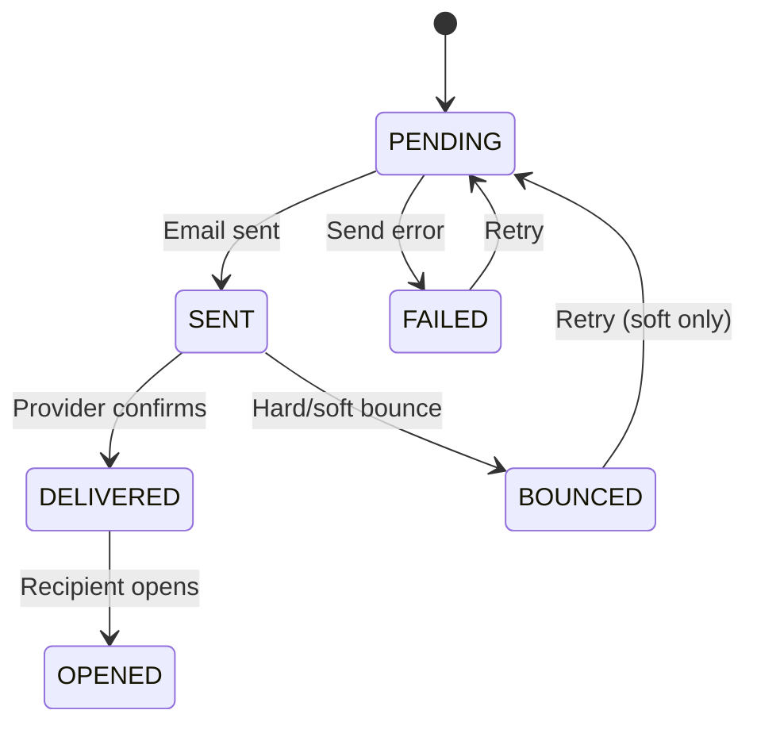

# Report Delivery Center Page Contract

## Route
`/admin/operations/email-tracking`

## Component
`src/pages/admin/ReportDeliveryCenterPage.tsx`

## Purpose
Admin dashboard for managing statement email delivery, tracking delivery status, and handling bounces/retries.

---

## Data Sources

### Primary Tables
| Table | Purpose |
|-------|---------|
| `statement_email_delivery` | Delivery records |
| `generated_statements` | Statement data |
| `statement_periods` | Period information |
| `profiles` | Investor details |
| `report_delivery_events` | Webhook events |
| `report_delivery_audit` | Status change audit |

---

## Join Logic

### Delivery List
```sql
SELECT 
  sed.*,
  p.email as investor_email,
  p.first_name || ' ' || p.last_name as investor_name,
  sp.year as period_year,
  sp.month as period_month,
  gs.fund_names
FROM statement_email_delivery sed
JOIN profiles p ON p.id = sed.investor_id
JOIN statement_periods sp ON sp.id = sed.period_id
LEFT JOIN generated_statements gs ON gs.id = sed.statement_id
ORDER BY sed.created_at DESC;
```

### Delivery with Events
```sql
SELECT 
  rde.*
FROM report_delivery_events rde
WHERE rde.delivery_id = :delivery_id
ORDER BY rde.occurred_at ASC;
```

---

## Filters

| Filter | Type | Default | Purpose |
|--------|------|---------|---------|
| `status` | Multi-select | All | Filter by delivery status |
| `period_id` | Select | Latest | Filter by statement period |
| `search` | Text | Empty | Search investor name/email |
| `date_range` | Date range | Last 7 days | Created date filter |

---

## Aggregation Rules

### Summary Stats
```
total_queued = COUNT WHERE status = 'PENDING'
total_sent = COUNT WHERE status = 'SENT'
total_delivered = COUNT WHERE status = 'DELIVERED'
total_opened = COUNT WHERE opened_at IS NOT NULL
total_bounced = COUNT WHERE status = 'BOUNCED'
total_failed = COUNT WHERE status = 'FAILED'
```

### Delivery Rate
```
delivery_rate = (delivered / (sent + failed)) × 100
open_rate = (opened / delivered) × 100
bounce_rate = (bounced / sent) × 100
```

---

## Precision Rules

| Field | Format |
|-------|--------|
| Percentages | X.X% |
| Counts | Integer |
| Timestamps | Relative ("2h ago") + full on hover |

---

## Status Workflow



---

## Cache Invalidation

### After Status Change
- `['report-delivery']`
- `['report-delivery', periodId]`
- `['report-delivery-stats']`

### After Retry
- `['report-delivery', deliveryId]`
- `['report-delivery-stats']`

---

## State Management

### React Query Keys
```typescript
const deliveriesQuery = useQuery({ 
  queryKey: ['report-delivery', { periodId, status: filters.status }] 
});
const statsQuery = useQuery({ 
  queryKey: ['report-delivery-stats', periodId] 
});
const eventsQuery = useQuery({ 
  queryKey: ['report-delivery-events', selectedDeliveryId],
  enabled: !!selectedDeliveryId
});
```

---

## Actions

| Action | RLS Check | Effect |
|--------|-----------|--------|
| View | is_admin() | Read only |
| Retry | is_admin() | Reset status to PENDING |
| Cancel | is_admin() | Set status to CANCELLED |
| Bulk send | is_admin() | Queue all pending |

---

## Error Handling

| Error | User Message | Recovery |
|-------|--------------|----------|
| No deliveries | "No deliveries for this period" | Select different period |
| Send failure | Toast with error code | Retry button |
| Invalid email | "Invalid recipient email" | Update investor email |

---

## Webhook Event Types

| Event | Description |
|-------|-------------|
| `delivered` | Email delivered to recipient |
| `opened` | Recipient opened email |
| `clicked` | Recipient clicked link |
| `bounced` | Email bounced |
| `complained` | Marked as spam |
| `unsubscribed` | Recipient unsubscribed |

---

## Accessibility

- Status badges are color-coded with text labels
- Table is keyboard navigable
- Retry confirmations are accessible
- Event timeline is screen-reader friendly
