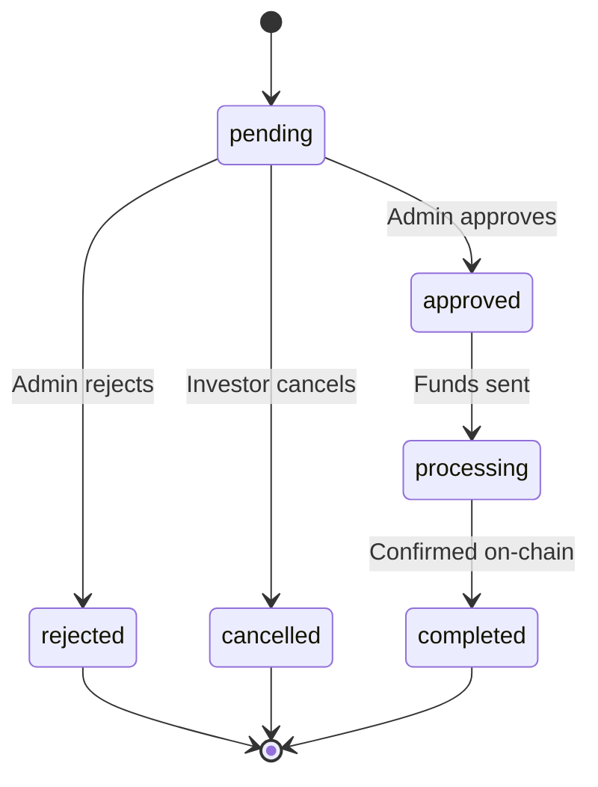

# Withdrawals Page Contract

## Route
`/admin/withdrawals`

## Component
`src/pages/admin/AdminWithdrawalsPage.tsx`

## Purpose
Admin interface for viewing, approving, and processing withdrawal requests.

---

## Data Sources

### Primary Tables
| Table | Purpose |
|-------|---------|
| `withdrawal_requests` | All withdrawal requests |
| `profiles` | Investor details |
| `funds` | Fund details |
| `investor_positions` | Position validation |
| `withdrawal_audit_logs` | Audit trail |

### Views Used
| View | Purpose |
|------|---------|
| `withdrawal_queue` | Pending requests prioritized |

---

## Join Logic

### Withdrawal List
```sql
SELECT 
  wr.*,
  p.email as investor_email,
  p.first_name || ' ' || p.last_name as investor_name,
  f.code as fund_code,
  f.name as fund_name,
  f.asset,
  ip.current_value as available_balance,
  ap.email as approved_by_email
FROM withdrawal_requests wr
JOIN profiles p ON p.id = wr.investor_id
JOIN funds f ON f.id = wr.fund_id
LEFT JOIN investor_positions ip ON ip.investor_id = wr.investor_id 
  AND ip.fund_id = wr.fund_id
LEFT JOIN profiles ap ON ap.id = wr.approved_by
ORDER BY 
  CASE wr.status 
    WHEN 'pending' THEN 1 
    WHEN 'approved' THEN 2 
    WHEN 'processing' THEN 3 
    ELSE 4 
  END,
  wr.request_date ASC;
```

---

## Filters

| Filter | Type | Default | Purpose |
|--------|------|---------|---------|
| `status` | Multi-select | pending, approved | Status filter |
| `fund_id` | Select | All | Filter by fund |
| `date_range` | Date range | Last 30 days | Request date filter |
| `search` | Text | Empty | Search investor name/email |

---

## Aggregation Rules

### Summary Stats
```
pending_count = COUNT WHERE status = 'pending'
pending_amount = Σ requested_amount WHERE status = 'pending'
approved_count = COUNT WHERE status = 'approved'
processing_amount = Σ approved_amount WHERE status = 'processing'
```

### Validation
```
// Before approval
can_approve = requested_amount <= investor_position.current_value
partial_allowed = fund.allows_partial_withdrawal
```

---

## Precision Rules

| Field | Decimals | Format |
|-------|----------|--------|
| Requested amount | 8 (crypto) | Asset-specific |
| Approved amount | 8 (crypto) | Asset-specific |
| USD equivalent | 2 | $X,XXX.XX |

---

## Cache Invalidation

### After Approval
- `['withdrawals']`
- `['withdrawals', 'pending']`
- `['investor-positions', investorId]`
- `['transactions', investorId]`
- `['fund-aum', fundId]`

### After Processing
- `['withdrawals']`
- `['withdrawals', 'processing']`

---

## State Management

### React Query Keys
```typescript
const withdrawalsQuery = useQuery({ 
  queryKey: ['withdrawals', { status: filters.status, fundId: filters.fundId }] 
});
const pendingCountQuery = useQuery({ 
  queryKey: ['withdrawals', 'pending', 'count'] 
});
```

### Local State
```typescript
const [selectedWithdrawal, setSelectedWithdrawal] = useState<Withdrawal | null>(null);
const [filters, setFilters] = useState<WithdrawalFilters>(defaultFilters);
const [isApproving, setIsApproving] = useState(false);
```

---

## Workflow States



---

## Error Handling

| Error | User Message | Recovery |
|-------|--------------|----------|
| Insufficient balance | "Investor balance too low" | Adjust amount or reject |
| Already processed | "Withdrawal already processed" | Refresh list |
| Fund locked | "Investor in lock period" | Show lock end date |
| RPC failure | Toast with error | Retry |

---

## Actions

| Action | RLS Check | Audit |
|--------|-----------|-------|
| View | is_admin() | No |
| Approve | is_admin() | Yes |
| Reject | is_admin() | Yes |
| Process | is_admin() | Yes |
| Cancel | is_admin() OR owner | Yes |

---

## Accessibility

- Table is keyboard navigable
- Status badges have ARIA labels
- Action buttons have tooltips
- Confirmation dialogs are focus-trapped
