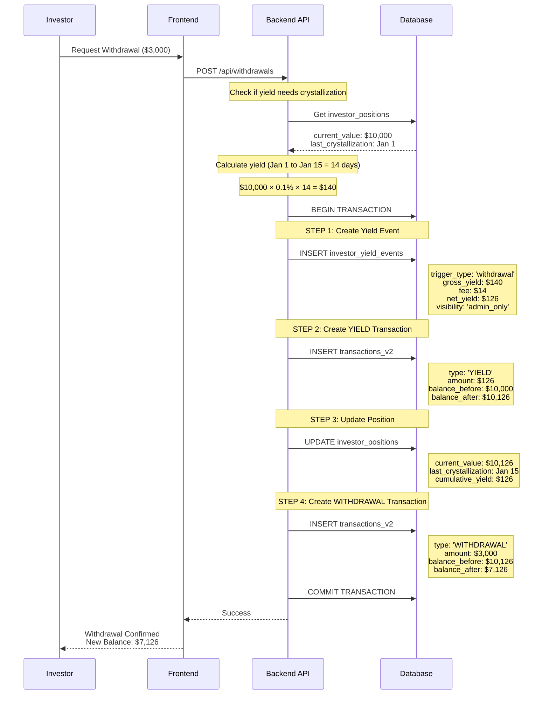
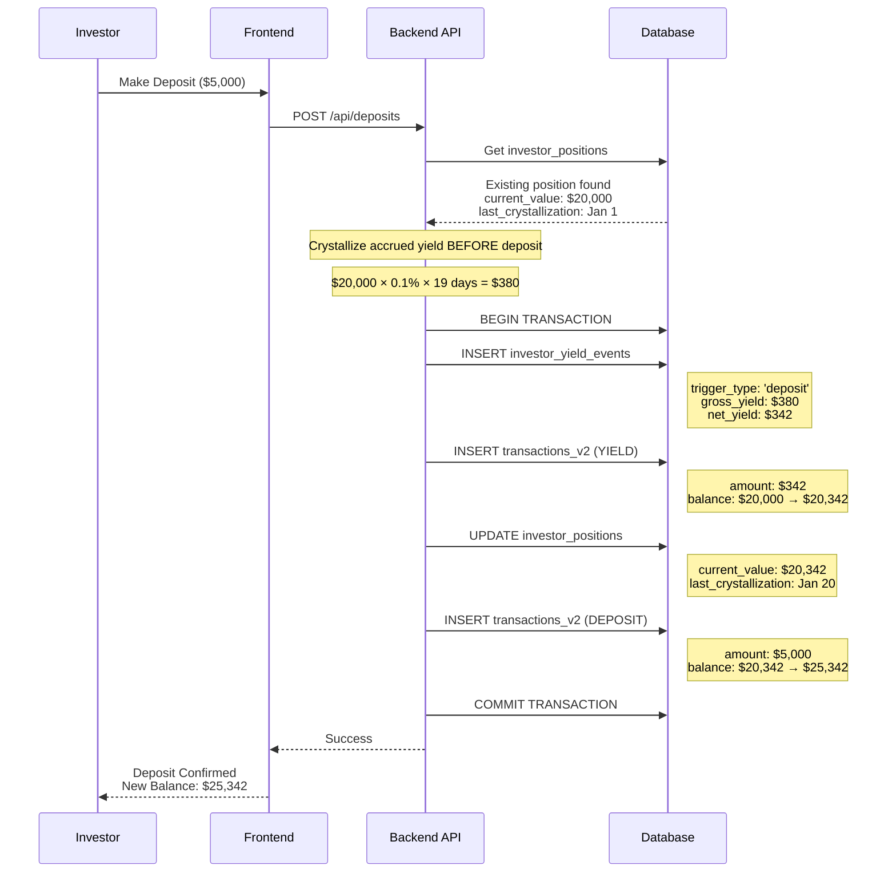
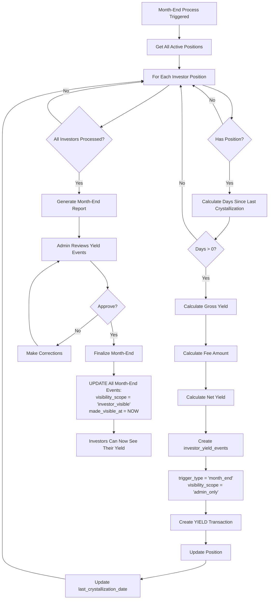
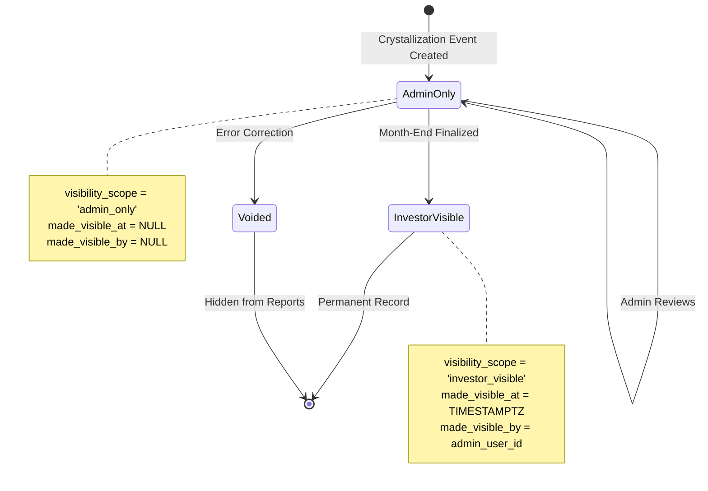

# Yield Crystallization Flow Diagrams

## Overview

This document provides visual flowcharts and diagrams for the yield crystallization process.

## 1. Withdrawal-Triggered Crystallization



## 2. Deposit-Triggered Crystallization



## 3. Month-End Batch Crystallization



## 4. Transaction Ordering Guarantee

```mermaid
gantt
    title Transaction Ordering in Crystallization
    dateFormat HH:mm:ss
    axisFormat %H:%M:%S

    section Withdrawal Flow
    Get Position Data           :a1, 10:00:00, 1s
    Calculate Yield             :a2, after a1, 1s
    INSERT yield_event          :a3, after a2, 1s
    INSERT YIELD transaction    :a4, after a3, 1s
    UPDATE position             :a5, after a4, 1s
    INSERT WITHDRAWAL transaction :a6, after a5, 1s

    section Database Constraint
    YIELD created_at            :milestone, after a4, 0s
    WITHDRAWAL created_at       :milestone, after a6, 0s
```



## 5. Multiple Crystallizations in Same Month

```
Timeline: January 2026

Jan 1           Jan 10          Jan 20          Jan 31
|---------------|---------------|---------------|
Deposit         Withdraw        Deposit         Month-End
$10,000         $1,000          $5,000          (finalize)

Crystallization Events:
━━━━━━━━━━━━━━━━━━━━━━━━━━━━━━━━━━━━━━━━━━━━━━━━

1️⃣ Jan 10 Withdrawal
   Period: Jan 1 → Jan 10 (9 days)
   Balance: $10,000
   Yield: $10,000 × 0.1% × 9 = $90
   New Balance: $10,090 - $1,000 = $9,090

2️⃣ Jan 20 Deposit
   Period: Jan 10 → Jan 20 (10 days)
   Balance: $9,090
   Yield: $9,090 × 0.1% × 10 = $90.90
   New Balance: $9,180.90 + $5,000 = $14,180.90

3️⃣ Jan 31 Month-End
   Period: Jan 20 → Jan 31 (11 days)
   Balance: $14,180.90
   Yield: $14,180.90 × 0.1% × 11 = $155.99
   New Balance: $14,336.89
```

## 6. Visibility Scope State Machine



## 7. Balance Calculation Flow

```
Initial State:
├─ Position: $10,000
├─ Last Crystallization: Jan 1
└─ Cumulative Yield: $0

Withdrawal on Jan 15:
├─ Step 1: Calculate Accrued Yield
│   └─ $10,000 × 0.1% × 14 days = $140 (gross)
│       └─ Fee: $140 × 10% = $14
│       └─ Net: $140 - $14 = $126
│
├─ Step 2: Apply Yield to Position
│   └─ $10,000 + $126 = $10,126
│
├─ Step 3: Apply Withdrawal
│   └─ $10,126 - $3,000 = $7,126
│
└─ Final State:
    ├─ Position: $7,126
    ├─ Last Crystallization: Jan 15
    └─ Cumulative Yield: $126

Verification:
✓ Position Balance = $7,126
✓ Transactions:
    - DEPOSIT (Jan 1): +$10,000 → $10,000
    - YIELD (Jan 15): +$126 → $10,126
    - WITHDRAWAL (Jan 15): -$3,000 → $7,126
✓ Sum of Transactions = $7,126 ✓
```

## 8. Database Relationships

```
┌─────────────────────────────┐
│   investor_positions        │
│─────────────────────────────│
│ investor_id                 │
│ fund_id                     │
│ current_value               │◄────┐
│ last_yield_crystallization_date│  │
│ cumulative_yield_earned     │    │
└─────────────────────────────┘    │
                                   │
                                   │ Updates
                                   │
┌─────────────────────────────┐    │
│   investor_yield_events     │    │
│─────────────────────────────│    │
│ id                          │    │
│ investor_id                 │────┤
│ fund_id                     │    │
│ event_date                  │    │
│ trigger_type                │    │
│ period_start                │    │
│ period_end                  │    │
│ days_in_period              │    │
│ gross_yield_amount          │    │
│ net_yield_amount            │    │
│ visibility_scope            │    │
│ trigger_transaction_id      │────┐
└─────────────────────────────┘    │
                                   │
                                   │ References
                                   │
┌─────────────────────────────┐    │
│   transactions_v2           │    │
│─────────────────────────────│    │
│ id                          │◄───┘
│ investor_id                 │
│ fund_id                     │
│ type (YIELD/DEPOSIT/...)    │
│ amount                      │
│ balance_before              │
│ balance_after               │
│ tx_date                     │
│ created_at                  │
└─────────────────────────────┘
```

## 9. Test Scenarios Summary

| Scenario | Deposit | Action | Days | Expected Yield | Final Balance |
|----------|---------|--------|------|----------------|---------------|
| **Same-Day Withdrawal** | Jan 1: $10,000 | Jan 1: -$1,000 | 0 | $0 | $9,000 |
| **14-Day Withdrawal** | Jan 1: $10,000 | Jan 15: -$3,000 | 14 | $140 | $7,140 |
| **19-Day Deposit** | Jan 1: $20,000 | Jan 20: +$5,000 | 19 | $380 | $25,380 |
| **30-Day Month-End** | Jan 1: $15,000 | Jan 31: (crystallize) | 30 | $450 | $15,450 |
| **16-Day Partial Month** | Jan 15: $12,000 | Jan 31: (crystallize) | 16 | $192 | $12,192 |
| **Multiple Events** | Jan 1: $10,000 | Jan 10: -$1,000<br/>Jan 20: +$5,000<br/>Jan 31: (month-end) | 9+10+11 | $90+$91+$156 | $14,337 |

## 10. API Endpoints (Expected)

```typescript
// Crystallization API endpoints

POST /api/admin/crystallization/batch
{
  "fund_id": "uuid",
  "crystallization_date": "2026-01-31",
  "trigger_type": "month_end"
}

POST /api/admin/crystallization/finalize
{
  "month": 1,
  "year": 2026,
  "fund_id": "uuid"
}

GET /api/investor/yield-events
Query: ?start_date=2026-01-01&end_date=2026-01-31
Response: [
  {
    "id": "uuid",
    "event_date": "2026-01-31",
    "trigger_type": "month_end",
    "gross_yield_amount": 450.00,
    "net_yield_amount": 405.00,
    "visibility_scope": "investor_visible",
    "period_start": "2026-01-01",
    "period_end": "2026-01-31",
    "days_in_period": 30
  }
]
```

---

## Notes

- All monetary amounts are in the fund's base asset (e.g., USDT, BTC, ETH)
- Yield rates are annualized and converted to daily for calculation
- Crystallization is atomic - either all steps succeed or none
- Voided yield events do not affect position balances
- Visibility scope can only transition: admin_only → investor_visible (one-way)

## References

- [Test Suite](./yield-crystallization.spec.ts)
- [README](./README.md)
- [Database Schema](../../../src/contracts/dbSchema.ts)
